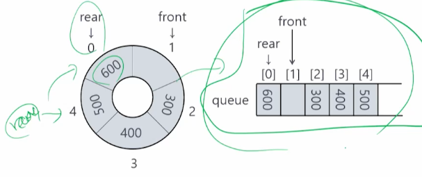

# 4강. 큐

## 1. 큐의 개념

### 큐의 의미

- 한 쪽에서는 삽입 연산만 가능하고, 다른 한쪽에서는 삭제 연산만 발생 가능한 양쪽이 모두 터진 관
- 선입선출(First-In-First-Out, FIFO) 또는 선착순 서브(First-Come-First-Serve, FCFS) 알고리즘과 함께 사용됨

### 큐의 정의

## 2. 큐의 추상 자료형

### 큐의 객체 정의

- 큐의 추상자료형
- 큐 객체: 0개 이상의 원소를 갖는 유한 순서 리스트

### 큐의 연산 

### 큐의 삽입(Add_q) 연산

### 큐의 삭제(Delete_q) 연산

### 빈 큐 검사 (isEmpty_q) 연산

### 큐의 만원 검사(IsFull_q) 연산

### Add/Delete 연산의 실행

## 3. 큐의 응용

### CPU의 관리 방법

- **FCFS(First Come First Serve)** 스케줄링(or FIFO) 기법은 작업(프로그램)이 준비 큐에 도착한 순서대로 CPU를 할당받고 작업이 완료될 때까지 CPU를 사용하는 기법
- **RR(Round Robin)** 스케쥴링 기법은 대화형 시스템에 적합하며, 일정 시간(time slice)만 CPU를 사용하는 스케줄링 방식

 

## 4. 배열을 이용한 큐의 구현

### 큐의 생성

- 변수 rear의 초기값은 큐의 공백 상태를 나타내는 -1로 시작

### 큐의 삽입 & 삭제 연산

- 삽입 연산이 발생하면 rear 변수만 오른쪽으로 이동하고, 삭제 연산이 발생하면 front 변수만 오른쪽으로 이동함
- 삭제 연산의 수행 결과로 삭제된 원소를 delete_q 연산자의 호출 프로그램에 반환해 줌

## 5. 원형 큐

### 큐의 삭제로 인한 빈 상태

- rear와 front가 붙어있으면 비었다고 판단(선형 큐)

### 큐의 만원 상태

- 배열로 구현한 큐의 경우, 큐의 원소의 갯수가 n-1이 아니더라도 큐가 full이 될 수 있음
- 큐의 빈공간이 너무 아까웠던 개발자들...원형큐를 고안해 내게 되는데

### 원형 큐의 초기 상태

- 배열로 구현한 큐의 문제점을 해결하기 위해 원형 큐가 제안됨
- 원형 큐는 파이프의 입구와 출구 부분을 연결시킨 상태

### 원형 큐의 삽입 연산 결과

- 연결된 부분의 데이터 공간을 연속적으로 사용하기 위해 '나머지 연산자'를 활용함
- 오른쪽이 원형 큐 펼쳐놓은 것

- 원형 큐가 Full 인지 아닌지 판단하는 방법
  - 원소의 갯수를 카운트 하는 방법(삽입/삭제가 일어난 횟수로 큐에 남아있는 원소 갯수 카운트)