# 5강. 연결 리스트

## 1. 리스트의 개념

> "리스트"와 "배열"의 차이점 알기

### 리스트의 의미

- 일정한 순서의 나열
- 어떤 정의에 의해서 결정된 '**의미적, 논리적인 순서**'의 나열
  - 개발자들이 머릿속에 담고 있는 추상화된 순서이므로, 물리적인 순서와 동일하지 않아도 상관없음
- 리스트의 '순서'는 데이터가 저장되는 물리적인 위치와 상관없이 사람들의 머릿속에 인식되는 논리적인 순서
- 혹은 리스트에 나타나는 원소들 간의 '의미적인' 순서를 의미

### 배열의 정의

- 원소의 메모리 공간(메인 메모리, DDR)의 물리적인 위치를 '순서'적으로 결정하는 특징
- 배열의 순서는 메모리 공간에서 저장되는 '원소값의 물리적 순서'

### 리스트의 구현 방법

- 포인터를 이용한 리스트의 구현 방법
  - 원소값을 저장하는 공간과 다음 원소를 가리키는 위치 정보를 저장하는 공간을 함께 구현하는 방법
- 배열을 이용한 리스트의 구현 방법

## 2. 배열을 이용한 리스트의 구현

### 배열을 이용한 리스트의 원소 삽입

- 배열을 이용해서 리스트를 만들었을 때, 원소를 삽입할 땐 원소를 이동시키는 연산 필요

- 배열의 확장
  - 초기 배열 선언에서 충분히 크게 하면 어느 정도는 배열의 추가 확장을 피할 수 있지만, => 메모리 낭비
  - 원소를 리스트의 중간에 삽입하기 위해서는
  - 리스트의 원소값을 하나씩 뒤로 밀어야 하는 상황이 발생 => 연산 시간 증가

### 배열을 이용한 리스트의 원소 삽입/삭제

- 배열로 구현된 리스트는 원소의 순서가 연속적인 물리적 주소에 저장됨
  - 원소를 삽입하거나 삭제하기 위해서는 해당 원소의 위치 뒤에 있는 모든 원소를 뒤로 물리거나 앞으로 당겨야 함
  - 리스트 원소값의 이동은 원소수가 많을수록 프로그램의 수행시간을 증가시킴

### 배열을 이용한 리스트의 원소 삽입/삭제 시 발생하는 문제

- 리스트의 원소 삽입은 프로그램의 실행 중에 메모리 할당을 필요로 하는 경우도 발생시킴
- 배열을 이용한 리스트의 구현은 실제 IT 서비스 환경에서는 자주 사용되지 않고 있음
- 자료의 삽입과 삭제가 빈번히 발생화는 상황에서 리스트를 배열로 구현하는 것은 빈번한 자료 이동으로 인한 **비효율적**인 컴퓨팅 성능을 유발함

 

## 3. 포인터를 이용한 리스트의 구현

### 노드의 구조

- 노드(node)
  - 리스트의 원소값(**데이터**) + 다음 원소를 가리키는 정보(**포인터**)
- 노드는 데이터 요소(원소값)와 리스트의 다음 노드를 지시하는 포인터(주소, 링크(link))로 구성됨

### 노드의 구조 및 연결

- 연결 리스트(linked list)

### 연결 리스트의 논리적 순서와 실제 메모리 표현

## 4. 포인터 변수

### 리스트의 생성

- 정수값 data와 링크 link로 구성된 노드의 생성

  

- 포인터의 할당과 반환 예

  - malloc(memory allocation)

  

### 포인터의 할당과 반환의 실행 결과

- `*` 는 주소값을 나타냄

## 5. 연결 리스트의 삽입과 삭제

### 연결 리스트에서 노드의 삭제

- 연결 리스트의 초기 모습

  - 괄호 안에 있는 것들이 그 다음 노드의 주소값

  

- 연결 리스트의 삭제 결과(x 를 삭제)

  - 연결 리스트의 연결을 끊어버리는 것
  - 삭제할 노드의 선행 노드의 링크 필드를 삭제할 노드의 후행 노드를 가리키게 하는 것

  

  

- 리스트의 원소 삭제 연산 단계
  - 삭제할 노드의 선행 노드의 링크 필드를 삭제할 노드의 후행 노드를 가리키게 한다
  - 삭제할 노드를 메모리에 반환한다

### 연결 리스트에서 노드의 삽입

- 연결 리스트의 초기 모습

  

- 연결 리스트의 삽입 노드(x를 i와 j사이에 삽입)

  

- 연결 리스트의 삽입 결과

  

- 연결 리스트에서 노드의 삽입

  - 리스트의 원소 삽입 연산 단계
    - 메모리 공간을 할당받고 삽입할 내용을 저장하여 삽입할 x 노드를 생성합니다
    - x 노드의 링크부분이 후행 노드가 될 j 노드를 가리키게 함
    - 삽입될 x 노드의 선행 노드가 될 i 노드의 링크 필드가 x 노드를 가리키게 함

## 6. 연결 리스트의 여러 가지 연산 프로그램

### 연결 리스트의 생성

### (1) 연결 리스트의 노드 삽입

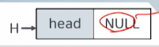

### (2) 연결 리스트의 헤드에 노드 삽입(빈 연결리스트의 경우)

- Newnode의 생성

  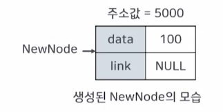

- 헤드 노드와 Newnode의 연결

  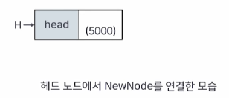

- LastNode의 위치가 정해진 모습

  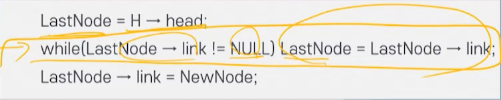

- LastNode가 NewNode를 가리키는 모습

  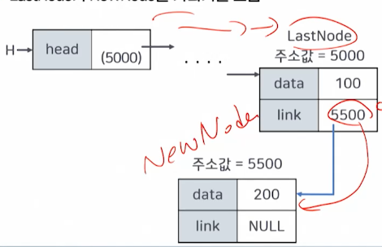

### (3) 연결 리스트의 특정 노드 뒤에 새 노드의 삽입 연산

- 코드

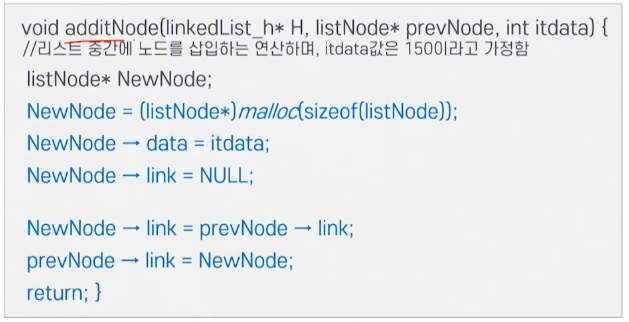

- 생성된 노드의 모습

  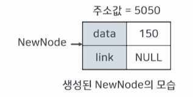

- prevNode가 NewNode를 먼저 가리킨 모습(실패)

  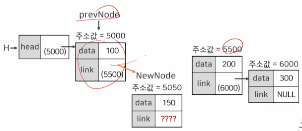

- NewNode의 링크 필드 값이 변경된 모습

  

  

  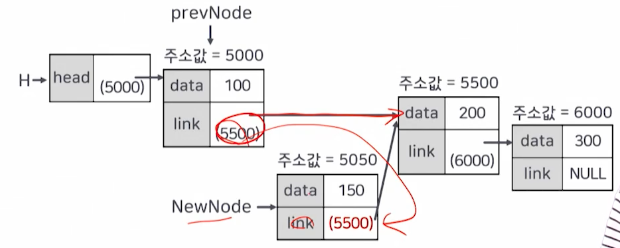

- prevNode의 링크 필드 값이 변경된 모습

  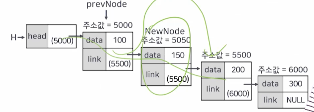

### (4) 연결 리스트의 마지막 노드 삭제

- 코드

- 리스트에 노드가 한 개인 경우

  

- 연결 리스트에 노드가 여러개인 경우

  

- prevNode의 위치 모습

  

- delNode의 위치 모습

  

- 변경된 prevNode의 위치 모습

  

- 마지막 노드를 가리키는 delNode

  

- prevNode의 링크 필드 값이 변경된 모습

  

### (5) 연결 리스트의 특정 노드 검색

- 코드

  

  

- 첫번째 노드를 카리키는 delNode의 위치 모습

  

- 변경된 delNode의 위치 모드

  

- 특정 노드를 찾은 상태의 delNode의 위치 모습

  

### 연결 리스트의 특정 노드 삭제

- 코드

  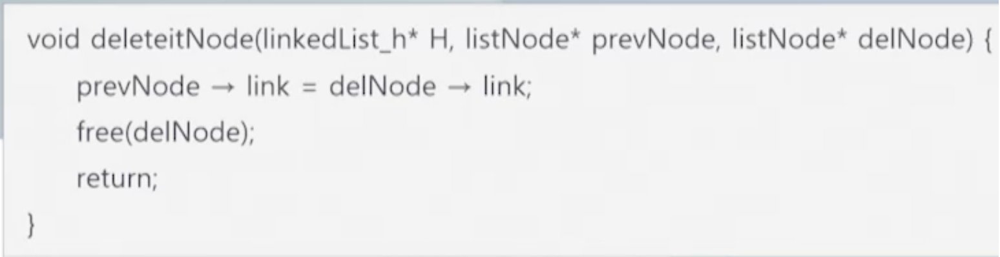

- 특정 노드를 찾은 상태의 delNode의 위치 모습

  

- delNode의 다음 노드를 가리키는 prevNode의 모습

  

- 데이터 값이 200인 노드가 삭제된 모습

  

  