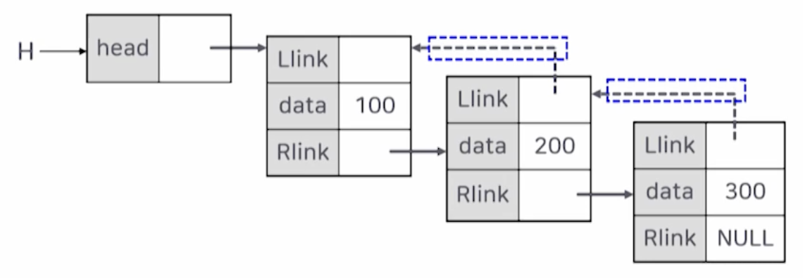
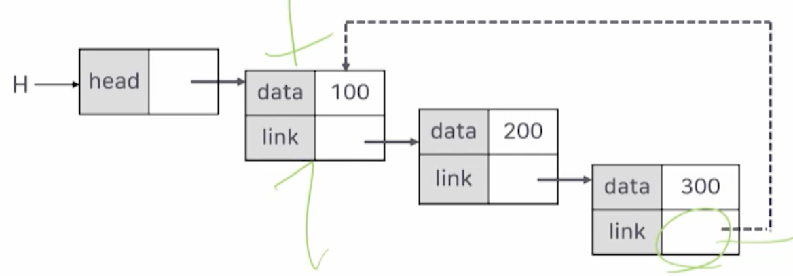
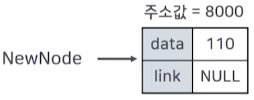
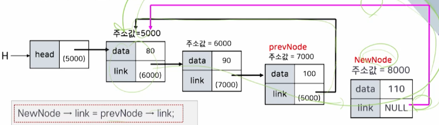
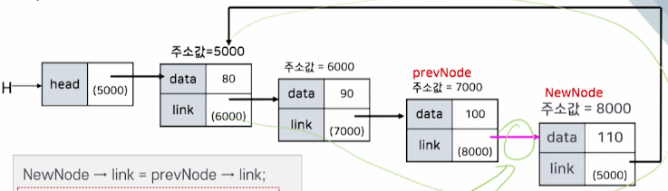
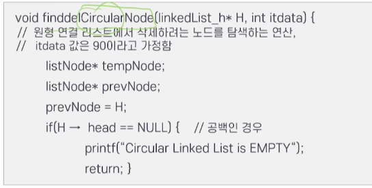
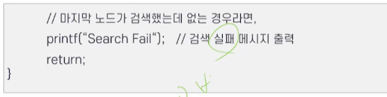
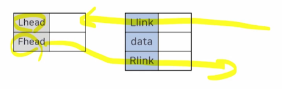

# 6강. 연결 리스트의 응용

## 1. 연결 리스트의 변형

- 단순 연결 리스트의 문제점
  - 하나의 링크만 있고, 각각의 노드의 링크는 후행 노드만을 가리키는 구조 
    - 이전 노드에 대한 정보를 알기가 어려움
  - 특정 노드의 후행 노드는 쉽게 접근할 수 있지만, 특정 노드의 선행 노드에 대한 접근은 헤드 노드부터 재검색해야 하는 문제점이 발생함

- 이러한 문제점들을 해결하기 위해 아래의 세 가지 변형 연결 리스트들이 생겨남
  - 이중 연결 리스트
  - 단순 원형 연결 리스트
  - 이중 원형 연결 리스트

### 이중 연결 리스트

- 선행 노드를 가리키는 링크와, 후행 노드를 가리키는 링크를 가짐
- 특정 노드에서 선행 노드와 후행 노드에 직접적으로(간단한 프로그램 코드를 통해) 접근할 수 있음
  - 단, 메모리는 더 많이 필요

- 연결 리스트를 살펴보면, 가장 마지막 노드의 링크 필드는 언제나 NULL
  - 리스트의 마지막 원소 뒤에는 아무 원소도 없기 때문에, 연결 리스트의 마지막 노드의 링크 필드는 언제나 NULL 값임
  - 그래서 마지막 노드의 링크 필드를 활용하면서도 프로그램 성능에 도움이 되도록 하기 위해서 원형 연결 리스트가 제안됨

## 2. 원형 연결 리스트

### 원형 연결 리스트

- 연결리스트의 마지막 노드의 링크 필드를 활용하면서도 프로그램 성능에 도움이 되도록 하기 위해서 원형 연결 리스트가 제안됨

### 원형 연결 리스트의 생성

- 정의 및 생성

  

- 원형 연결 리스트의 노드 삽입(1)

  - 새로운 노드 만들기

  

  

  - 원형 연결 리스트가 공백인 경우와 아닌 경우

  

  - 공백인 경우 (`if ~`)

    

    

  - 공백이 아닌 경우 (`else ~`)

    

    - `NewNode -> link = tempNode -> link;`

      

    - `tempNode -> link = NewNode;`

      

    - `H -> head = NewNode;`

      헤드 노드가 새롭게 추가된 노드를 가리킴

      

- 원형 연결 리스트의 노드 삽입(2)

  - 특정 위치 뒤에 노드 삽입
  - 원형 연결 리스트의 중간 위치(prevNode 뒤)에 노드를 삽입하는 연산 예

  

  

  - 새롭게 생성된 노드의 모습

    

  - NewNode의 링크 값이 변경된 모습

    - `NewNode -> link = prevNode -> link;`

    

  - prevNode의 링크 값이 변경된 모습

    - `prevNode -> link = NewNode;`

    

  

### 원형 연결 리스트의 노드 삭제를 위한 탐색

- 원형 연결 리스트의 삭제 노드 탐색

  

  

  

## 3. 이중 연결 리스트

 ### 1. 단순 연결 리스트

- 단순 연결 리스트의 단점

  - X 노드의 선행노드를 찾는 방법 (단순 연결 리스트)

    

  - X 노드의 선행노드를 찾는 방법 (이중 연결 리스트)

    

### 2. 이중 연결 리스트

- 이중 연결 리스트

- 이중 연결 리스트의 노드 구조

  - 양쪽 방향으로 순회할 수 있도록 링크 필드가 두 개 필요함

    - 시작점(head)도 두 개의 링크(Lhead, Fhead)가 필요

  - 이중 연결 리스트의 노드 구조: 두 개의 링크 필드(Llink, Rlink)와 한 개의 데이터 필드

    
