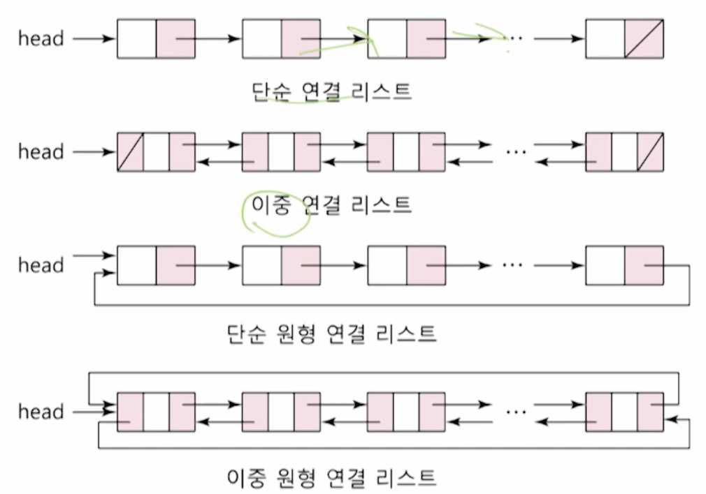

# 6강. 연결 리스트의 응용

## 1. 연결 리스트의 변형

- 단순 연결 리스트의 문제점
  - 하나의 링크만 있고, 각각의 노드의 링크는 후행 노드만을 가리키는 구조 
    - 이전 노드에 대한 정보를 알기가 어려움
  - 특정 노드의 후행 노드는 쉽게 접근할 수 있지만, 특정 노드의 선행 노드에 대한 접근은 헤드 노드부터 재검색해야 하는 문제점이 발생함

- 이러한 문제점들을 해결하기 위해 아래의 세 가지 변형 연결 리스트들이 생겨남
  - 이중 연결 리스트
  - 단순 원형 연결 리스트
  - 이중 원형 연결 리스트

### 이중 연결 리스트

## 2. 원형 연결 리스트

## 3. 이중 연결 리스트

 

