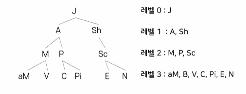
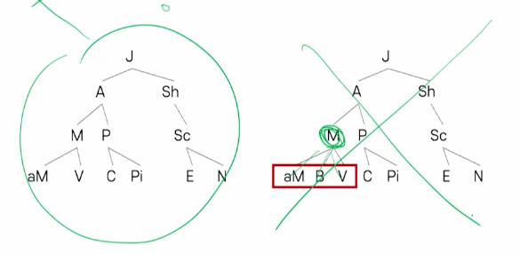
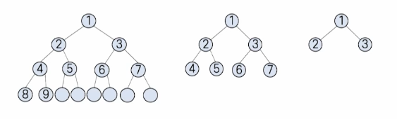
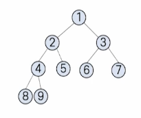
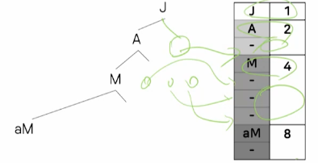
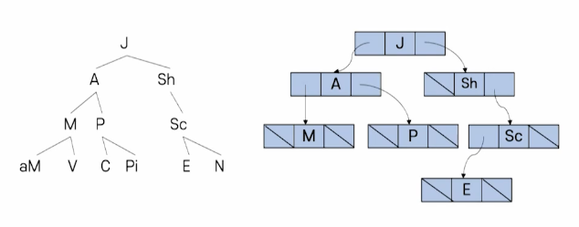
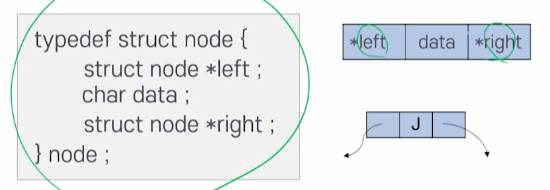
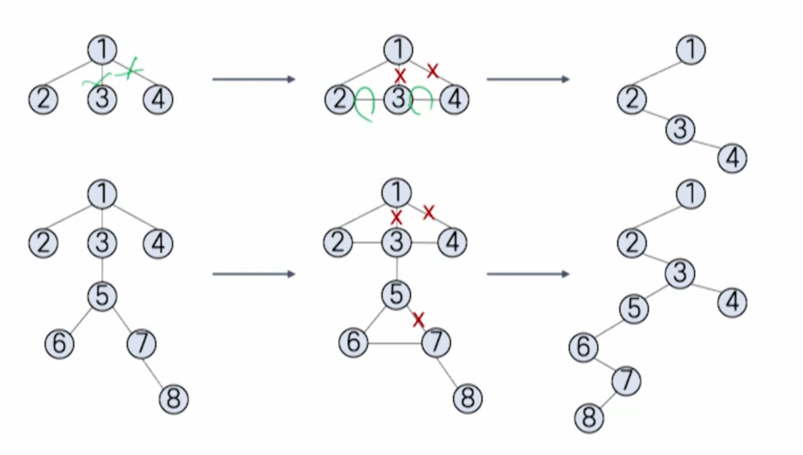

# 7강. 트리

## 1. 트리의 개념

- 트리의 정의
  - 검색의 편리함
  - 논리적 계층
  - 계급적 특성


## 2. 트리의 표현 방법

### 트리의 구성

- 노드
  - 트리의 항목/트리에 저장되는 데이터의 묶음
- 부모노드-자식노드
  - 상하 계층구조가 있고 직접적으로 연결된 노드들로서 상위계층의 부모 노드와 하위계층의 자식 노드를 의미함

- 루트 노드
  - 트리의 최상위 노드(부모 없는 노드)
- 서브 트리
  - 부모 노드를 삭제하면생기는 트리
- 잎 노드
  - 트리의 맨 끝(바닥)에 있으면서, 자신의 서브트리를 갖지 않는 노드


### 진입/진출차수

- 루트 노드 = 0
- 루트를 제외한 모든 노드의 진입 차수:1
- 잎 노드: 진출 차수=0


### 내부 노드와 형제

- 내부 노드
  - 루트도 아니고 잎도 아닌 노드
- 형제
  - 같은 부모를 갖는 노드들


### 트리의 레벨



- 노드의 레벨: 루트로부터 그 노드까지 이어진 선(경로)의 길이


### 트리의 깊이

- 트리의 깊이
  - 트리의 레벨에서 가장 큰 값에 1을 더한 것


## 3. 추상 자료형

### 트리의 추상 자료형

- 트리 객체의 정의
  - 루트 노드를 갖는 유한 리스트
- 다양한 연산


## 4. 이진 트리

### 이진 트리의 정의

- **모든 노드의 차수가 2 이하**인 트리
- 수학적으로 이진 트리의 구성에 관한 이론을 정리하기 쉽고, 컴퓨터 내부에서 구현하기도 효율적임
- 모든 노드가 2개 이하의 자식 노드를 가지므로 일반성을 잃지 않고 '오른쪽', '왼쪽'이라는 방향 개념을 부여할 수도 있음
- 오른쪽 노드와 왼쪽 노드의 개념적 접근(의미적 관계)도 있음



### 가득 찬 이진 트리(perfect binary tree)



- 이진 트리의 각 레벨에서 허용되는 최대 개수 노드를 가지는 트리
- 포화 이진 트리


### 완전 이진 트리(complete binary tree)의 정의



- 높이가 k인 이진 트리가 '0레벨'부터 'k-2 레벨'까지 다 채우고, 마지막 'k-1 레벨'에서 왼쪽부터 오르쪽으로 노드들이 차례로 채워진 이진 트리


### 배열을 이용한 이진 트리의 구현

- 트리가 완전 이진 트리 또는 가득 찬 이진 트리인 경우 낭비되는 공간이 없어 효율적임

  

- 트리가 깊어질수록 기억장소의 낭비가 2의 거듭제곱에 비례하며 낭비가 심해짐

  

- 따라서 배열을 이용해서 구현 잘 안함. 포인터 이용해서 구현해야 함


### 포인터를 이용한 이진 트리의 구현



- 포인터를 이용한 이진 트리의 노드 생성

  

  ```c
  typedef struct node {
    struct node *left ;
    char data ;
    struct node *right ;
  } node ;
  ```


## 5. 이진 트리 연산

### 이진 트리의 순회

- 이진 트리의 각 노드를 (빠짐없이 그리고 중복없이) 한 번 씩 방문하는 것


### 이진트리의 전위순회

- 루트노드 - 왼쪽 자식노드(왼쪽 서브트리) - 오른쪽 자식노드(오른쪽 서브트리)
- P - SL - SR


### 이진트리의 후위순회

- 왼쪽 자식노드 - 오른쪽 자식노드 - 루트노드

  


### 이진트리의 중위순회

- 왼쪽 자식노드 - 루트노드 - 오른쪽 자식노드
- SL - P - SR


### 이진 트리의 순회 단위

- 루트 방문(P)
- 왼쪽 서브트리 순회(L)
- 오른쪽 서브트리 순회(R)


### 이진 트리의 순회 알고리즘

- 전위 순회(PLR)

  ```c
  void preorder(node* root) {
    if (root != NULL) {
      printf("%c", root -> data); // 전위
      preorder(root -> left);
      preorder(root -> right);
    }
  }
  ```

- 후위 순회(LRP)

  ```c
  void postorder(node* root) {
    if (root != NULL) {
      postorder(root -> left);
      postorder(root -> right);
      printf("%c", root -> data); // 후위
    }
  }
  ```

- 중위 순회(LPR)

  ```c
  void inorder(node* root) {
    if (root != NULL){
      inorder(root -> left);
      printf("%c", root -> data); // 중위
      inorder(root -> right);
    }
  }
  ```


### 이진 트리의 생성/삽입/삭제

- 일반적인 이진 트리를 생성하는 것은 연결 리스트 연산을 사용
- 첫 노드를 생성하면 루트 노드가 되고, 새로운 노드를 추가하려면 연결 리스트의 삽입 연산을 사용함
- 노드를 삭제할 때, 삭제하려는 노드가 잎 노드인 경우에는 해당 노드를 가리키는 포인터를 NULL로 지정하면 됨
- 잎 노드가 아닌 경우, 삭제하려는 노드의 자식노드에 대한 처리를 추가로 해줘야 함


### 이진 트리의 노드 삽입 코드

```c
node *insert(node *here, node *it) {
  if (here == NULL) {
    here = it;
    return NULL;
  }
  else {
    node* victim;
    victim = here;
    *here = *it;
    return victim
  }
}
```


### 이진 트리의 노드 삭제 코드

```c
node *delete(node *root, node *it, char direction) {
  node *parent = searchParent(root, it);
  if (parent == NULL) {
    printf("삭제 불가!₩n");
    return NULL; // 더 이상 삭제할 수 있는 것이 없음
  } else {
    if (direction == 'l') { // 왼쪽이라면
      parent -> left = NULL;
      free(parent -> left);
      return it;
    } else if (direction == 'r') { // 오른쪽이라면
      parent -> right = NULL;
      free(parent -> right);
      return it;
    }
    else return NULL
  }
}
```


### 이진 트리 노드의 갯수를 세는 연산

```c
int get_nodeNum(node *root) {
  int num = 0; 
  if (root == NULL) {
    return 0; // 루트 노드도 없으면 0
  } else { // 루트 노드는 기본적으로 확보된 것
    num = 1;
    // 재귀
    num += (get_nodeNum(root -> left) + get_nodeNum(root -> right))
    return num;
  }
}
```


### 이진 트리의 잎 노드의 갯수 세는 연산

```c
int get_leafNum(node *root) {
  int result = 0;
  if (root == NULL) {
    return 0;
  } else if ( root -> left == NULL && root -> right == NULL) {
    return 1;
  }
  result += (get_leafNum(root->left) + get_leafNum(root->right));
  return result;
}
```


## 6. 일반 트리를 이진 트리로 변환

### 이진 트리로 변환 방법

- 일반 트리에 대하여 각 노드의 형제들을 연결
- 각 노드에 대하여 가장 왼쪽 링크만 남기고 모두 제거
- 루트 노드는 반드시 왼쪽 자식노드 하나만 갖도록 함

