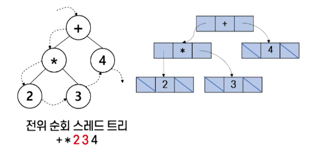
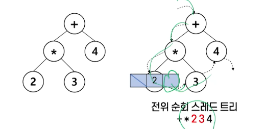
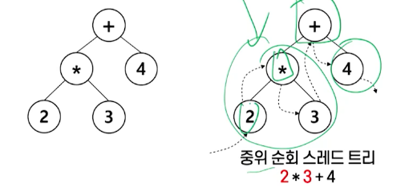
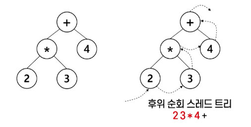
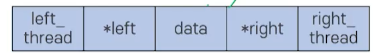
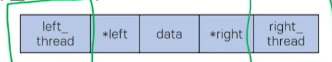

# 8강. 스레드트리

## 1. 스레드 트리

### 스레드 트리

- 이진 트리의 노드 순회: 전위 순회, 중위 순회, 후위 순회

- 이진 트리의 노드를 순환 함수를 사용하지 않고 순회할 때, 방문하지 않고 지나쳐 온 노드들은 스택에 저장하여 관리해야 하는 번거로움이 발생

- 스레드 트리: '스레드'라는 포인터를 추가해 트리 순회를 편리하게 한 것

- 스레드: 순회 방법에 따른 방문순서를 유지하는 포인터

  


### 세 가지 순회에 대한 스레드 트리

- 전위 순회

  

- 중위 순회

  

- 후위 순회

  


## 2. 스레드 트리 구현

### 스레드의 구현 방법(1): 포인터 필드의 추가

- 포인터 필드의 추가: 스레드를 저장하는 포인터를 추가하는 것

  - 왼쪽 스레드 포인터, 왼쪽 자식 포인터, 데이터
  - 오른쪽 자식 포인터, 오른쪽 스레드 포인터 필드로 노드 구조를 정의함

- 오른쪽 스레드: 정해진 순회 순서에 따른 그 노드의 후속 노드를 가리키고

- 왼쪽 스레드: 그 노드의 선행 노드를 가리킴

  

- 포인트 필드의 추가

  

   ```c
   typedef struct tfNode {
     struct tfnode *left;
     struct tfnode *lthread;
     char data;
     struct tfnode *right;
     struct tfnode *rthread;
   } tfnode;
   ```

- 추가된 포인터 필드를 이용한 중위 순회 연산과정

  - 순회할 트리의 시작 노드를 가리키는 포인터 startNode를 매개변수로 하는 함수의 이름을 inorder()로 함
  - 노드를 가리킬 수 있는 (tfNode) 타입의 포인터 ptr을 생성하고 시작 노드를 가리키도록 합니다

  ```c
  void inorder(tfNode *startNode) {
    tfNode *ptr;
    ptr = startNode;
    while (ptr != NULL) {
      printf("%c", ptr -> data);
      ptr = ptr -> rthread;
    }
  }
  ```

  


## 3. 스레드 트리 순회, 삽입, 삭제

