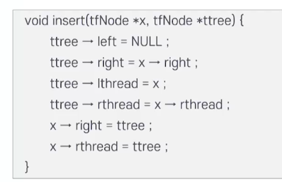

# 8강. 스레드트리

## 1. 스레드 트리

### 스레드 트리

- 이진 트리의 노드 순회: 전위 순회, 중위 순회, 후위 순회

- 이진 트리의 노드를 순환 함수를 사용하지 않고 순회할 때, 방문하지 않고 지나쳐 온 노드들은 스택에 저장하여 관리해야 하는 번거로움이 발생

- 스레드 트리: '스레드'라는 포인터를 추가해 트리 순회를 편리하게 한 것

- 스레드: 순회 방법에 따른 방문순서를 유지하는 포인터

  


### 세 가지 순회에 대한 스레드 트리

- 전위 순회

  

- 중위 순회

  

- 후위 순회

  


## 2. 스레드 트리 구현

### 스레드의 구현 방법(1): 포인터 필드의 추가

- 포인터 필드의 추가: 스레드를 저장하는 포인터를 추가하는 것

  - 왼쪽 스레드 포인터, 왼쪽 자식 포인터, 데이터
  - 오른쪽 자식 포인터, 오른쪽 스레드 포인터 필드로 노드 구조를 정의함

- 오른쪽 스레드: 정해진 순회 순서에 따른 그 노드의 후속 노드를 가리키고

- 왼쪽 스레드: 그 노드의 선행 노드를 가리킴

  

- 포인트 필드의 추가

  

   ```c
   typedef struct tfNode {
     struct tfnode *left;
     struct tfnode *lthread;
     char data;
     struct tfnode *right;
     struct tfnode *rthread;
   } tfnode;
   ```

- 추가된 포인터 필드를 이용한 중위 순회 연산과정

  

  - 순회할 트리의 시작 노드를 가리키는 포인터 startNode를 매개변수로 하는 함수의 이름을 inorder()로 함
  - 노드를 가리킬 수 있는 (tfNode) 타입의 포인터 ptr을 생성하고 시작 노드를 가리키도록 합니다

  ```c
  void inorder(tfNode *startNode) {
    tfNode *ptr;
    ptr = startNode;
    while (ptr != NULL) {
      printf("%c", ptr -> data);
      ptr = ptr -> rthread;
    }
  }
  ```

- 스택을 운영하지 않고도 트리에 속한 모든 노드를 순회할 수 있음

- 하지만 스레드를 위해 추가 기억장소를 사용한다는 부담이 생김

- 스레드를 이용한 전위 순회

  


### 스레드의 구현 방법(2): 빈 포인터의 활용


- 노드의 빈 포인터 필드를 활용

  - 기존 이진 트리의 노드 구조를 그대로 사용하면서, 노드에 있는 사용하지 않는 포인터(빈 포인터)를 활용하는 방법

- 추가 기억장소를 사용하지 않아도 되는 장점이 있음

- 어떤 노드 X에 대해 오른쪽 포인터가 NULL 이면 이 포인터의 노드 X의 후행 노드를 가리키도록 함

- 왼쪽 포인터가 NULL이면 노드 X의 선행 노드를 가리키도록 함

- 잎 노드의 빈 포인터 필드의 활용

  - 이진 트리의 포인터 갯수(노드의 개수를 n개라고 가정)
  - 왼쪽 서브트리를 가리키는 포인터 n개 + 오른쪽 서브트리를 가리키는 n개 => 2n개의 포인터

- 노드의 빈 포인터 필드의 활용

  - 루트 노드를 제외한 각 노드 개수는 모두 진입 차수가 1이므로 
  - 루트 노드를 제외한 전체 노드. 즉, 누군가로부터 가리켜져야 할 노드의 갯수: n-1개
  - (각 노드의) NULL이 아닌 포인터 갯수: n-1
  - 2n - (n-1) = n+1개의 NULL 포인터가 노드에 존재함

- 각 노드에 대해 포인터가

  - 스레드로 사용 중인지 아니면 서브트리에 대한 포인터인지를 구분하기 위해 스레드 사용여부 태그 필드가 필요함(삽입/삭제 연산에서 반드시 필요함)

- 전위 순회: 각 노드의 오른쪽 포인터 필드를 스레드로 사용하는 제한을 가정

  - 어떤 노드의 왼쪽 포인터가 실제 왼쪽 자식을 가리키면(실선) 그대로 두고, NULL 이면 전위 순회로 순회할 때 다음으로 순회하는 노드(후행 노드)를 가리키도록(점선) 지정

- 스레드를 이용한 전위 순회 

  

- 스레드를 이용한 중위 순회

  

  


## 3. 스레드 트리 순회, 삽입, 삭제

### 중위 순회 스레드 트리

- 중위 순회 스레드 트리 중위 순회 연산

  

  

  

### 스레드 트리 삽입 연산

- 중위 순회 스레드 트리의 노드 삽입 연산(1)

  

  

  

- 중위 순회 스레드 트리의 노드 삽입 연산(1): 노드 x가 잎 노드의 경우

  

- 중위 순회 스레드 트리의 노드 삽입 연산(2): 노드 x가 내부 노드인 경우

  

### 스레드 트리 삽입 연산


### 스레드 트리 삭제 연산

