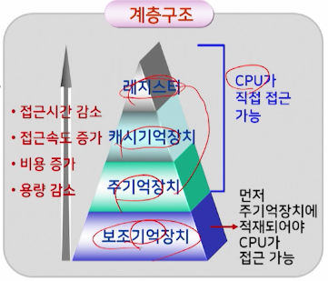
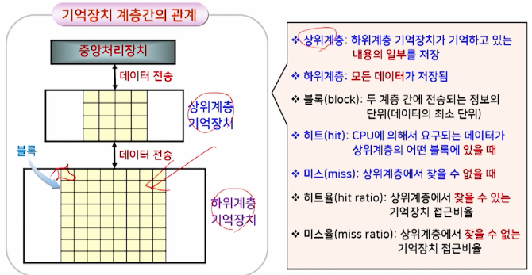
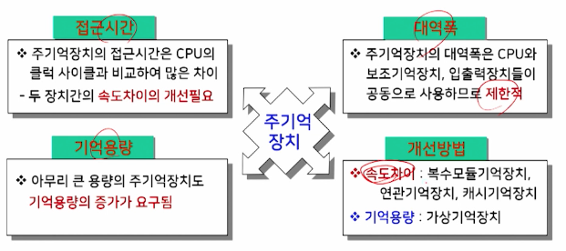
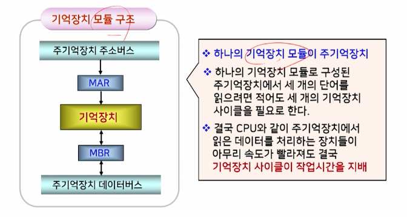
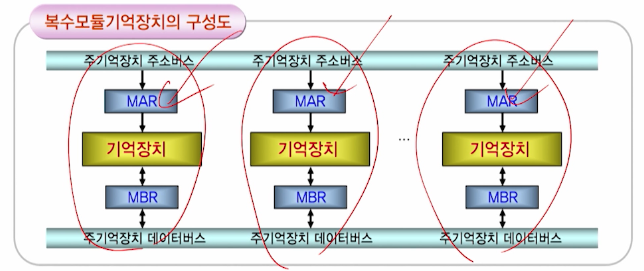
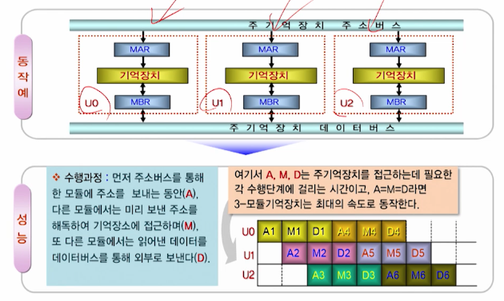

# 10강. 기억장치(1)

## 1. 기억장치의 개요

### 기억장치

> 프로그램과 데이터를 저장하는 장치

- 주기억장치
  - 처리에 당장 필요한 프로그램이나 데이터 저장
  - 중앙처리장치와 직접 데이터 교환이 가능
- 보조기억장치
  - 주 기억장치의 용량부족으로 인해 저장이 어려운 대량의 자료를 보관하는 장치
  - 중앙처리장치와 직접적인 자료교환이 불가능하며, 주기억장치를 통해서만 가능
  - 주기억장치에 비해 가격이 저렴하고 용량이 크지만, 자료의 전송속도는 느림

### 지역성의 원리

- 주어진 시간 동안에 프로그램의 실행에서 발생하는 주소들은 기억장치 내의 몇몇 한정된 영역만을 반복적으로 지정하며, 그 밖의 영역에 대한 접근은 상대적으로 드문 현상

- 시간적 지역성(temporal locality)
  - 어떤 내용이 한번 참조되면, 곧 바로 다시 참조되기 쉽다
- 공간적 지역성(spatial locality)
  - 어떤 내용이 참조되면, 그 내용에 가까운 곳에 있는 다른 내용이 곧바로 참조되기 쉽다

### 프로그램의 지역성

- 반복적으로 명령어와 데이터를 접근하게 되는 루프를 포함하는 대부분의 프로그램은 상당히 큰 시간적 지역성을 보임
- 또한, 대개 명령어들이 순차적으로 접근되기 때문에 큰 공간적 지역성도 보임
  - 예를 들어 레코드나 배열의 요소에 접근할 때는, 공간적 지역성이 커짐

### 기억장치 계층 구조

- 기억장치 계층
  - 속도와 크기가 다른 기억장치를 여러 층으로 구성한 것
  - 지역성의 원리를 이용해 기억장치 계층을 구현
- 계층구조의 목적
  - 전체 기억장치를 구성하는데 있어서 가격은 최소화하면서 가능한 한 빠른 접근속도와 대용량의 크기를 제공하기 위해 -> 입출력의 경제성 확보

- 기억장치 계층간의 관계

  

  

### 기억장치 성능평가 요인

- 기억용량(capacity)
- 접근 시간(access time)
  - 기억장치에서 데이터를 판독하거나 기록하는데 걸리는 시간
- 사이클 시간(cycle time)
  - 하나의 액세스를 시작한 시간부터 다음 액세스를 시작할 때까지의 시간
- 기억장치 대역폭(bandwitdth)
  - 기억장치의 데이터 처리속도를 말하며, 데이터 전송률이라고 함
- 가격(cost)

### 주기억장치

- 컴퓨터 시스템에서 필수적인 하드웨어 요소

- 성능평가의 중요한 요인

  - 접근시간
  - 대역폭
  - 기억용량

- 주기억장치의 성능평가 요인과 개선 방법

  

## 2. 복수모듈 기억장치

### 주기억장치의 대역폭

- 명령어 수행 속도의 제한적인 속도
- 중앙처리장치와 입출력장치가 주기억장치를 경쟁적으로 이용하기 때문에 병목현상 발생

### 대역폭의 개선방법

- 속도가 빠른 기억소자를 이용해 설계
- 주기억장치에서 한 번에 읽을 수 있는 단어의 증가

- 기억장치의 구조적 개선 => 복수모듈 기억장치

### 복수모듈 기억장치

### 복수모듈 기억장치의 개요

- 기억장치 모듈을 여러 개 가지고 있는 기억장치(각 모듈은 독자적인 주기억장치)

- 기억장치를 구성하고 있는 모듈 수 만큼 단어들을 동시에 접근 가능

  

### 복수모듈 기억장치의 동작(3-모듈의 경우)

- 하나의 모듈에 기억장치 버스를 통해 주소를 보내는 동안
- 다른 모듈에서는 미리 보낸 주소를 해독해 접근
- 또 다른 모듈에서는 인출한 데이터를 버스를 통해 외부로 내보냄
- 이런 동작이 동시에 이루어져서 기억장치의 대역폭을 높일 수 있다
- 또한 버스를 구성하는 데이터 선들의 수가 많을 떄에는 모든 모듈에 동시에 병렬로 접근이 가능

### 문제점

- 한 개의 버스를 공유할 경우, 동시에 버스 사용을 요구하면 버스경합 발생
- 동시에 한 개 이상의 모듈들이 동일 버스를 사용하면 데이터간의 충돌 기억장치 충돌
- 해결 방법
  - 메모리 인터리빙(memory interleaving)
    - 버스 경합이나 기억장치충돌과 같은 문제를 해결하기 위해 기억장치 복수모듈로 구성하고, 각 모듈이 동시에 접근할 수 있게 하는 방식
    - 같은 시각에 CPU로부터 여러 모듈로 동시에 주소를 전달할 수 없기 때문에, CPU각 각 모듈 별로 전송할 주소를 교대로 배치한 후, 차례 차례로 전송해 여러 모을 병행 접근하는 기법
      - 기억장치의 접근시간을 효율적으로 높일 수 있음

## 3. 연관기억장치

## 4. 캐시기억장치(캐시기억장치의 원리)