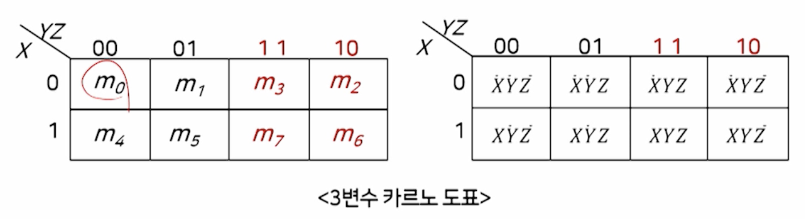

# 1강. 컴퓨터구조의 개요 및 디지털논리회로(1)

## 1. 컴퓨터 구조의 개요

### 컴퓨터 시스템의 개요

- 컴퓨터(computer)

  - 전자식 데이터 처리 시스템(EDPS: Electronic Data Processing System)

- 컴퓨터 시스템

  - 시스템: 그 시스템에 부여된 목적을 달성하기 위해 **상호작용**하는 구성요소들의 집합

- 컴퓨터를 이해하기 위해서는 아래의 내용을 아는 것이 중요 

  - 시스템 측면에서 컴퓨터는 무엇으로 구성되어 있는지
  - 구성 요소는 각각 무슨 기능을 하는지
  - 입력과 출력이 무엇인지

- 컴퓨터 시스템의 구성요소

  - 데이터 처리 - 중앙처리장치(CPU)

  

### 컴퓨터 시스템의 발전과정

- 세대별 발전과정

  

  

### 컴퓨터 시스템의 전체적 구성

- 컴퓨터구조 강의에서는 컴퓨터 시스템 > 하드웨어 부분을 다룸

### 컴퓨터시스템의 분류

- **처리성능과 규모**에 따른 분류
  - 마이크로 컴퓨터
  - 미니 컴퓨터
  - 메인 프레임 컴퓨터
    - 고속의 입출력과 대용량의 저장장치
    - 대규모 데이터베이스 저장 및 관리용
  - 슈퍼 컴퓨터
    - 병렬처리 구조
    - 복잡한 연산을 초고속으로 처리

- **구조**에 따른 분류
  - 파이프라인 슈퍼 컴퓨터
    - 파이프라이닝 구조를 이용한 고속의 벡터 계산
  - 대규모 병렬처리 컴퓨터
    - 수 천개 이상의 처리장치를 가지며, 이러한 처리장치들이 병렬로 구성

## 2. 컴퓨터와 디지털논리회로(1)

### 디지털논리회로의 개요

- 디지털 논리회로
  - 컴퓨터를 구성하는 기본 회로
  - 2진 디지털 논리를 논리 게이트로 구현한 것
  - 집적회로(IC: Integrated Circuits)로 구성
- 디지털 논리회로는 저장요소(F/F: Flip Flop)의 유무에 따라
  - **조합**논리회로: 저장요소가 **없음**(예: 가산기, 디코더, 멀티플렉서 등)
  - **순서**논리회로: 저장요소가 **있음**(예: 레지스터, 카운터 등)

### 논리 게이트와 부울대수

- 논리 게이트
  - 디지털 논리회로를 구현하는데 기본적으로 사용되는 요소
  - 디지털 2진 정보만 다루는 소자
  - 2진 논리연산을 수행하는데 사용
- 기본적인 논리 연산
  - AND연산: 점(﹒)으로 표시, 생략 가능
  - OR연산: 덧셈 기호(+)로 표시
  - NOT연산: 변수 위에 줄(-)을 그어 표시

### 논리 게이트

- 기본 논리 게이트
  - 기본적인 논리 연산(AND, OR, NOT 연산)을 수행하는 논리 게이트
  - AND 게이트, OR 게이트, NOT 게이트
- 기타 논리 게이트
  - NAND 게이트, NOR 게이트, XOR 게이트, XNOR 게이트

- 논리 게이트의 종류

  

### 부울 대수

- 부울 대수(Boolean algebra)
  - 0 또는 1의 값을 갖는 논리변수와 논리연산을 다루는 대수

#### (1) 부울 함수의 표현

- 논리 변수의 상호관계를 나타내기 위해, 부울 변수, 부울 연산기호, 괄호 및 등호 등으로 나타내는 대수적 표현

  

- 세 개의 항을 최소이라고 함

- 부울 함수는 논리 게이트들로 구성되는 논리 회로도를 작성할 수 있게 함

  

- 부울 함수와 진리표

  - 진리표: 논리 변수에 할당한 0과 1의 조합 리스트

    

- 부울 함수와 진리표와의 관계

  - 부울 함수에 대한 진리표는 하나
  - 그러나 동일 진리표를 만족하는 부울함수는 여러 개가 될 수 있다
  - 따라서 동일 진리표에 대한 논리회로도는 여러 개가 될 수 있다
  - 결론적으로 논리회로도는 단순해야 한다
    - 복잡하면 게이트 수, 게이트의 입력 수가 많아지므로 비효율적
    - 따라서 부울 함수의 단순화(간소화)가 필수적

- 부울 함수의 간소화 필요성

  - 첫 번째 부울 함수에 대한 회로보다, 두 번째 회로를 구성하는 소자들의 갯수가 적음
  - 동작은 동일함

  

- 부울 함수의 간소화 방법
  - 대수적인 방법: 부울 대수의 기본 공식을 이용하여 가장 간단한 형태의 함수를 구함
  - **도표를 이용한 방법: 카르노 도표(Karnaugh map) 이용** ✨
  - 테이블을 이용한 방법: 퀸-맥클러스키(Quine-Mcluskey) 방법

#### (2) 부울 대수의 기본 공식

#### (3) 부울 함수의 간소화

- 부울 함수의 유도

  - 부울 함수는 진리표에서 유도 가능

  - 진리표에서 각 변수의 조합은 최소항 또는 최대항으로 나타낼 수 있음

    - 최소항(minterm)
      - AND 결합
    - 최대항(maxterm)
      - OR 결합

  - 결국 부울 함수는 최소항 또는 최대항으로 표현된다(부울 함수의 정규형 표현)

    - 이 때 부울 함수를 최소항으로 나타낼 경우, 각각의 최소항들은 논리합(OR)결합 으로 표현되고, 최대항으로 나타낼 경우 각각의 최대항으로 논리곱(AND) 결합으로 표현된다. 

  - 예:  세 입력변수에 대한 최소항과 최대항

    

- 부울 함수의 유도와 대수적인 간소화 예

  

- 도표를 이용한 간소화

  - 카르노 도표 이용
  - 카르노 도표란 여러 개의 사각형으로 된 다이어그램
  - 사각형은 각각 하나의 최소항 또는 최대항을 의미
  - 최소항 또는 최대항들이 차지하는 도표 내의 면적을 이용해 간소화
  - 카르노 도표는 부울 함수의 입력 변수의 수에 따라 기본 도표의 형태가 결정됨
  - 입력 변수의 수가 n 인 경우, n 변수 카르노 도표라 하고, 2^n 개의 사각형으로 구성

- 카르노 도표를 이용한 간소화의 예(3개의 입력변수 경우)

  - 세 개의 변수를 가지는 부울 함수 → 8개(2^3)의 최소항

    - 3변수 카르노 도표는 8개의 정사각형으로 구성되고
    - 각각의 정사각형은 하나의 최소항에 대응

    

  

- 카르노 도표를 이용하여 부울 함수를 간소화 하는 방법은
  - 부울 함수를 시각적인 방법으로 간소화하기 때문에, 
  - 대수적인 방법으로 간소화 하는 방법보다 효과적
- 가장 간소화된 부울 함수는
  - 논리회로의 **게이트 수**와 **게이트의 입력 수**를 **최소화**할 수 있기 때문에
  - **디지털 논리회로를 설계**할 때 매우 유용한 방법으로 사용됨

