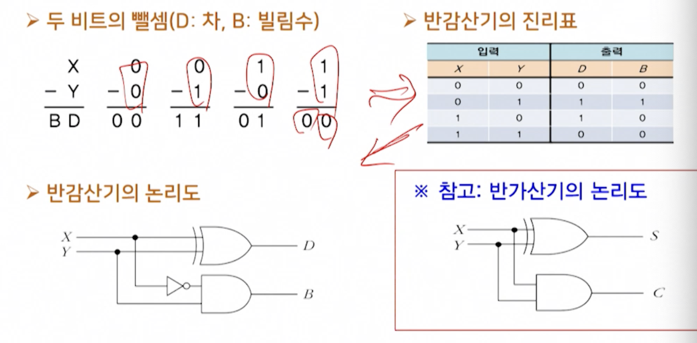
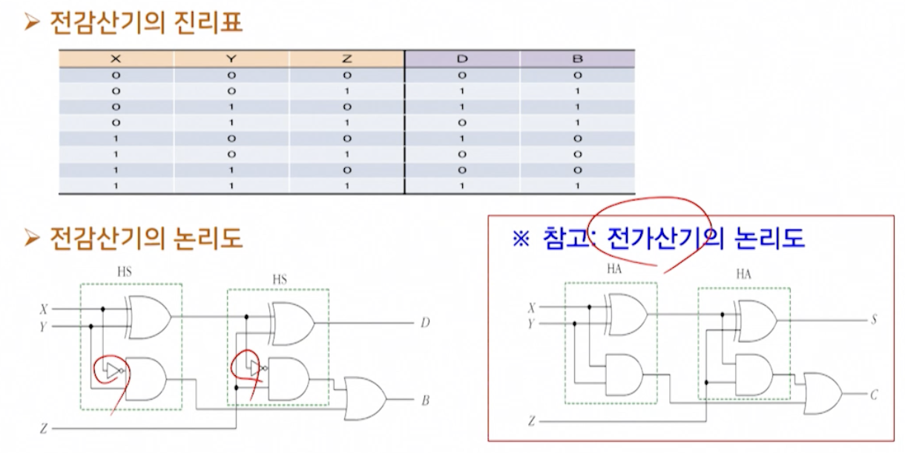
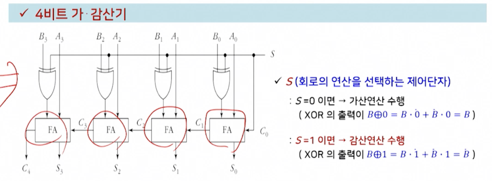
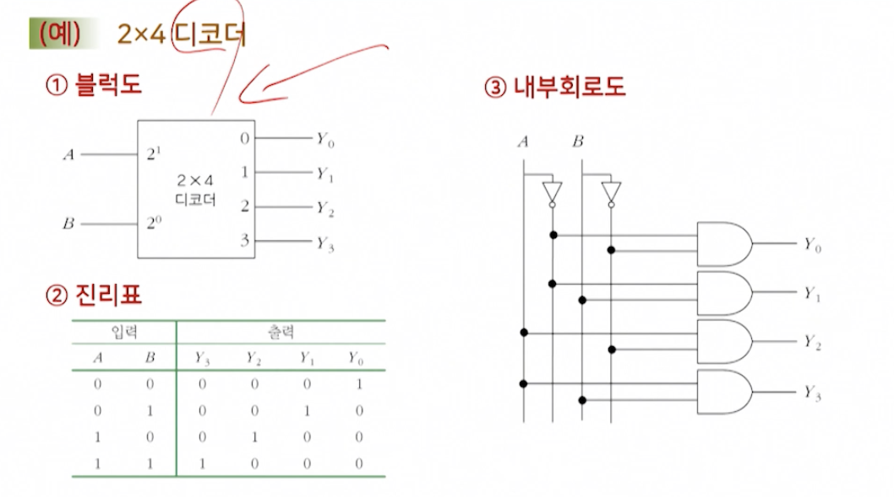
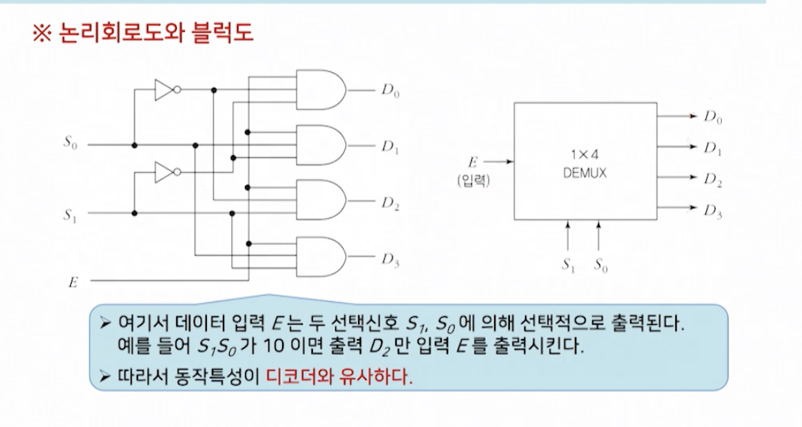

# 2강. 디지털논리회로(II) 및 컴퓨터 명령어(I)

## 1. 컴퓨터와 디지털논리회로(2)

### 디지털 논리회로

- 조합논리회로(combinational logic circuit)
  - 현재의 입력에 의해서만 출력이 결정되는 논리회로
- 순서논리회로(sequential logic circuit)
  - 조합논리회로에 **저장요소**를 추가한 회로로서, 저장요소의 상태와 입력변수에 의해서 출력이 결정됨

### 기본 연산회로

- 기본 연산회로
  - 가, 감, 승, 제의 산술연산회로
    - 가산기: 덧셈회로
    - 감산기: 뺄셈회로
    - 승산기: 곱셈회로
    - 제산기: 나눗셈회로

#### (1) 가산기

>  2진수의 덧셈을 수행하는 조합논리회로
>
> - 반가산기(HA: Half Adder): 두 비트의 덧셈을 수행
> - 전가산지(FA: Full Adder): 세 비트의 덧셈을 수행

- 반 가산기: 두 비트의 덧셈

  

- 전가산기: 세 비트의 덧셈

  

#### (2) 감산기

> 2진수의 뺄셈을 수행하는 조합논리회로
>
> - 반감산기(HS: Half Subtractor): 두 비트의 뺄셈 수행
> - 전감산기(FS: Full Subtractor): 세 비트의 뺄셈 수행

- 반감산기

  - NOT게이트가 있는 반감산기

  

- 전감산기

  - NOT게이트가 있는 전감산기

  

#### (3) 가/감산기

- 덧셈과 뺄셈 연산을 가산기만으로 수행

  - 감산기는 가산기에 인버터를 추가한 형태이므로
  - 가산기만 사용해 감산을 수행하면 회로를 최소화할 수 있음

  

### MSI를 이용한 조합논리회로

- 디지털 시스템에서
  - 효과적인 조합논리회로를 설계하기 위해서는 주어진 함수를 실현하는데 필요한 게이트의 수를 최소화할 필요
  - 이를 위해 집적회로(IC)를 사용
  - 왜냐하면 패키지화된 IC의 내부 게이트를 이용하면 경제적인 설계 가능
- 이미 만들어진 MSI(Medium Scale Integrated circuits)장치를 이용하면 다양한 조합논리회로의 설계가 가능
  - 예
    - 인코더, 디코더, 멀티플렉서, 디멀티플렉서

#### (1) 인코더 / 디코더

- 인코더

  - 부호화되지 않은 입력을 받아서 부호화된 출력을 내보내는 **부호화기**

  - 예. 문자, 숫자, 기호 등을 2진 코드로 변환시켜주는 조합논리회로

  - 인코더는 2^n개의 입력과 n개의 출력을 가지고 있음

    

- 디코더( 더 중요 )

  - 인코더에 상대되는 개념. 부호화된 입력을 받아서 부호화되지 않은 출력을 내보내는 **복호화기**

  - 예. 기억장치에서 특정 번지(address)를 선택할 때나 컴퓨터 명령어를 해독하는 데 사용되는 조합논리회로

  - 디코더는 n비트의 2진 코드를 최대 2^n개의 서로 다른 정보로 바꾸어주는 조합논리회로

    

    

#### (2) 멀티플렉서 / 디멀티플렉서

- 멀티플렉서

  - 여러 개의 입력선 중 하나를 선택해 단일의 출력을 내보내는 조합논리회로
  - 특정 입력선을 선택하기 위해 선택변수 사용
  - 즉, 2^n 개의 입력선 중에서 특정 입력선을 선택하기 위해선 n개의 선택변수가 있어야 함
  - 이 n개의 선택변수의 조합에 의해 특정 입력선이 선택도김
  - 데이터 선택기(data selector)라고도 하며, 약어로 MUX로 표현
  - 컴퓨터 시스템에서 공통 버스 시스템을 구성하거나 여러 개의 레지스터중 하나를 선택하는데 사용

  

- 디멀티플렉서

  - 멀티플렉서와 반대되는 동작을 수행하는 조합논리회로

  - 데이터 분배기(Data distributor)라고도 불림

  - 한 개의 입력선으로부터 정보를 받아, 이를 2^n 개의 출력선 중의 하나로 내보냄. 이 때 특정 출력선의 제어는 n개의 선택입력의 조합으로 제어됨

    디멀티플렉서는 약어로 DEMUX로 표현

### 순서논리회로

## 2. 컴퓨터 명령어(1)

### 컴퓨터 명령어 개요

### 컴퓨터 명령어의 구성