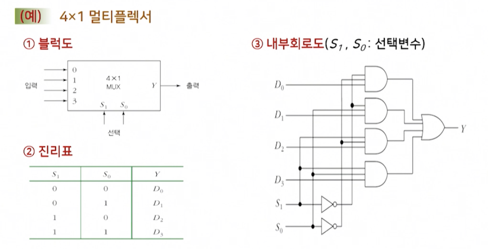

# 2강. 디지털논리회로(II) 및 컴퓨터 명령어(I)

## 1. 컴퓨터와 디지털논리회로(2)

### 디지털 논리회로

- 조합논리회로(combinational logic circuit)
  - 현재의 입력에 의해서만 출력이 결정되는 논리회로
- 순서논리회로(sequential logic circuit)
  - 조합논리회로에 **저장요소**를 추가한 회로로서, 저장요소의 상태와 입력변수에 의해서 출력이 결정됨

### 기본 연산회로

- 기본 연산회로
  - 가, 감, 승, 제의 산술연산회로
    - 가산기: 덧셈회로
    - 감산기: 뺄셈회로
    - 승산기: 곱셈회로
    - 제산기: 나눗셈회로

#### (1) 가산기

>  2진수의 덧셈을 수행하는 조합논리회로
>
> - 반가산기(HA: Half Adder): 두 비트의 덧셈을 수행
> - 전가산지(FA: Full Adder): 세 비트의 덧셈을 수행

- 반 가산기: 두 비트의 덧셈

  

- 전가산기: 세 비트의 덧셈

  

#### (2) 감산기

> 2진수의 뺄셈을 수행하는 조합논리회로
>
> - 반감산기(HS: Half Subtractor): 두 비트의 뺄셈 수행
> - 전감산기(FS: Full Subtractor): 세 비트의 뺄셈 수행

- 반감산기

  - NOT게이트가 있는 반감산기

  

- 전감산기

  - NOT게이트가 있는 전감산기

  

#### (3) 가/감산기

- 덧셈과 뺄셈 연산을 가산기만으로 수행

  - 감산기는 가산기에 인버터를 추가한 형태이므로
  - 가산기만 사용해 감산을 수행하면 회로를 최소화할 수 있음

  

### MSI를 이용한 조합논리회로

- 디지털 시스템에서
  - 효과적인 조합논리회로를 설계하기 위해서는 주어진 함수를 실현하는데 필요한 게이트의 수를 최소화할 필요
  - 이를 위해 집적회로(IC)를 사용
  - 왜냐하면 패키지화된 IC의 내부 게이트를 이용하면 경제적인 설계 가능
- 이미 만들어진 MSI(Medium Scale Integrated circuits)장치를 이용하면 다양한 조합논리회로의 설계가 가능
  - 예
    - 인코더, 디코더, 멀티플렉서, 디멀티플렉서

#### (1) 인코더 / 디코더

- 인코더

  - 부호화되지 않은 입력을 받아서 부호화된 출력을 내보내는 **부호화기**

  - 예. 문자, 숫자, 기호 등을 2진 코드로 변환시켜주는 조합논리회로

  - 인코더는 2^n개의 입력과 n개의 출력을 가지고 있음

    

- 디코더( 더 중요 )

  - 인코더에 상대되는 개념. 부호화된 입력을 받아서 부호화되지 않은 출력을 내보내는 **복호화기**

  - 예. 기억장치에서 특정 번지(address)를 선택할 때나 컴퓨터 명령어를 해독하는 데 사용되는 조합논리회로

  - 디코더는 n비트의 2진 코드를 최대 2^n개의 서로 다른 정보로 바꾸어주는 조합논리회로

    

    

#### (2) 멀티플렉서 / 디멀티플렉서

- 멀티플렉서

  - 여러 개의 입력선 중 하나를 선택해 단일의 출력을 내보내는 조합논리회로
  - 특정 입력선을 선택하기 위해 선택변수 사용
  - 즉, 2^n 개의 입력선 중에서 특정 입력선을 선택하기 위해선 n개의 선택변수가 있어야 함
  - 이 n개의 선택변수의 조합에 의해 특정 입력선이 선택도김
  - 데이터 선택기(data selector)라고도 하며, 약어로 MUX로 표현
  - 컴퓨터 시스템에서 공통 버스 시스템을 구성하거나 여러 개의 레지스터중 하나를 선택하는데 사용

  

- 디멀티플렉서

  - 멀티플렉서와 반대되는 동작을 수행하는 조합논리회로

  - 데이터 분배기(Data distributor)라고도 불림

  - 한 개의 입력선으로부터 정보를 받아, 이를 2^n 개의 출력선 중의 하나로 내보냄. 이 때 특정 출력선의 제어는 n개의 선택입력의 조합으로 제어됨

    디멀티플렉서는 약어로 DEMUX로 표현

### 순서논리회로

- 조합논리회로: 현재 시간의 입력에 의해 출력이 결정
- 순서논리회로: 조합논리회로에 저장요소를 추가한 회로
  - 비동기 순서논리회로
    - 시간지연소자 이용
    - 시간지연소자는 신호가 전달되려면 일정한 시간이 걸리므로 기억능력을 갖게 됨
    - 논리 게이트로 구성되는 시간지연소자는 게이트간의 피드백 때문에 예측 못한 상태로 동작하거나, 불안정한 상태가 발생되기도 함
    - 이러한 이유로 자주 사용되지 않음
  - 동기순서논리회로
    - 특정 순간에서만 저장요소를 내용을 변화시킬 수 있는 신호를 사용(클럭 펄스)
    - 이러한 클럭 펄스는 시스템 전체에 제공
    - 이처럼 저장요소 입력에 클럭 펄스를 제공하는 동기 순서회로를 클럭을 가진 순서논리회로라고 함
    - 플립플롭이라는 저장요소를 사용하며, 가장 많이 사용되는 순서논리회로

#### 플립플롭

- 플립플롭

  - 입력 신호에 의해 상태를 바꾸도록 지시가 있을 때 까지 현재의 2진 상태를 유지하는 논리소자
  - 한 비트의 2진 정보를 저장할 수 있는 장치
  - 클럭 신호에 의해 출력상태를 바꾼다

- 플립플롭의 종류

  - SR 래치
    - 넓은 의미의 플립플롭
    - 구동 방법이 다름(구동입력이 1일때 출력이 바뀜)
    - 비동기 순서논리소자
    - RS, D, JK, T 플립플롭

  - RS 플립플롭

    - 문제점: 세 입력이 모두 1일 때 어떤 값으로도 결정할 수 없는 상태 발생
    - 문제점 해결을 위해 D, JK 플립플롭 등이 만들어짐

    

  - D 플립플롭

    - RS 플립플롭의 문제점 해결을 위한 방법
    - 미정상태라는 불필요한 상태를 제거하는 방법으로, S, R이 동시에 1을 갖지 않도록 함

    

  - JK 플립플롭

    - RS 플립플롭의 문제점을 개량한 형태 - 미정상태 개선
    - **가장 많이 사용되는 플립플롭**

    

  - T 플립플롭

    - JK 플립플롭의 변화된 형태
    - JK 플립플롭의 두 입력을 하나로 묶어 만든 것
    - 명칭 T는 상태를 반전한다는 토글에서 유래

    

#### 레지스터

- 레지스터

  - 데이터를 일시 저장하거나 전송하는 장치
  - 여러 개의 플립플롭을 연결해 구성
  - n 비트 레지스터는
    - n 개의 플립플롭으로 구성되며
    - n 비트의 2진 정보를 저장

- 레지스터의 기본 형태

  

- 데이터 적재 레지스터

  - 입력된 데이터를 그대로 기억하는 역할을 수행하는 레지스터
  - 일반적으로 D F/F를 사용해 구성
  - 데이터 입력 방식에 따라
    - 직렬 적재 레지스터
    - 병렬 적재 레지스터

- 직렬적재 레지스터

  - 여러 개의 플립플롭을 연결해 구성

  - 직력적재 방식: 직렬 입력 - 직렬 출력 레지스터

    - 데이터를 순차적으로 받아들이는 방식

    - 즉, 1비트씩 입력하는 방식

      

- 병렬적재 레지스터

  

- 쉬프트 레지스터

  - 레지스터가 기억하고 있는 정보에 대해 한 방향 혹은 양방향으로 정보의 위치를 이동시킬 수 있는 레지스터

  - F/F을 직렬 연결, 모든 F/F은 공통 클럭펄스

  - 클럭펄스에 따라 한 단씩 자리를 이동

    

#### 카운터

- 카운터의 개요

  - 플립플롭을 사용해 만든 순서논리회로
  - 입력되는 클록 펄스의 적용에 따라 미리 정해진 순서를 밟아가는 특수한 형태의 레지스터
  - 외부의 입력이나 출력이 없으며,
  - 상태 변환느 클럭펄스에 의해 수행
  - 일반적으로 T F/F 혹은 JK F/F이 사용됨

- 카운터의 분류

  

  - 예시

    

## 컴퓨터 명령어(1)

### 컴퓨터 명령어의 개요

- 컴퓨터 명령어의 필요성

  - 디지털 시스템의 분석

    

- 컴퓨터 명령어(instruction)

  - 컴퓨터가 수행해야 하는 일을 나타내기 위한 비트들의 집합
  - 일정한 형식을 가짐

- 명령어 집합(instruction set)

  - 컴퓨터에서 사용할 수 있는 명령어의 세트(set)
  - 모든 컴퓨터는 자신의 명령어 집합을 가지고 있음
  - 명령어 집합은 그 컴퓨터의 구조적인 특성을 나타내는 가장 중요한 정보
  - 동일 계열의 컴퓨터는 같은 명령어 집합 사용
  - 따라서 명령어 집합을 이용하여 컴퓨터 시스템의 구조를 살펴볼 수 있음

### 명령어의 구성

- 명령어는 필드(field)라는 비트그룹으로 이루어지며, 연산코드와 오퍼랜드 필드로 구성됨

  - 연산코드 필드: 처리해야할 연산의 종류
  - 오퍼랜드 필드: 처리할 대상 데이터 또는 데이터의 주소

  

- 컴퓨터 명령어의 수행 기능

  - 함수연산 기능
    - 덧셈, 시프트, 보수 등의 산술연산
    - AND, OR, NOT 등의 논리연산 수행 기능
  - 정보전달 기능
    - 레지스터들 사이의 정보전달 기능
    - 중앙처리장치와 주기억장치 사이의 정보전달 기능
  - 순서제어 기능
    - 조건 분기와 무조건 분기 등을 통해 명령어의 수행 순설르 제어하는 기능
  - 입출력 기능
    - 주기억장치와 입출력장치 사이의 정보 이동 기능

### 명령어 형식

- 명령어 형식
  - 명령어를 구성하는 필드들의 수와 배치 방식 및 각 필드들의 비트 수를 말함
  - 명령어는 컴퓨터의 내부 구주에 따라 여러 가지 형식이 있음
- 명령어 형식의 분류
  - 오퍼랜드의 기억장소에 따른 명령어 형식
  - 오퍼랜드의 수에 따른 명령어 형식