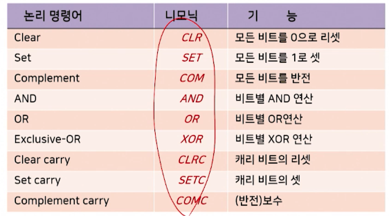

# 3강. 컴퓨터 명령어(2)

## 1. 명령어 형식

> 기억장소에 따른 명령어 형식
>
> 오퍼랜드 수에 따른 명령어 형식


### 3.3.1 기억장소에 따른 명령어 형식

- 명령어 형식의 분류
  - 오퍼랜드의 기억장소에 따른 명령어 형식
  - 오퍼랜드의 수에 따른 명령어 형식
- 오퍼랜드가 기억되는 장소에 따라 
  - **누산기를** 이용하는 명령어 형식
  - **다중 레지스터**를 이용하는 명령어 형식
  - **스택 구조**를 이용하는 명령어 형식


#### (1) 누산기를 이용하는 명령어 형식


- 누산기를 가진 컴퓨터 구조에서 사용되는 형식 

- AC: Accumulator

  - 누산기를 가진 컴퓨터 구조에서 중앙처리장치에 있는 유일한 **데이터 레지스터**로서, 명령어가 수행될 때 오퍼랜드를 기억시키는 레지스터

- 예제 1

  ```
  ADD X ; AC <- AC + M[X]
  ```

  - 의미

    - 누산기(AC)에 있는 내용과 기억장치 X 번지에 있는 내용을 더해서 누산기(AC)로 전송해라

    

- 예제 2

  ```
  LOAD X ; AC <- M[X]
  ```

  - 의미
    - 기억장치 X 번지에 있는 내용을 누산기로 적재하라 

- 예제 3

  ```
  STORE X ; M[X] <- AC
  ```

  - 의미
    - 누산기의 내용을 기억장치 X 번지에 저장하라


#### (2) 다중 레지스터를 이용하는 명령어 형식


- 다중 레지스터를 가진 컴퓨터 구조는 중앙처리장치 내에 여러 개의 레지스터를 가지고 있는 컴퓨터이다.

- 예시 1

  

  - 세 개의 레지스터를 사용하는 경우

    ```
    ADD R1, R2, R3 ; R3 <- R1 + R2
    ```

  - 의미

    - 레지스터 R1의 내용과 R2의 내용을 더해서, 레지스터 R3로 전송하라
    - R1, R2 는 출발 레지스터
    - R3는 도착 레지스터

- 예시 2

  - 두 개의 레지스터를 사용하는 경우

    ```
    ADD R1, R2 ; R2 <- R1 + R2
    ```

  - 의미

    - 레지스터 R1의 내용과 레지스터 R2의 내용을 더해서, 레지스터 R2로 전송하라
    - R2는 출발 레지스터로도 쓰이고, 도착 레지스터로도 쓰인다

- 예시 3

  - 전달 기능을 가진 명령어인 경우

  ```
  MOVE R1, R2 ; R2 <- R1
  ```

  - 의미
    - 레지스터 R1의 내용을 레지스터  R2로 전송하라

- 예시 4

  - 주소 필드 중 하나가 기억장치 주소 필드의 경우

  ```
  LOAD X, R1 ; R1 <- M[X]
  STORE R1, X ; M[X] <- R1
  ```

  - 의미
    - 기억장치 X 번지의 내용을 레지스터  R1에 적재하라
    - 레지스터 R1의 내용을 기억장치 X 번지에 저장하라


#### (3) 스택 구조를 이용한 명령어 형식


- 스택 구조 컴퓨터는 연산에 필요한 오퍼랜드들을 기억장치 스택에 기억시켜야 하고, 연산의 결과도 스택에 기억시키는 구조이다.


- 예시 1

  - 주소 필드를 사용하지 않는 경우
  - TOS: Top of Stack

  ```
  ADD ; TOS <- TOS + TOS-1
  ```

  - 의미
    - 기억장치 스택의 맨 위(TOS)의 내용과 그 아래(TOS-1)의 내용을 더해서 스택의 맨 위(TOS)로 전송하라

- 예시 2

  - 주소 필드를 사용하는 경우

  ```
  PUSH X ; TOS <- M[X]
  POP X ; M[X] <- TOS
  ```

  - 의미
    - 기억장치 주소 X의 내용을 기억장치 스택의 맨 위(TOS)로 전송하라
    - 기억장치 스택의 맨 위(TOS)의 내용과 그 아래(TOS-1)의 내용을 더해서 스택의 맨 위(TOS)로 전송하라


### 3.3.2 오퍼랜드의 수에 따른 명령어 형식

- 명령어 형식의 분류
  - 오퍼랜드의 기억장소에 따른 명령어 형식
  - 오퍼랜드의 수에 따른 명령어 형식
- 오퍼랜드의 개수에 따라
  - 3주소 명령어(three-address instruction)
  - 2주소 명령어(two-address instruction)
  - 1주소 명령어(one-address instruction)
  - 0주소 명령어(zero-address instruction)


#### (1) 3-주소 명령어


- 명령어 오퍼랜드의 개수가 3 개인 명령어 형식

- 예시

  

  - 장점
    - 산술식을 프로그램화 하는데 있어서 프로그램의 길이가 짧아짐
  - 단점
    - 3-주소 명령어를 2진 코드화 했을 때 세 개의 오퍼랜드를 나타내기 위한 비트 수가 다른 주소 명령어 형식보다 많이 필요하다


#### (2) 2-주소 명령어


- 장점
  - 3-주소 명령어에 비해 명령어의 길이는 짧아짐
- 단점
  - 같은 내용을 수행하기 위해 수행해야 하는 명령어의 수는 증가됨


#### (3) 1-주소 명령어


- 장점
  - 모든 연산은 누산기 레지스터와 기억장치에 저장된 오퍼랜드를 대상으로 수행
- 단점
  - 프로그램을 수행하기 위해 사용되는 명령어의 수는 더 증가


#### (4) 0-주소 명령어

- 스택 구조에서 사용되는 형식
- 주소 필드를 사용하지 않음


- 장점
  - 명령어의 길이가 매우 짧아서 기억 공간을 적게 차지
- 단점
  - 특수한 경우를 제외하고는 많은 양의 정보가 스택과 기억장치 사이를 이동하게 되어 비효율적


## 2. 주소 지정 방식

### 3.4 주소지정방식

#### 명령어 주소 지정방식(addressing mode)

- 프로그램 수행 시 오퍼랜드를 지정하는 방식
- 명령어의 주소 필드를 변경하거나 해석하는 규칙을 지정하는 형식
- 주소지정방식을 사용하면 명령어의 수를 줄일 수 있는 효과적ㅇ니 프로그래밍 가능


#### 유효 주소

- 주소지정방식의 각 규칙에 의해 정해지는 오퍼랜드의 실제 주소


#### 별도의 주소지정방식 필드를 가진 명령어 형식


#### 주소지정방식의 종류


1. 의미주소지정방식(implied mode)
   - 명령어 형식에서 주소 필드를 필요로 하지 않는 방식
   - 연산코드 필드에 지정된 묵시적 의미의 오퍼랜드를 지정
2. 즉치 주소지정방식(immediate mode)
3. 직접 주소지정방식(direct-addressing mode)
4. 간접 주소지정방식(indirect-addressing mode)
5. 레지스터 주소지정방식(register mode)
6. 레지스터 간접 주소지정방식(register-indirect mode)
7. 상대 주소지정방식(relative addressing mode)
   - 프로그램카운터가 가지고 있는 주소값을 더해서 주소값으로 쓰는 것
   - 유효주소 = 명령어 주소부분의 내용 + PC(프로그램카운터)
     - 프로그램카운터: 프로그램이 컴파일 하게 되면 실행파일 만들어지고 기억장치에 보관됨. 즉, 내가 짠 프로그램의 시작 순서를 알고 있는 레지스터
8. 인덱스 주소지정방식(indexed addressing mode)
   - 인덱스 레지스터의 내용을 명령어 주소 부분에 더해서 유효주소를 얻는 방식
   - 유효주소 = 명령어 주소부분의 내용 + 인덱스 레지스터의 내용


## 3. 명령어의 종류

### 3.5. 명령어의 종류

#### 3.5.1 데이터 전송 명령어


- 한 장소에서 다른 장소로 단지 데이터를 전송하는 명령어
- 레지스터와 레지스터 사이, 레지스터와 기억장치 사이, 또는 기억장치와 기억장치 사이에 데이터를 이동하는 기능
- 입출력 명령어가 포함


#### 3.5.2 데이터 처리 명령어

- 데이터에 대한 연산을 실행하고 컴퓨터에 계산 능력을 제공

  - 산술 명령어
  - 논리와 비트 처리 명령어
  - 시프트 명령어

- **산술 명령어**

  - 사칙연산에 대한 명령어

    

  - 논리와 비트처리 명령어

  

  - 시프트 명령어

    - 오퍼랜드의 비트를 오른쪽이나 왼쪽으로 이동시키는 명령어
    - 논리적 시프트와 산술적 시프트, 회전형 시프트 연산 등이 있음

    


#### 3.5.3 프로그램 제어 명령어


- 프로그램 제어 명령어
  - 프로그램 수행의 흐름을 제어
  - 다른 프로그램의 세그먼트(segment)로 분기

