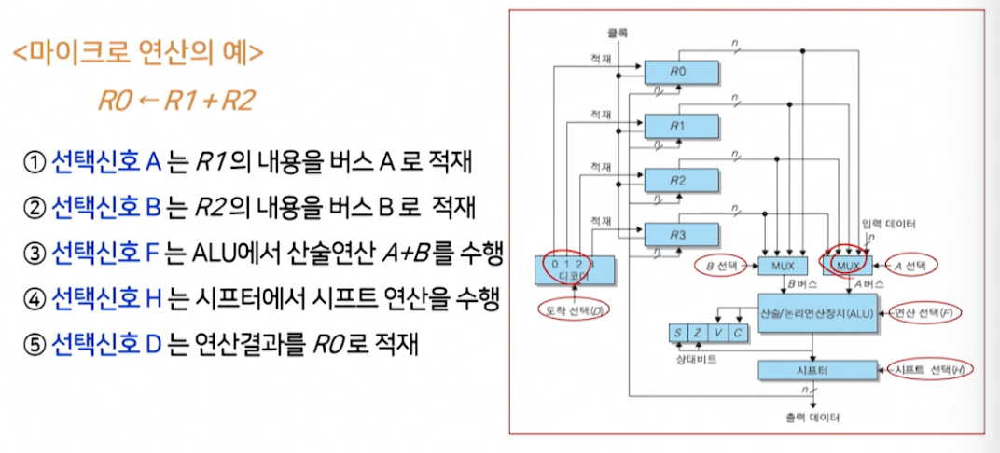

# 4강. 처리장치(1)

## 1. 처리장치의 개요

### 처리장치의 개요


- 중앙처리장치(CPU: Central Processing Unit)
  - 각종 데이터 처리를 위한 연산을 수행하는 **처리장치**와
  - 연산의 실행순서를 결정해주는 **제어장치**(5장에서 다룰 예정)가 결합된 형태

- 처리장치와 제어장치의 관계

  

- 처리장치의 구성

  - **산술논리연산장치**와 **레지스터**들로 구성
    - 산술논리연산장치(ALU: Arithmetic and Logic Unit)
      - 산술, 논리, 비트연산 등의 연산을 수행
    - 레지스터(Register)
      - 플립플롭을 저장 소자들을 모아서 만드는 연산에 사용되는 데이터나 연산의 결과를 저장
      - RAM과 레지스터의 차이점?
        - 레지스터는 디지털 논리회로로 만들어져있고 => 더 빠름!
        - RAM은 반도체 소자로 만들어짐
  - 산술논리연산장치는 독립적으로 데이터를 처리하지 못하며, 반드시 레지스터들과 조합하여 데이터를 처리
    - 대상 데이터들은 레지스터에 저장되어 있음


## 2. 마이크로 연산

### 마이크로 연산

- 마이크로 연산
  - 레지스터에 저장되어 있는 데이터에 대해 이루어지는 기본적인 연산
    - 한 레지스터의 내용을 다른 레지스터로 옮기는 것
    - 두 레지스터의 내용을 합하는 것
    - 레지스터의 내용을 1만큼 증가시키는 것 등
  - 처리장치의 동작원리를 이해하기 위해서는, 마이크로 연산을 이해해야 함
- 마이크로 연산의 종류
  - 레지스터 전송 마이크로 연산(register transfer micro-operation)
  - 산술 마이크로 연산(arithmetic micro-operation)
  - 논리 마이크로 연산(logic micro-operation)
  - 시프트 마이크로 연산(shift micro-operation)


#### (1) 레지스터 전송 마이크로 연산

- 레지스터의 표현

  

- 레지스터 전송 마이크로 연산

  - 한 레지스터에서 다른 레지스터로 2진 데이터를 전송하는 연산
    - 레지스터 사이의 데이터 전송은 연산자 '←' 로 표시

  

- 하드웨어적인 측면에서의 레지스터 전송

  - 레지스터 R1에서 R2로의 전송
  - n은 레지스터 크기(4비트 레지스터면 4, 8비트 레지스터면 8..)

  

- 레지스터 전송문

  

  

  - 앞의 그림을 조건문으로 표현하면?

    ```
    if (T1 = 1) then (R2 ← R1)
    ```

  - **레지스터 전송문으로 표현**하면? (마이크로 연산임)

    ```
    T1 : R2 ← R1
    ```

- 레지스터 전송문장에서 사용되는 기본적인 기호

  - AR(Address Register): 기억장치의 주소값을 저장하고 있는 레지스터
  - DR(Data Register): 데이터 저장하고 있는 레지스터
  - M(Memory)

  


#### (2) 산술 마이크로 연산

- 산술 마이크로 연산

  - 레지스터 내의 데이터에 대해서 실행되는 산술연산

    - 기본적인 산술연산으로는 덧셈, 뺄셈, 1증가, 1감소, 그리고 보수연산이 있음

    


#### (3) 논리 마이크로 연산

- 논리 마이크로 연산

  - 레지스터 내의 데이터에 대한 비트를 조작하는 연산

    - 기본적인 논리연산엔 AND, OR, NOT, XOR가 있음

    


#### (4) 시프트 마이크로 연산

- 시프트 마이크로 연산

  - 레지스터 내의 데이터를 시프트(shift) 시키는 연산

    - 데이터 측면이동에 사용

      

    - 시프트 연산을 수행하더라도 R2의 값은 변하지 않는다

    - sr이나 sl에 대해서 비트는 0으로 가정한다

    - 출력비트의 값은 버려진다


## 3. 처리장치의 구성요소

### 처리 장치의 구성요소

- 여러 개의 레지스터(레지스터 세트)
- 산술논리연산장치(ALU)
- 내부 버스(internal bus)
  - 레지스터간의 통로를 어떻게 구성하는지


#### 개요

- 간단한 처리장치의 내부 구성도

  - 레지스터 세트와 ALU 사이에 통로가 구성되는데, 이 통로가 내부 버스

  

- 처리장치의 동작

  - 마이크로 연산의 수행과정을 통해 처리장치가 동작

- 마이크로 연산의 수행과정(위의 내부 구성도 참고)

  1. 지정된 출발 레지스터의 내용이 ALU의 입력으로 전달
  2. ALU에서 그 연산을 실행
  3. 그 결과가 도착 레지스터에 전송

- 처리장치에서 마이크로 연산의 수행과정

  - 처리장치의 구성요소들의 선택신호에 의해 제어됨

    - 마이크로 연산의 예 / 마이크로 전송 표현

      ```
      R0 ← R1 + R2
      ```

      

#### 내부버스

- 내부버스

  

  - 레지스터들 간의 **데이터 전송**을 위한 **공통선로(통로)**의 집합

- 내부 버스를 구성하는 방법

  - 멀티플렉서와 디코더를 이용
    - **멀티플렉서**는 **출발** 레지스터 선택
    - **디코더**는 **도착** 레지스터 선택

- 네 레지스터의 버스시스템

  

- 간단한 내부 버스의 구성 및 동작 예

  - 마이크로 연산: R1 ← R0

    - R0, R1이 4비트 레지스터인 경우

    - 내부버스 구성을 위해 2 x 1 MUX 4개, 1 x 2 디코더 1개 필요

    - 마이크로 연산을 위해 **MUX의 선택신호는 0**(2진수), **디코더의 선택 신호는 1**(2진수) 부여

      

    