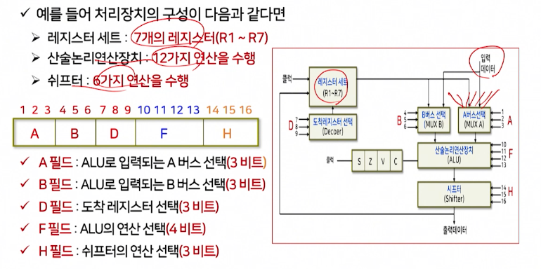
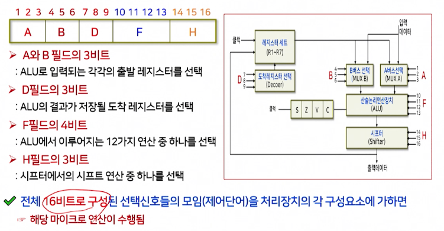
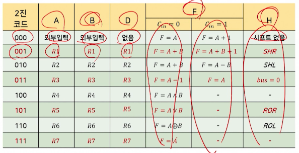
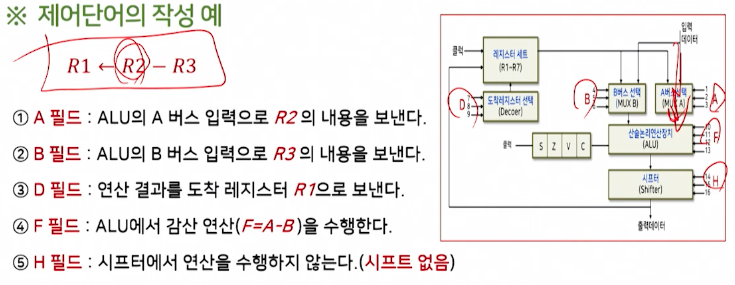
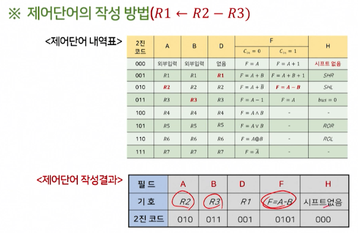
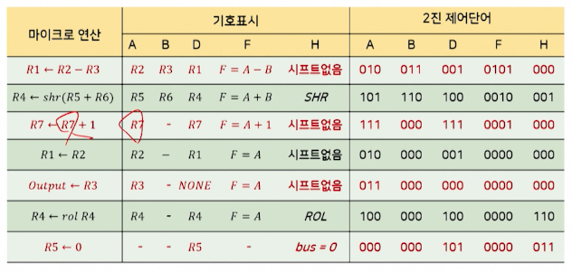

# 5강. 처리장치(II)

## 1. 산술논리연산장치

### 산술논리연산장치

- 산술연산과 논리연산을 실행하는 조합논리회로

  - 산술연산회로와 논리연산회로의 결합

  

- 산술연산회로

  - 여러 개의 전가산기(FA)를 연속적으로 연결한 병렬가산기로 구성
  - 병렬가산기로 들어가는 제어입력 값을 선택하여 여러 가지 형태의 산술연산을 실행

  

  -  산술연산의 종류

    

- 논리연산회로

  - 레지스터에 있는 각 비트를 독립된 2진 변수로 간주하여 비트별 연산을 실행
  - AND, OR, XOR, NOT 연산 등이 있으며, 이를 이용해 복잡한 연산을 유도

  

- 산술논리연산회로

  - 산술연산장치와 논리연산장치를 결합

  

  - ALU에 대한 연산표

    

## 2. 상태 레지스터

### 상태 레지스터

- 상태 레지스터(flag register)

  -  ALU에서 산술연산이 수행된 후 연산결과에 의해 나타나는 상태 값을 저장

    - 상태 레지스터는 C(carry bit), S(sign bit), Z(zero bit), V(overflow bit)로 구성

    

## 3. 시프터

### 시프(shifter)

- 시프터(shifter)

  - 입력 데이터의 모든 비트들을 각각 서로 이웃한 비트로 자리를 옮기는 시프트 연산을 수행

  

  - 시프터 연산의 종류

    

## 4. 제어단어

### 제어 단어

- 제어 단어(control word)

  - 제어 변수(선택 신호)들의 묶음

  - 선택 신호

    - 처리장치내에서 수행되는 마이크로 연산을 선택하는 변수
    - 처리 장치의 버스, ALU, 쉬프터, 도착 레지스터 등을 제어
    - 선택신호 즉, 제어변수가 특정한 마이크로 연산을 선택
    - 이러한 제어 변수들의 묶음을 제어단어(control word)라고 함

  - 제어 단어를 살펴보기 위해

    - 예를 들어 처리장치의 구성이 다음과 같다면
      - 레지스터 세트: 7개의 레지스터(R1 ~ R7)
      - 산술논리연산장치: 12가지 연산을 수행
      - 시프터: 6가지 연산을 수행
    - 제어단어를 구성하는 선택신호(제어변수)는?

  - 처리장치의 구조에서 선택신호와 제어단어의 구성

    

  - 제어단어의 내역

    

  - 제어단어 각 필드의 동작

    

  - 제어단어의 내역표

    

  - 제어단어의 작성 예

    

  - 제어 단어의 작성 방법

    

  - 여러 가지 마이크로 연산에 대한 제어단어의 예

    

- 제어 단어 생성을 위한 효과적인 방법

  - 작성된 제어단어를 기억장치에 저장하고, 기억장치의 출력을 처리장치의 각 구성요소의 선택신호로 연결
  - 이렇게 하면, 기억장치로부터 연속적인 제어단어를 읽음으로써 처리장치에서의 마이크로 연산이 정해진 순서대로, 연속적으로 수행된다.
    - 제어장치의 역할