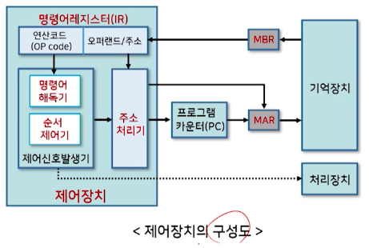

# 6강. 제어장치(I)

## 1. 제어장치의 개요

### 제어장치의 개요

- 제어장치의 정의

  - 컴퓨터시스템의 모든 장치들을 유기적으로 제어하는 장치

- 제어장치의 역할

  - 기억장치에 저장된 프로그램으로부터 명령어를 순차적으로 하나씩 읽어내어 연산코드 부분을 해독한 후, 그 결과에 따라 컴퓨터 시스템의 각 요소를 동작시키는 제어신호를 발생시켜 명령어를 수행한다
    - 하나의 명령어는 한 클럭 동안에 수행되는 마이크로 연산의 집합으로 구성
    - 명령어의 실행은 이러한 마이크로 연산의 연속적인 반복으로 이루어짐
  - 결국 제어장치는 요구되는 마이크로연산을 연속적으로 수행하게 하는 신호를 보내어 명령어를 수행하게 하는 역할을 한다

- 제어장치와 처리장치와의 관계

  

## 2. 제어장치의 구성

- 구성요소

  - 명령어 레지스터, 명령어 해독기, 순서 제어기, 주소 처리기

    

- 제어장치의 동작(명령어 수행과정)

  1. 프로그램카운터(PC)에 저장된 주소로 기억장치에 접근
  2. 기억장치에서 명령어를 읽어와 명령어 레지스터(IR)에 저장하고, 프로그램 카운터를 1 증가시킴
  3. 읽어온 명령어에서 연산코드는 명령어 해독기로, 오퍼랜드는 주소처리기로 보냄
  4. 주소처리기는 명령어 수행에 필요한 오퍼랜드의 주소 또는 다음 명령어의 주소를 계산
  5. 제어신호 발생기에서 연산코드를 해독하여 명령어 수행을 위한 제어신호를 발생

## 3. 제어장치의 구현방법

- - 

## 4. 마이크로프로그램에 의한 제어장치

