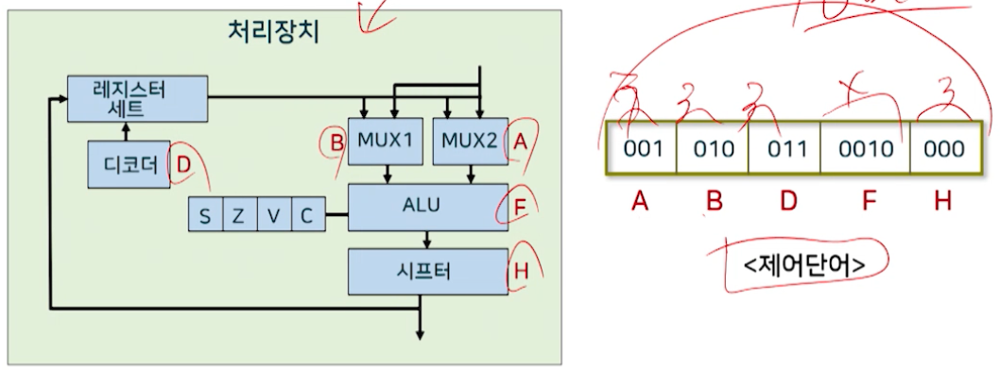
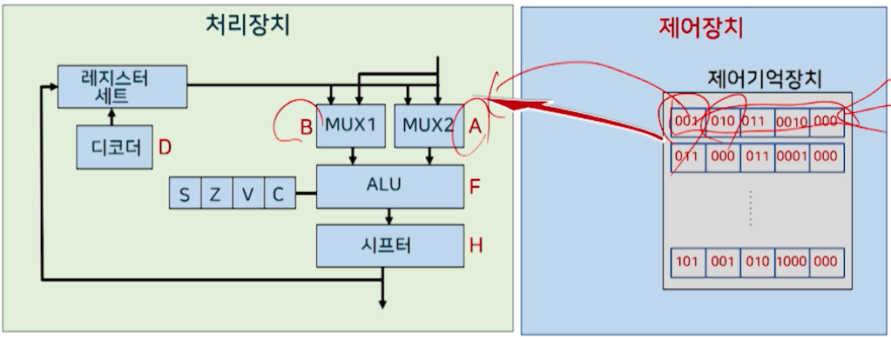
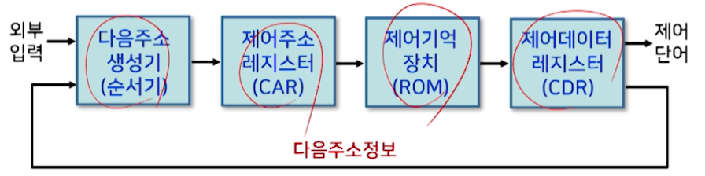
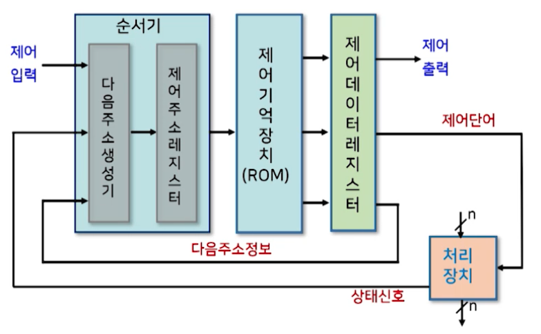

# 6강. 제어장치(I)

## 1. 제어장치의 개요

### 제어장치의 개요

- 제어장치의 정의

  - 컴퓨터시스템의 모든 장치들을 유기적으로 제어하는 장치

- 제어장치의 역할

  - 기억장치에 저장된 프로그램으로부터 명령어를 순차적으로 하나씩 읽어내어 연산코드 부분을 해독한 후, 그 결과에 따라 컴퓨터 시스템의 각 요소를 동작시키는 제어신호를 발생시켜 명령어를 수행한다
    - 하나의 명령어는 한 클럭 동안에 수행되는 마이크로 연산의 집합으로 구성
    - 명령어의 실행은 이러한 마이크로 연산의 연속적인 반복으로 이루어짐
  - 결국 제어장치는 요구되는 마이크로연산을 연속적으로 수행하게 하는 신호를 보내어 명령어를 수행하게 하는 역할을 한다

- 제어장치와 처리장치와의 관계

  

## 2. 제어장치의 구성

- 구성요소

  - 명령어 레지스터, 명령어 해독기, 순서 제어기, 주소 처리기

    

- 제어장치의 동작(명령어 수행과정)

  1. 프로그램카운터(PC)에 저장된 주소로 기억장치에 접근
  2. 기억장치에서 명령어를 읽어와 명령어 레지스터(IR)에 저장하고, 프로그램 카운터를 1 증가시킴
  3. 읽어온 명령어에서 연산코드는 명령어 해독기로, 오퍼랜드는 주소처리기로 보냄
  4. 주소처리기는 명령어 수행에 필요한 오퍼랜드의 주소 또는 다음 명령어의 주소를 계산
  5. 제어신호 발생기에서 연산코드를 해독하여 명령어 수행을 위한 제어신호를 발생

## 3. 제어장치의 구현방법

- 제어장치의 유형
  - 마이크로프로그램에 의한 제어장치
    - 제어단어와 같은 제어정보를 특별한 기억장치에 기억시킨 구조
    - 프로그램에 의한 제어방식
      - 장점: 제어신호를 수정하고자 할 때 융툥성이 뛰어남
      - 단점: 기억장치에서 명령을 인출하는 별도의 시간 때문에 속도가 느림
      - 고밀도 집적회로(VLSI)가 가능해 대부분의 컴퓨터에서 사용
  - 하드웨어에 의한 제어장치 
    - 순서회로와 같은 게이트와 플립플롭(flip-flop)으로 이루어짐
      - 장점: 순서회로로 구성되기 때문에 고속 동작이 가능
      - 단점: 회로의 동작방법이 바뀌면 다시 설계 해야 함
      - 특수한 컴퓨터에서 사용

## 4. 마이크로프로그램에 의한 제어장치

### 마이크로프로그램에 의한 제어

- 제어 방식

  - 제어변수 값들을 여러 개의 단어로 결합하여 표현하고, 그것을 연속적으로 읽어서 제어논리회로에 공급하여 동작시키는 방식

- 제어장치의 역할

  - 일련의 마이크로 연산을 순차적으로 수행하도록 제어
  - 이러한 제어를 위해 제어변수로서 제어단어를 사용

- 제어단어

  - 0과1의 스트링으로 표현
  - 각 제어단어에는 마이크로명령어(microinstruction)가 포함
    - 마이크로명령어는 하나 혹은 다수의 마이크로 연산을 나타냄
  - 제어단어를 이용해 처리장치의 여러 구성요소들이 특정 시점에서 연산을 시작하도록 프로그램이 가능

  

### 제어단어와 처리장치

### 제어장치의 구조

- 구성도(1)

  

- 구성요소

  - 제어기억장치
    - 모든 제어정보(제어신호)를 항상 저장하고 있는 기억장치(ROM)
  - 제어 주소레지스터(CAR: Control Address Register)
    - 제어기억장치에 있는 마이크로 명령어의 주소를 나타냄
  - 다음 주소 생성기(순서기)
    - 다음에 수행될 마이크로 명령어의 주소를 만들어 낸다
  - 제어 데이터레지스터(CDR: Control Data Register)
    - 제어기억장치에서 읽어온 마이크로 명령어를 저장하고 있다
    - 시스템의 간소화를 위해 일반적으로 생략

- 구성요소의 동작원리

  - 제어기억장치
    - 마이크로 명령어들이 저장되어 있음
    - 저장된 마이크로 명령어는 하나 또는 다수의 마이크로 연산을 나타내는 제어단어를 포함함
    - 마이크로 명령어가 모두 수행되고 나면, 다음에 수행될 마이크로 명령어의 주소를 결정해야 함
    - 다음 마이크로 명령어의 주소를 결정하기 위해서는 주소 정보가 현재의 마이크로 명령어 내에 한 비트 혹은 여러 비트로 있어야 함

  - 다음주소 생성기(순서기)
    - 다음에 수행될 마이크로 명령어의 주소를 만들어 냄
    - 이 주소는 다음 클럭 펄스가 입력될 때 CAR로 이동되어 ROM으로 부터 다음 마이크로 명령어를 읽어내는데 사용된다
    - 따라서 마이크로명령어 내에는 처리장치의 마이크로 연산을 실행시키는 제어 비트와 실행될 마이크로 명령어의 순서를 정하는 비트가 포함됨
    - 다음 마이크로 명령어의 주소는 순서기의 입력에 따라 다양한 방법으로 결정될 수 있다
      - CAR의 1 증가
      - 제어기억장치의 주소를 CAR로 적재
      - 외부로부터 온 주소를 CAR에 적재
      - 제어동작을 시작하는 초기주소 적재
  - 제어주소 레지스터(CAR)
    - 다음에 읽을 마이크로명령어의 주소를 제어하는 레지스터
  - 제어 데이터레지스터(CDR)
    - 다음 주소가 계산되어 다음 마이크로명령어가 제어기억장치로부터 읽혀질 때 까지 현재의 마이크로명령어를 저장

- 구성도(2)

  

- 구성도(3)

  

  - 처리장치
    - 레지스터 세트(R1~R7)
    - 산술논리연산장치
    - 시프터
    - 상태 레지스터(C, Z, S, V)
  - 제어장치
    - 제어기억장치(64x26 ROM)
    - 제어주소 레지스터(CAR)
    - MUX 1
    - MUX 2

- 제어장치의 동작

  - 제어기억장치에 저장된 마이크로명령어(제어단어 포함)에 의해 동작
  - 마이크로명령어의 내역 예
    - 모두 26비트로 구성됨
      - 처리장치 제어를 위한 16비트(제어단어)
      - 다음주소 선택을 위한 10비트
    - 26비트의 구체적인 내역
      - 16비트(1~16): 처리장치 제어를 위한 제어단어
      - 1비트(17): MUX1에서 외부에서 입력한 주소와 내부 마이크로명령어의 주소 중 하나를 선택
      - 3비트(18~20): MUX2의 8개 입력 중 하나를 선택
      - 6비트(21~26): ROM의 64 단어를 선택하기 위한 주소 비트

  1. CAR에 새로운 주소가 들어오면, 이 주소에 있는 26비트의 마이크로 명령어를 제어기억장치로부터 인출
  2. 마이크로 명령어의 제어단어는 CAR의 다음 동작을 결정
  3. 처리장치에서 해당하는 상태비트를 새로운 값으로 갱신하며, 다음 주소를 CAR로 전송
  4. CAR의 새로운 주소는 제어기억장치의 다음 마이크로명령어를 지정
  5. 이러한 과정을 각 클럭의 천이 때마다 반복

- 구성요소별 제어장치의 동작
  - MUX 1
    - 외부주소나 내부주소 중 하나를 선택
      - 선택 신호 = 0
        - 현재의 마이크로명령어의 주소부분을 CAR로 적재
      - 선택 신호 = 1
        - 외부주소를 CAR로 적재
  - MUX 2
    - 상태비트의 값에 따라 CAR의 동작을 결정