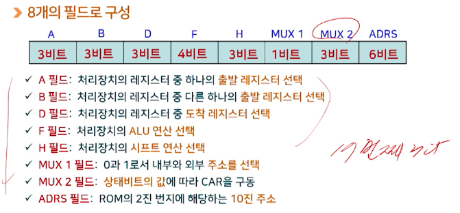

# 7강. 제어장치(2)

## 1. 마이크로명령어 형식

- 마이크로명령어
  - 마이크로프로그램에 의한 제어방식이나 제어기억장치에 있는 제어단어의 내역

- 마이크로명령어의 구성내역(26비트 예)

  

- 각 필드의 내역

  

- MUX2의 선택기능

  

- 마이크로 명령어의 예

  - 마이크로프로그램이 아님

    

    

    

    

    

    

## 2. 마이크로프로그램의 개념

## 3. 마이크로프로그램의 작성

- 마이크로프로그램이란?

  - 제어기억장치에 저장된 일련의 마이크로명령어들의 집합
    - 마이크로프로그램 루팅(microprogram routine)
  - 이러한 마이크로프로그램을 이용하여 제어장치를 구현
    - 마이크로프로그램에 의한 제어장치

- 작성 예

  

- 레지스터 전송문

  

- 기호 마이크로프로그램

  

- 2진 마이크로프로그램

  

- 마이크로프로그램의 개념
  - 제어장치 설계를 위한 시스템적인 접근 과정
  - 마이크로 명령어 형식을 설정하면 마이크로프로그램의 작성과정은 컴퓨터의 프로그램 작성과정과 유사
  - 이러한 이유로 펌웨어(firmware)라고도 함

## 4. 하드웨어에 의한 제어

- 하드웨어에 의한 제어장치

  - 주어진 시간에 처리장치에서 수행할 마이크로연산을 결정해주는 제어상태를 갖는 순서회로

- 블럭도

  

- 제어장치의 설계

  - 입력신호들에 따라 출력신호들을 발생하도록 내부논리 설계
  - 각 제어신호에 대한 부울 표현식이 입력함수로 구현
  - 결국 제어장치의 설계는 순서회로의 설계
  - 일반적으로 제어순서의 상태도를 이용하여 설계

- 제어장치의 구현 방법

  - 상태 플립-플롭을 이용한 제어방식
  - 순차 레지스터와 디코더를 이용한 제어방식

- 상태 플립-플롭을 이용한 제어방식의 구성도

  

- 순서 레지스터와 디코더를 이용한 제어

  - 레지스터: 제어상태의 순서를 정하는데 사용
  - 디코더: 각 상태마다 하나의 출력만을 나오도록 사용
  - n-비트 순서 레지스터: n개의 플립-플롭과 게이트로 구성

  - 구성도

    

- 장점

  - 순서회로를 사용함으로써 부품의 수는 최소화 되고, 동작속도는 극대화 된다

- 단점

  - 시스템이 복잡해지면 설계까 어렵고, 한번 구성되면 바꾸기가 어렵다

- RISC 방식에 사용