# 8강. 중앙처리장치(1)

## 1. 중앙처리장치의 개요

### 중앙처리장치(CPU)

- 컴퓨터에서 명령어를 수행하고 데이터를 처리하는 장치
- 프로그램이 수행되는 전반적인 과정을 제어
- 처리장치와 제어장치로 구성

## 2. 중앙처리장치의 내부 구조

### 구성 요소

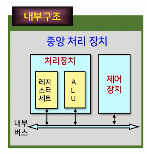

- 산술논리연산장치
- 레지스터 세트
- 제어 장치
- 내부 버스

### 중앙처리장치의 구성요소

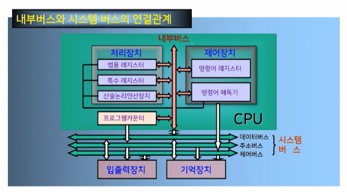

- 산술논리연산장치(ALU)
  - 구성요소
    - 산술연산장치, 논리연산장치, 시프터, 상태 레지스터, 보수기
- 상태 레지스터(status/flag register)
  - 연산결과의 상태를 나타내는 플래그(flag)를 저장하는 레지스터
- 보수기(complementar)
  - ALU 내의 데이터에 대해 보수연산을 수행

- 레지스터 세트

  - CPU내의 레지스터 집합
  - 기억장치 중 액세스 속도가 가장 빠름
  - 따라서 CPU에서의 빠른 처리속도를 지원
  - 빠른 속도를 갖지만, 가격이 비싸므로 CPU 내의 레지스터 수는 제한됨

- 제어장치

  - 프로그램에 의한 연산의 순서대로 기억장치, 연산장치, 입출력장치에 제어신호를 발생한다

  - 제어장치의 동작
    - 1단계: 명령어를 해독하고, 명령어 레지스터에 저장
    - 2단계: 명령어 레지스터에 저장된 명령어 실행

- 내부버스

  - ALU와 레지스터 간의 데이터 전송을 위한 통로
    - 데이터 버스와 제어버스로 구성
  - 외부장치(기억장치, 입출력장치)와 데이터 전송
    - 시스템 버스와 연결
    - 시스템 버스: 데이터, 주소, 제어 버스로 구성

## 3. 레지스터

### 레지스터의 종류

- 범용 레지스터(general purpose register)
  - 데이터를 일시적으로 저장
- 특수 레지스터(special purpose register)
  - 특수한 기능을 수행

### 범용 레지스터

- 데이터 저장과 같은 일반적인 목적을 위한 레지스터
- CPU 내부에 있는 소규모의 일시적인 기억장치로, 프로그램의 진행 도중 가까운 시간 내에 사용할 데이터나 연산결과를 일시적으로 기억시키는데 사용
- 데이터를 연산할 때 메모리로부터 데이터를 인출할 경우, 호출 시간이 많이 걸리기 떄문에 CPU 내부의 레지스터에 데이터를 기억시켜두고 연산한다

### 범용 레지스터의 형태

- 대형컴퓨터의 경우에는 스크래치패드 메모리 구조 사용하기도 함

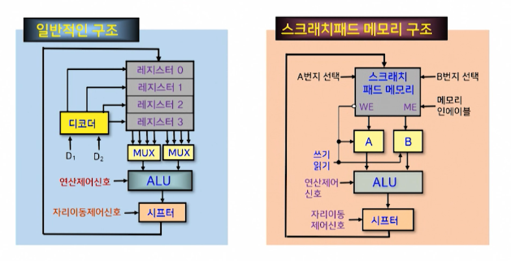

### 특수 레지스터

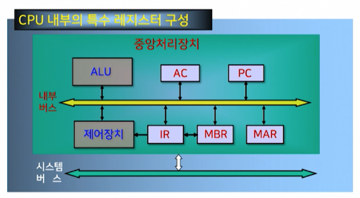

(1) **주소를** 기억하는 레지스터 (AR)

(2) **명령어**를 기억하는 레지스터 (IR)

(3) **데이터**를 기억하는 레지스터 (DR)

#### (1) 주소를 기억하는 레지스터

- 프로그램 카운터(PC: program counter)
  - 다음에 수행되어질 명령어가 있는 주소를 갖고 있다
    - 즉, 데이터가 저장되어 있는 기억장치의 주소를 지정
  - 현재 처리하려고 하는 데이터를 인출한 후에는 자동적으로 1이 증가됨
  - 프로그램 카운터의 비트 수는 기억장치의 용량에 따라 결정된다. 
    - 기억장치의 전체 영역이 256MByte면(2^28)라면 프로그램카운터의 비트 수는 28비트

- 기억장치 주소 레지스터(MAR: Memory Address Register)
  - 기억장치 주소를 임시 저장하는 레지스터
- 스택 포인터(SP: Stack Pointer)
  - 스택 주소지정방식에 사용
  - 스택 영역의 번지를 지정해 주는 포인터
  - 스택 영역은 실제로 데이터가 피신되는 기억 장소로써 기억장치에 위치한다
  - 프로그램 카운터와 같은 크기의 비트 수를 가짐
- 제어 주소 레지스터(CR: Control Address Register)
  - 제어기억장치에 있는 마이크로명령어의 주소를 나타낸다
- 인덱스 레지스터(XR: indeX Register)
  - 인덱스된 주소지정방식에서 사용된다
  - 명령어의 주소 영역에 대한 상대적인 변윗값을 저장하는데 사용
- 베이스 레지스터(BR: Base Register)
  - 베이스 레지스터 주소지정방식에서 사용된다
  - 명령어의 주소 부분에 저장된 변윗값에 더해질 기준주소를 저장하는데 사용

#### (2) 명령어를 기억하는 레지스터

- 명령어 레지스터(IR: Instruction Register)
  - 프로그램의 수행 중 가장 최근에 기억장치로부터 인출되어진 명령어를 갖고 있다
  - 명령어 레지스터의 비트 수는 명령어의 연산코드의 비트 수와 같다
  - 명령어 레지스터에 있는 명령어는 명령어 해독기(decoder)에 의해 해독된 후 그 명령어에 해당되는 제어신호가 각 구성요소에 전달된다.

#### (3) 데이터를 기억하는 레지스터

- 기억 장치 버퍼 레지스터(MBR: Memory Buffer Register)
  - 기억장치로 쓰여질 데이터나 혹은 기억장치로부터 읽혀질 데이터를 임시로 젖아하는 레지스ㄷ
- 누산기(AC: Accumulator)
  - 데이터를 일시적으로 저장하는 레지스터
  - 입력장치로부터 데이터를 받아들이거나, 출력장치로 데이터를 전송하는데 사용
  - 산술 및 논리 연산이 이루어질 경우에는 오퍼랜드나 연산 결과를 일시적으로 기억하는 레지스터
  - CPU가 연산을 수행한 후 그 결과는 반드시 누산기에 저장

## 4. 명령어 사이클

### 명령어 사이클의 개념

- 컴퓨터의 기본적인 기능은 기억장치에 기억되어 있는 프로그램을 실행하는 것
  - 실행되는 프로그램은 명령어로 구성
- 따라서 중앙처리장치는 기억장치에 저장되어 있는 명령어를 인출하여 실행함으로써 프로그램을 수행
- 이러한 명령어의 수행과정을 명령어 사이클이라 함

### 중앙처리장치에서의 명령어 수행과정은

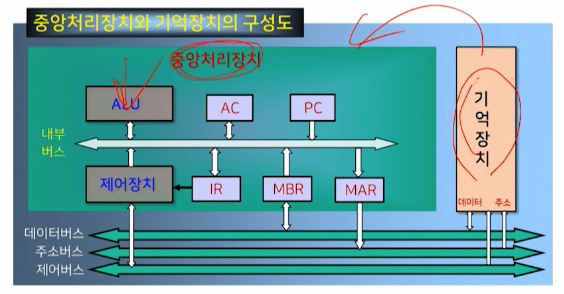

- 기억장치에 중앙처리장치의 레지스터들의 동작을 통해 살펴볼 수 있다

### 명령어 사이클(instruction cycle)

- 한 개의 명령어를 CPU에서 수행하는 데 필요한 전체 수행 과정

### 명령어 사이클의 종류

- 인출 사이클(fetch)
- 실행 사이클(execute)
- 간접 사이클(indirect)
- 인터럽트 사이클(inturrupt)

### 명령어 수행과정

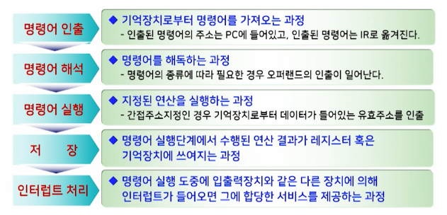

### 기억장치에 저장되어 있는 명령어를 인출하는 과정

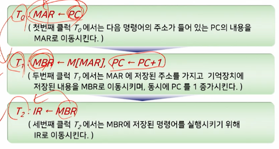

### 명령어 인출 사이클

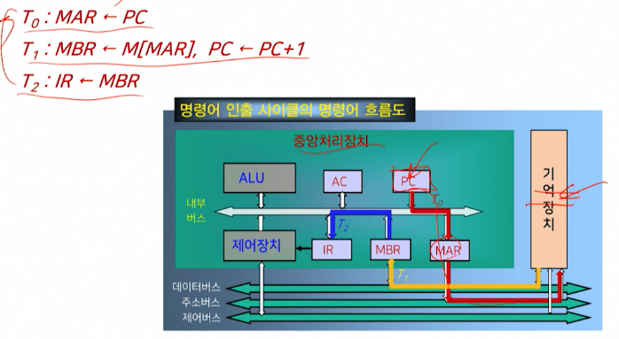

### 명령어를 실행하는 과정

- 이 과정에서는 명령어 인출과정을 통해 IR 레지스터에 실린 명령어를 해독하고, 해독한 명령어에 따라 필요한 연산 수행
- 수행되는 연산들의 기능
  - 데이터의 이동 기능: 기억장치와 CPU 또는 입출력장치 사이에 데이터의 이동
  - 데이터의 처리 기능: 산술 혹은 논리연산을 통한 데이터 처리
  - 데이터의 저장 기능: 연산결과를 기억장치에 저장
  - 제어 기능: 프로그램의 실행 순서 결정

#### (1) LOAD 명령어

- LOAD 명령어의 실행 사잉클

  - 데이터 이동을 위한 명령어

  - 원하는 기억장치의 데이터를 CPU의 내부 레지스터인 누산기로 가져오는 명령

    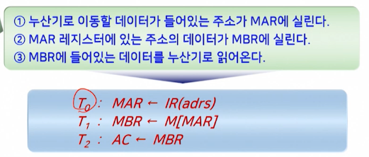

    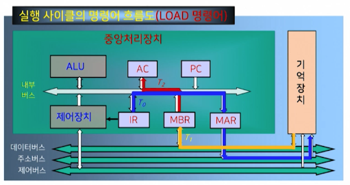

#### (2) ADD 명령어

- ADD 명령어의 실행 사이클

  - 데이터 처리명령어로서, 누산기에 있는 데이터와 기억 장치에 있는 데이터를 더한 후에 그 결과를 누산기에 저장하는 명령어

    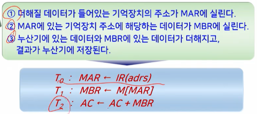

#### (3) STORE 명령어

- STORE 명령어의 실행 사이클

  - 연산 결과를 갖고 있는 누산기의 데이터를 기억장치에 저장하는 동작 수행

    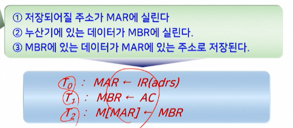

#### (4) 분기 혹은 점프 명령어

- 분기 및 점프 명령어의 실행 사이클

  - 분기(branch)와 점프 명령어는 제어기능을 수행하는 명령어

  - 프로그램의 순서를 바꾸는 명령어.

    - 즉, 다음에 수행할 명령어는 PC가 가지는 주소의 명령어가 아니라, 분기 혹은 점프 명령어에 있는 주소에 해당하는 명령어

    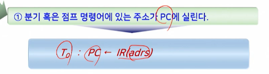

### 간접 사이클

- 간접주소지정방식에서 명령어 오퍼랜드의 유효주소를 결정하는 과정

  - 인출 사이클에서 인출된 명령어가 간접주소지정방식을 사용하면, 간접 사이클이 실행 사이클보다 먼저 실행됨

    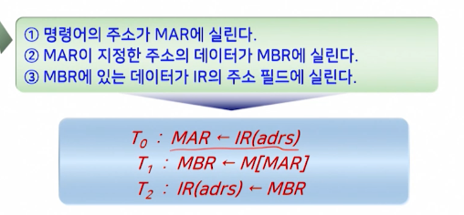

### 인터럽트 사이클

- CPU의 정상적인 동작 중에 인터럽트 요청이 발생했을 때 실행되는 과정

  - 실행 사잉클이 끝난 직후에 인터럽트가 발생했는지를 검사하며, 발생했다면 인터럽트 서비스 루틴(ISR: Interrupt Service Routine)이 시작되도록 하는것

  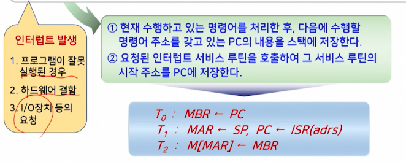