# 9강. 중앙처리장치(2)

## 1. 간단한 구조의 컴퓨터 설계

### 설계 과정

- 기본적인 컴퓨터 구성 설계
- 컴퓨터 명령어 설계
- 명령어 분석을 통한 제어논리 설계
- 하드웨어에 의한 제어장치 설계

### 기본적인 컴퓨터 구성 설계

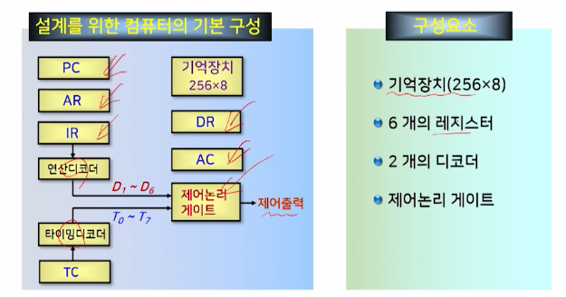

- 컴퓨터 설계를 위한 레지스터

  

### 컴퓨터 명령어 설계

- 6개의 명령어

  - 실제 연산코드에 필요한 비트 수는 사용하는 연산의 총 수와 관련됨
  - 즉, 2^n 개의 연산을 수행하기 위해서는 최소한 n 비트가 필요하다

  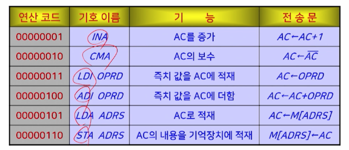

### 명령어 분석을 통한 제어논리 설계

#### (1) 명령어 인출 단계

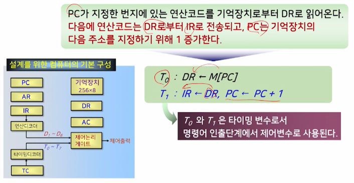

#### (2-1) 명령어 실행 단계(예: INA 명령어)

- Increment Accumulator

  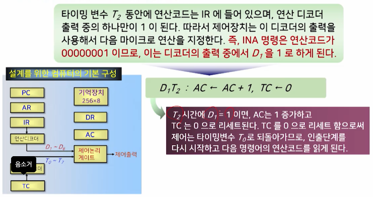

#### (2-2) 명령어 실행 단계(예: LDI OPRD 명령어)

- LDI: Load Immediately

  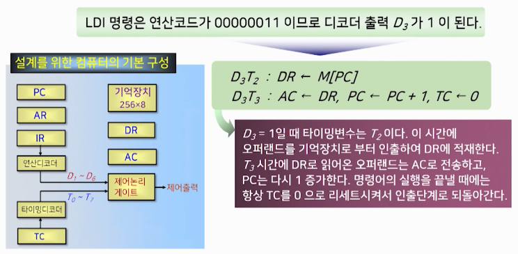

#### (2-3) 명령어 실행 단계(예. LDA ADRS 명령어)

- Load Accumulator

  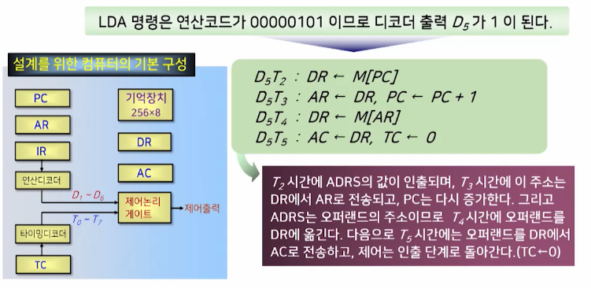

#### 명령어의 전체 수행과정

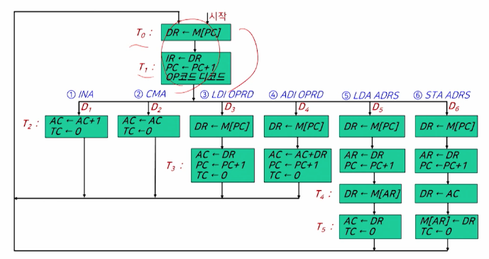

### 하드웨어에 의한 제어장치 설계

#### 마이크로 전송문, 마이크로 연산, 제어 함수

- 레지스터 전송표현
  - 컴퓨터 명령어가 수행하는 연산 정의, 컴퓨터의 내부 동작을 나타내는데 유용한 방법
  - 전송문에서 나타낸 제어 함수와 마이크로 연산이 디지털 시스템을 설계하는데 사용됨
- 마이크로 연산
  - 레지스터의 종류와 데이터 처리장치에서 수행해야 할 디지털 함수를 나타내며, 제어 함수는 제어장치에 필요한 제어논리 게이트를 나타냄
- 제어 함수
  - 논리 게이트들을 이용한 논리 회로로 구현할 수 있으며, 이렇게 구현된 제어논리들이 마이크로연산을 수행하게 되기 때문에 하드웨어에 의한 제어장치를 구현할 수 있게 됨

#### 제어함수의 유도

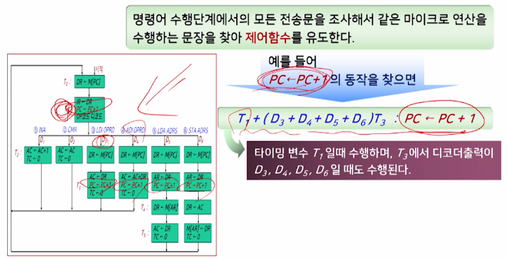

#### 제어함수의 하드웨어 구현

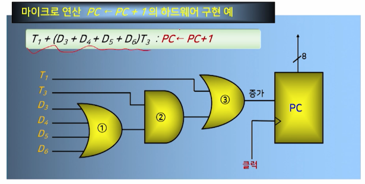

#### 간단한 컴퓨터의 설계를 위한 제어함수

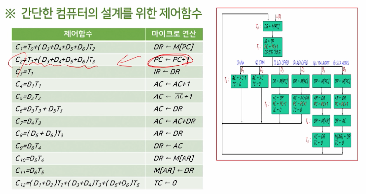

#### 제어함수를 구현한 제어논리

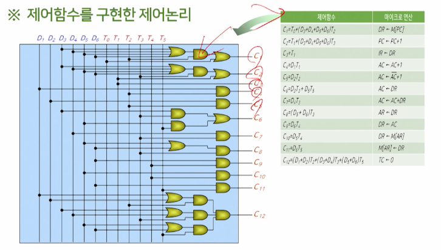

#### 제어함수를 이용한 컴퓨터 설계

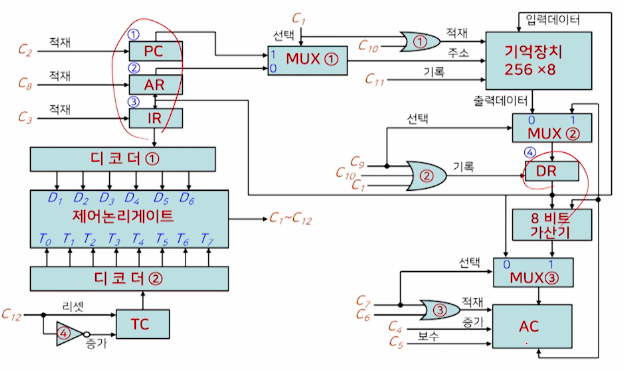

## 2. 명령어 파이프라이닝

### 파이프라이닝(pipelining)

- 어떤 일을 실행하는데 있어서 하나의 일을 여러 단계로 나누어, 중첩되게 실행함으로써 성능을 높이는 방법

### 명령어 파이프라이닝(instruction pipelining)

- CPU의 처리속도를 향상시키기 위한 방법 중의 하나로서, CPU의 내부 하드웨어를 여러 단계로 나누어 처리하는 기술
  - 하나의 처리기를 여러 개의 부 처리기로 나누어 각각의 처리기가 서로 다른 데이터를 처리하는 구조
- 명령어 파이프라이닝을 명령어 수행 사이클에 적용하면,
  - 여러 개의 명령어가 중첩되어 실행되도록 구현할 수 있음

### 명령어 파이프라이닝 방법

- 2단계 명령어 파이프라인
- 4단계 명령어 파이프라인
- 6단계 명령어 파이프라인

#### (1) 2단계 명령어 파이프라인

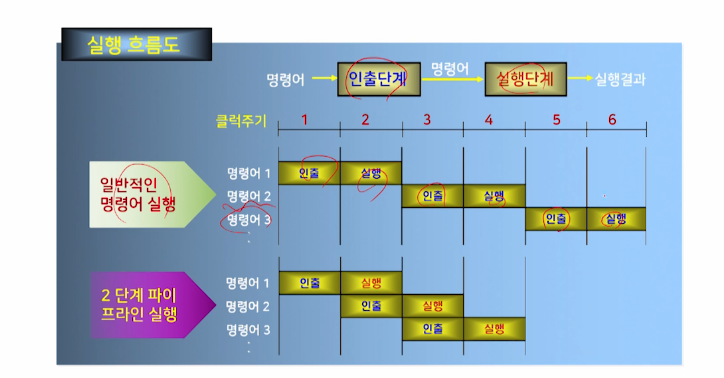

- 2가지 단계
  - 명령어 인출 단계
  - 명령어 실행 단계
- 2단계 명령어 파이프라인의 실행과 문제점
  - 실행속도
    - 명령어의 수행을 인출과 실행 단계가 중첩되도록 하면 명령어의 처리 속도를 2배 향상할 수 있음
  - 문제점
    - 2단계 명령어 파이프라인은 두 단계의 처리시간이 항상 동일해야 한다는 제약이 발생
  - 해소책
    - 파이프라인의 각 단계의 수를 늘려서 각 단계의 처리시간을 같게 한다
    - 즉, 단계의 세분화를 통해 각 단계 간의 시간 차이를 최소화 하는 것

#### (2) 4단계 명령어 파이프라인

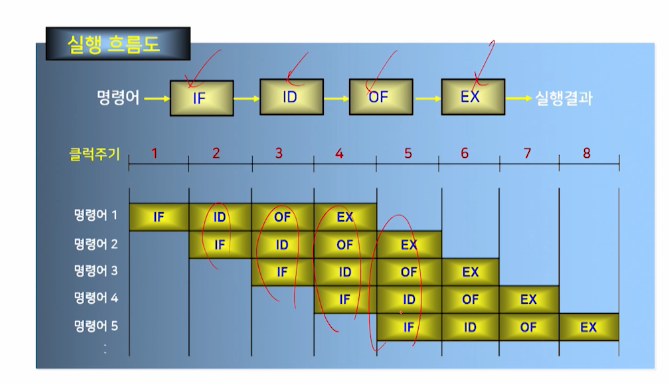

- 4가지 단계
  - 명령어 인출 단계(IF)
  - 명령어 해독 단계(ID)
  - 오퍼랜드 인출 단계(OF)
  - 명령어 실행 단계(EX)
- 4단계 명령어 파이프라인의 실행
  - 실행과정
    - 두 번째 클럭 주기에서부터 명령어 단계가 중첩되어 처리되며, 최대 4개의 단계들이 동시에 처리된다.
  - 실행속도
    - 2단계 명령어 파이프라인에 비하면 더 많은 단계의 중첩으로 인해 처리 속도가 향상될 수 있다

#### (3) 6단계 명령어 파이프라인

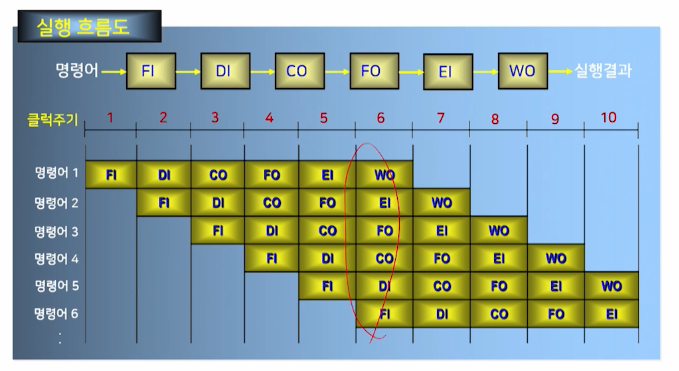

- 6가지 단계

  - 명령어를 인출하는 단계 **FI(Fetch Instruction)**

  - 명령어를 해독하는 단계 **DI(Decode Instruction)**

  - 오퍼랜드를 계산하는 단계 **CO(Calculate Operand)**

  - 오퍼랜드를 인출하는 단게 **FO(Fetch Operand)**
  - 명령어를 실행하는 단계 **EI(Execute Instruction)**
  - 연산된 결과 오퍼랜드를 저장하는 단계 **WO(Write Operand)**

- 6단계 명령어 파이프라인의 실행

  - 실행과정
    - 최대 6개의 명령어 단계가 동시에 처리됨
  - 실행속도
    - 2단계, 4단계에 비해 더 많은 단계의 중첩으로 처리 속도가 더욱 향상될 수 있음

- 속도 향상을 위한 조건

  

  - 모든 단계에서의 실행시간이 같아야 한다
  - 래치시간이 각 단계의 실행시간보다 무시할 정도로 작아야 한다
  - 실행되어야 할 명령어 수가 많아야 한다

## 3. CISC와 RISC의 비교

### 명령어 세트의 복잡성에 따라

- CICS(Complex Instruction Set Computer)
- RISC(Reduced Instruction Set Computer)

### 명령어 세트

- CICS
  - 명령어에 따라 다양한 길이를 갖는 가변길이 명령어 형식을 사용
  - 명령어 수행 시간이 1클럭에서 많게는 수백 클럭까지 수요됨
  - 약 200개 이상의 명령어를 갖고 있다
- RISC
  - 고정 길이의 명령어 형식을 사용하기 때문에 명령어 집합이 단순
  - 모든 명령어가 1 워드 단위로 고정되어 있기 때문에, 한 개의 명령어를 수행하는데 1개의 클럭만이 소요됨
  - 약 30여개의 명령어만 가지고 있음

### 제어장치의 구성

- CISC
  - 마이크로프로그램에 의한 제어방식으로 제어장치를 구성
- RISC
  - 하드웨어에 의한 제어방식으로 제어장치를 구성

### 레지스터 구조

- CISC
  - CPU 내부에 범용 레지스터의 수가 적다
  - 기억장치에 있는 데이터를 액세스하기 위해서는 기억장치 접근이 자주 발생하며, 이는 컴퓨터의 성능저햐의 요인이 됨
- RISC
  - CPU 내부에 많은 수(약 32개에서 200여 개)의 범용 레지스터가 있따
  - 처리하고자 하는 데이터를 미리 CPU의 내부 레지스터로 가져와서 실행할 수 있으므로 처리 속도의 향상을 도모할 수 있음

### 파이프라인 적용 효율

- CISC
  - 명령어의 길이가 가변적이므로 각 단계별 처리시간을 동일하게 해 주는 것이 어려우므로 파이프라인 구조에서는 비효율적이 됨
- RISC
  - 명령어가 고정길이 명령어이기 때문에, 각 단계별 처리시간을 동일하게 해 주는 것이 용이하므로 파이프랑니 구조에 효율적으로 사용됨

