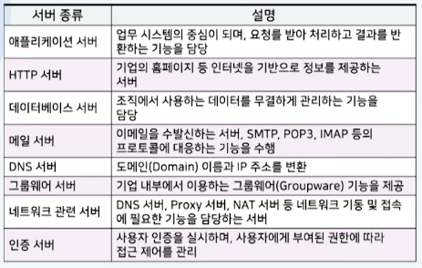
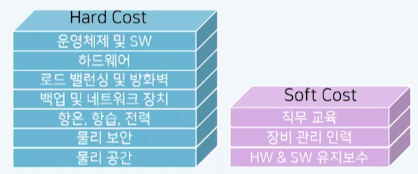
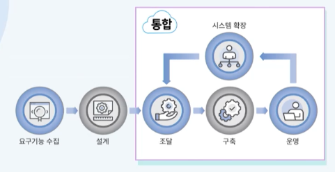
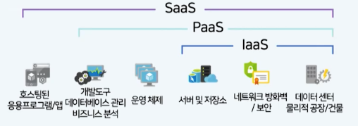

# 02강. 온프레미스와 클라우드

## 1. 온프레미스 시스템 구성 및 구축 과정

### 온프레미스(On-Premise)

- 온프레미스의 정의
  - 정보 서비스 제공에 요구되는 데이터 센터(하드웨어 및 소프트웨어 설비)를 자체적으로 보유하고 운용하는 방식
- 클라우드 컴퓨팅 기술이 나오기 전까지의 기업의 인프라 구축의 일반적인 방식
- 개인 혹은 기업이 IT 서비스를 제공하기 위하여 구축한 서버
- 이메일, 온라인 예약, 온라인 쇼핑, 미디어 스트리밍 등 다양한 서비스에 응용되어 옴

### 기업의 일반적인 시스템 구성

### 온프레미스 시스템 구축 단계

#### 요구기능 수집

- IT 리소스 요구량 추정(용량 계획) 및 추가 리소스 확보 계획 수립

#### 설계

- 구체적 하드웨어 및 소프트웨어 선정 및 아키텍처 작성

#### 조달

- IT 리소스별 벤더(vendor)사 선정 및 의뢰, 협상
- 발주에서 조달까지 2-3주 소요

#### 구축

- 하드웨어 배치, 연결 및 테스트, 소프트웨어 설정
- 기업내의 기술력과 경험을 갖춘 인력 자원 활용(전문가 필수)

#### 운영

- H/W, S/W 자산의 관리 및 모니터링, 데이터 백업, 시스템 보안 대응
- 시설관리, H/W 임대, 유지 보수, 네트워크 관리, 운영 담당자 인건비 등 다양한 요소의 부대비용 발생

### IT 리소스 요구량

- **자원 관리 비용을 최소화**하고 **응답 시간을 최소화**하기 위한 고려

- 리소스 요구량 추정이 매우 어려움

- 사용자가 늘어나면 더 파악하기 어려워짐

### IT 리소스의 요구량 대비 제공량

- 결핍 상태: 리소스 제공량이 서비스 요구량에 미달된 상태

  

- 잉여 상태: 리소스 제공량이 서비스 요구량을 초과한 상태

  

### 유동적 요구량에 따른 리소스 잉여/결핍 상태

- 시간대나 날짜에 따라서 사용자가 달라지고, 따라서 요구량도 달라짐

  

- 제공량 결정

  

  - 가장 사용자가 많이 몰리는 시간대에 맞춰서 제공량을 결정해야 함: 피크타입 요구량
  - 잉여량이 많이 발생할 수 밖에 없음

- 이상적인 IT 리소스 제공량

  - 온프레미스 방식에서는 불가능

  

### 온프레미스 시스템 구축 및 운영 비용

- 직접 비용(Hard Cost)
  - IT 장비 또는 장비 도입을 위한 외주 비용
- 간접 비용(Soft Cost)
  - IT 장비를 사용하기 위해 사용되는 유지비용 및 기회비용
  - 교육비 등

## 2. 클라우드 기반 시스템 구축

### 온프레미스와 클라우드 시스템 구축 단계 비교

### SLA(Service Level Agreement)

- IT 리소스를 대여하는 클라우드 서비스 제공자가 사용자에게 제공하는 서비스의 수준을 정량화 하여 명확하게 제시하고, 미달하는 경우 손해 배상하도록 하는 서비스 품질 보장 계약

### 온프레미스와 클라우드 시스템 비용 비교

- CapEx(자본 지출)
  - 물리적인 인프라에 대한 초기비용 지출
  - 시간에 지남에 따른 납입 고지서에 비용을 공제하는 지출 방식
- OpEx(운영 지출)
  - 현재 서비스 또는 제품에 대해 균등하게 지출되어 청구되는 비용
  - **초기 비용 없이** 사용하는 서비스 또는 렌탈 제품에 대한 지불 방식
- **클라우드는 IT 리소스 사용에 필요한 비용을 CapEx 에서 OpEx로 전환**

## 3. 클라우드 컴퓨팅 이용 방식

### 클라우드 컴퓨팅 이용 방식

- 클라우드 컴퓨터 서비스 모델

  - IaaS: H/W 리소스를 제공
  - PaaS: H/W 리소스와 OS, S/W 개발을 위한 다양한 도구도 같이 제공
  - SaaS: H/W 리소스와  OS, S/W 모두 제공

  

### 클라우드 컴퓨팅 이용 방식의 적용 사례

- IaaS
  - Netflix는 자체적인 스트리밍 기술을 AWS 클라우드 환경에서 구동
- PaaS
  - Google App Engine은 애플리케이션을 빌드하고 배포가 가능한 플랫폼 환경을 제공
  - 포켓몬 게임을 경우 PostgreSQL 서버 기반의 데이터베이스를 사용하여 플레이어의 데이터를 관리
- SaaS
  - 구글 워크스페이스, notion, Replit 등 대중화된 애플리케이션

### 클라우드 시스템 배포 모델

#### 1. 퍼블릭 클라우드

- 다수의 사용자가 클라우드 제공자가 공급하는 서버 및 저장소와 같은 IT 리소스를 공유하여 사용하는 모델
- Azure, AWS 등

#### 2. 프라이빗 클라우드

- 단일 조직이 독점적으로 데이터 센터를 구축하고 독점적으로 사용하는 모델

#### 3. 하이브리드 클라우드

- 2개 이상의 CSP의 퍼블릭 클라우드와 인프라와 조직 내 구성된 프라이빗 클라우드 인프라가 결합된 모델
- 평소에는 프라이빗 클라우드로 이용 하다가, 갑자기 이용자가 폭증하면 일부만 퍼블릭으로 옮겨서 늘어난 사용자에 필요한 자원 대응

- **멀티 클라우드**(최근에 부상)
  - 애플리케이션 및 서비스를 분산시키기 위해 2개 이상의 퍼블릭 클라우드, 2개 이상의 프라이빗 클라우드, 퍼블릭과 프라이빗 클라우드의 조합 등 여러 클라우드의 조합을 활용하는 클라우드 컴퓨팅 모델
  - 하이브리드 클라우드보다 확장된 개념 - aws 이용하고 있지만, 혹시 문제가 생길 수 있으므로 대체재를 함께 사용하는 것. 다양한 형태의 배포 모델을 두개 이상 결합해서 사용하는 것

#### 4. 커뮤니티 클라우드

- 업무와 기능이 유사한 경우, 조직들 간의 파트너수비을 맺고 공동으로 접근하고 사용하는 모델
  - 은행 등

