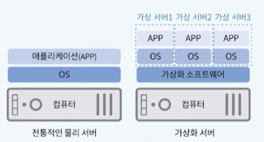
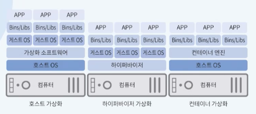
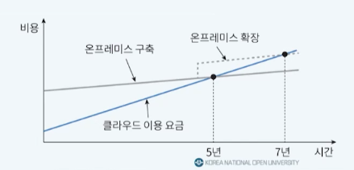
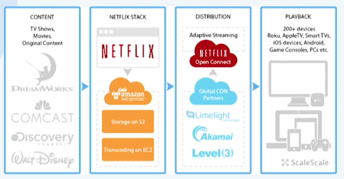

# 3강. 클라우드 컴퓨팅의 특징

## 1. 클라우드 컴퓨팅의 장점과 도입효과

### 클라우드 컴퓨팅의 장점

- 대내외적으로 발생한느 변화에 신속하게 대처하기 위해 적응하고, 진화할 수 있는 역량인 민첩성은 지속적이고 새로운 정보 서비스를 요구 받는 기업에게 필수 요소
- 클라우드 컴퓨팅의 특성
  - 탄력성(elasticity)
  - 신속성(agility)
  - 경제성(economy)
  - 가용성(availability)과 신뢰성(reliability)

#### (1) 탄력성

- 소비자에게 온디맨드 방식으로 IT 리소스를 실시간 및 동적으로 할당 가능
  - 정보 시슽메 구성에 요구되는 하드웨어, 소프트웨어의 구입 및 유지비용인 초기 대규모 IT 투자비용 절감

#### (2) 신속성

- 마우스 클릭 몇 회 수준으로 즉각적으로 시스템 구축 가능
- 온프레미스와 달리 서비스 CSP(인프라 엔지니어)와 소통이 없이 시스템적으로 리소스 할당이 자동화되어 있는 것이 특징

#### (3) 경제성

- H/W와 S/W를 소유하지 않고 원하는 기능을 사용하고자 하는 시간만큼만 사용하고 비용 지불
- S/W와 데이터를 클라우드에서 통합 관리하여 S/W 업데이트 작업 및 데이터의 유지보수 효율성을 높여 비용을 절감

#### (4) 가용성과 신뢰성

- 사용량 임곗값(threshold)에 도달했을 때 탄력적 IT 리소스를 제공하여 **예측 불가능한 요구량** 발생 시 서비스 중단 등의 문제 발생 억제
- **가용성**
  - IT 리소스가 **중단없이 작동하고 있을 확률**
  - 가용성이 높을 수록 장치에 오랜 시간 동안 접근이 가능
- **신뢰성**
  - **서비스가 정상 작동할 확률**, 즉 데이터 손실이나 잘못된 결과를 산출하지 않는 상태를 지속할 수 있는 비율
  - 시스템 장애의 발생을 대비하여 백업 및 복구 체계가 갖춰져야 신뢰성 보장이 가능

### 클라우드 컴퓨팅 도입효과

- 비용절감
  - 구축 비용이 거의 필요 없으며, 도입 비용을 큰 폭으로 감축
  - 도움에 필요한 시간을 단축하고, 유지 보수에 투입되는 리소스를 감소
- 인력문제 해소
  - IT에 투자하는 경영 리소스를 최소화
  - 시스템 운영 및 유지보수에 소요되는 리소스 감소
  - 핵심 역량(core confidence)에 경영 리소스를 집중

## 2. 클라우드 컴퓨팅 관련 기술

### 클러스터링 기술

- **고속의 네트워크로 동기화**되어 **단일 시스템인 것처럼** 동작하는 독립적인 IT 리소스 그룹
  - 작은 여러 개의 리소스들이 클러스터를 형성하는 것
- 이중화와 장애복구 기능이 내장되어 가용성과 신뢰성을 갖춘 클러스터 컴퓨터를 구성하는데 사용
- 전통적으로 동일한 하드웨어와 OS 기반에서 구성된다
  - 강하게 결합되었다
  - Homogeneous 환경
- 병렬 컴퓨팅, 분산 컴퓨팅기술이 클러스터링 기술에 같이 이용되었다

### 그리드 컴퓨팅 기술

- 컴퓨팅 리소스가 플랫폼 상에서 논리적 리소스풀로 등록되어 풀에 포함된 리소스가 집합적으로 고성능의 컴퓨팅 환경을 제공하는 기술
- 리소스의 결합성이 아주 작고, 서로 다른 기종의 리소스들이 물리적으로 분산되어 있음
  - Heterogeneous 환경
  - 약결합 형태의 시스템

### 가상화 기술

- 클러스트링과 그리드 컴퓨팅과는 패러다임적으로 다름
  - 분산된 리소스가 단일 시스템인 것처럼 동작하게 하는 것이 클러스트링/그리드 컴퓨팅
  - 단일 시스템이 서로 다른 여러 시스템인 것처럼 보이게 하는 것이 가상화 기술
- 물리적 컴퓨터 상에 가상 인스턴스(또는 가상 머신)를 생성하는 목적으로 사용되는 기술
- 각각의 사용자에게 실제 IT 리소스와 동일한 논리적 CPU, 메모리, 저장상치가 할당

### 가상화 방식의 종류

- 호스트 가상화
  - 호스트 OS가 있고, 그 위에 에뮬레이터(가상화 소프트웨어), 그 위에 게스트 OS, 그 위에 어플리케이션이 동작
  - 요새는 잘 안 쓰임
- 하이퍼바이저 가상화
  - 호스트 OS와 가상화 소프트웨어의 기능을 "하이퍼바이저"가 한 번에 함
- 컨테이너 가상화
  - 호스트 OS가 구동되고, 그 위에 컨테이너 엔진이 동작하게 되면, 게스트 OS 없이 곧 바로 어플리케이션을 설치하여 운용할 수 있도록 하는 것

### 서버리스 컴퓨팅 기술

- 서버를 생성, 구성, 또는 유지관리 하지 않고도 애플리케이션 코드를 실행할 수 있는 환경
- 사용자 요청을 처리하고 결과를 제공하는 과정에서만 풀에서 서버가 할당되고 사용자 요청이 없을 때는 서버를 반환
- 애플리케이션이 일부 작업에 의해 트리거 될 때 실행되는 별도의 기능으로 분리

## 3. 클라우드 컴퓨팅의 단점

### 보안 취약성 증가

- 데이터 보안의 책임이 클라우드 제공자와 공유됨
  - 기업의 데이터가 클라우드의 IT 리소스에 저장
- 보안 취약점(vulnerability) 증가
  - 클라우드와 사용자를 연결하는 네트워크의 다운, 악의적인 공격자의 통신 도청, 중간자 공격, 스푸핑 등의 공격을 받을 리스크 증가

### 책임 소재의 불분명

- 지리적 확장에 따른 네트워크 전달 단계의 증가로 지연시간 발생 및 잠재적 대역폭 제약 문제가 발생
  - 사용자는 온프레미스 환경의 IT 리소스보다 낮은 수준의 제어권한을 가지기 때문에 문제 발생 시 적극적인 직접 대응이 불가능

### 제한된 이식성과 규제 및 법적 이슈

- 제정된 산업 표준 또는 국제 표준의 부재
  - 서비스가 CSP에 의해 독점적으로 제공
  - 도입된 클라우드 서비스에 반강제적으로 종속된 솔루션을 구축
  - 한 CSP에서 다른 CSP로 이동하는 것이 어려운 lock-in 가능성
- 퍼블릭 클라우드의 경우 데이터와 비즈니스 로직이 저장되는 실제 위치를 모르기 때문에 기업이 속한 협회 또는 정부의 개인정보 보호 및 데이터 저장소 정책에 관한 규제와 관련하여 심각한 법적 문제가 생길 수 있음
  - 개인 정보 및 정보보호에 관해서는 클라우드 컴퓨팅 이용 시 세심한 판단이 필요

### 과도한 비용 지출

- 장기간에 걸쳐 시스템을 계속 사용하는 경우 또는 대규모 시스템을 구축하고 운용하는 경우
- 기존 온프레미스 시스템의 수정이나 데이터 마이그레이션에 필요한 숨은 비용이 발생하는 경우

## 4. 클라우드 컴퓨팅 적용 사례

### 넷플릭스

- DB 오류로 서비스가 장시간(일주일정도..) 중단되는 문제를 겪은 후 2008년에 클라우드 컴퓨팅으로 마이그레이션을 시작
  - 가용성, 신뢰성 문제 발생 -> 가입자 이탈

- 2015년 고객관련 서비스를 포함한 모든 서비스를 전면 클라우드 시스템으로 제공
- 자체 스트리밍 기술을 보유
  - 이를 클라우드 환경에 구동하기 위해서 컴퓨팅 리소스에 대한 일정 수준의 제어 권한만 있으면 되는 IaaS 선택

#### 넷플릭스 시스템 구조

#### 클라우드 도입에 따른 변화

- 2008년 대비 이용 회원 수 30배, 시청량은 1000배 이상 증가
- 수 만대 가상 서버와 페타바이트급 저장 용량을 수 분내 처리
  - 탄력성과 가용성
- 넷플릭스 제공 영역
  - 북미 -> 전세계