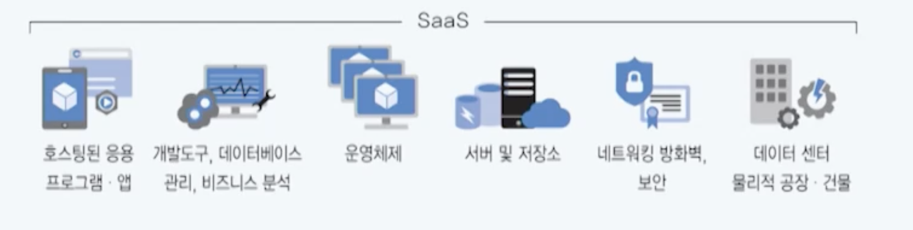
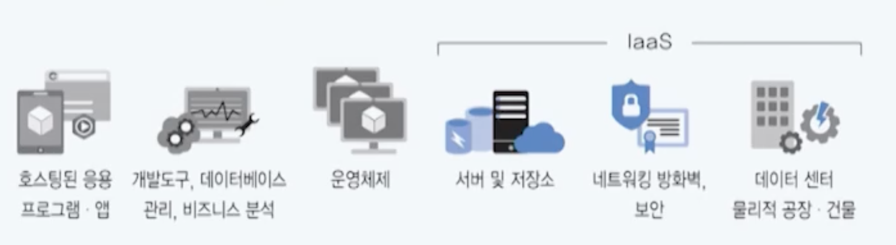
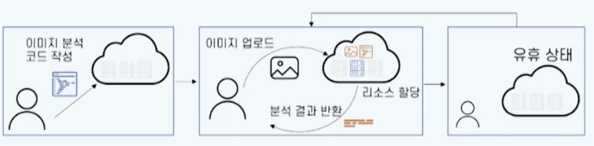

# 05강. 클라우드 이용 모델

## 1. 클라우드 서비스 모델

### 클라우드 서비스 모델의 정의

- CSP가 제공하는 IT 리소스의 서비스 수준에 따른 구분
- NIST의 클라우드 서비스 모델 분류

### 소프트웨어 실행 스택

### 서비스 모델에 따른 관리 영역

###  SaaS

- 사용자에게 소프트웨어를 가상화하여 제공하는 모델

  - 대부분 웹 브라우저를 통해 소프트웨어를 실행하며, 사용자 측에서 다운로드 및 설치를 필요로 하지 않음

- SaaS의 서비스 영역

  

- SaaS 주요사례
  - 구글 워크스페이스
  - 노션
  - replit

### PaaS 모델

- 사용자가 직접 소프트웨어 개발 및 애플리케이션 실행을 위해 클라우드 제공자로부터 기반 환경인 플랫폼을 제공받는 모델

- PaaS의 서비스 영역

  

- PaaS 주요사례

  - 기업이 독자적으로 소프트웨어를 개발하거나 서비스를 제공하기 위해 PaaS를 사용

    

### IaaS 모델

- 사용자가 요구한 IT 리소스를 가상화하여 제공하는 모델

  - 운영하는 서비스에 요구되는 사항들을 상세히 명시
  - 사용자가 인프라와 관련된 IT 리소스에 대해 고수준의 제어 권한을 소유

- IaaS의 서비스 영역

  

- IaaS 주요 사례
  - 가상 머신(VM)

### FaaS 모델

- Function as a Service

- 대규모 시스템을 구성하는 개별 기능, 비즈니스 로직, 혹은 함수를 클라우드에 등록하고 실행 시 요구되는 IT 리소스를 CSP 측에서 관리하는 모델

  - 서버리스 컴퓨팅의 기반

  

- 주요 FaaS

  

  - MS Azure Functions
  - AWS lambda
  - Google Cloud Functions

### CaaS 모델

- Container as a Service
- 사용자가 컨테이너 및 클러스터를 구동하기 위한 IT 리소스 및 기술을 제공
  - 컨테이너: 애플리케이션과 이를 구동하는데 요구되는 리소스(라이브러리, 바이너리, ... etc )를 묶은 패키지
  - 다양한 환경에서 오류 없이 사용 가능
- 대표적인 서비스
  - MS Azure AKS(Azure Kubernetes Service)
  - AWS EC2(Elastic Container Service)

### IaaS vs CaaS vs FaaS

## 2. 클라우드 배포 모델

### 클라우드 배포 모델의 이해

- 애플리케이션을 배포할 수 있는 클라우드 환경에 따른 분류
- NIST의 클라우드 배포 모델 분류
  - Private, Community, Public, Hybrid

### 퍼블릭 클라우드

- CSP가 네트워크를 통해 일반 사용자 및 기업(조직)이 이용할 수 있도록 컴퓨팅 리소스를 운영하는 모델

### 프라이빗 클라우드

- 하나의 기업이나 조직이 독립적으로 컴퓨팅 리소스를 점유하는 형태의 배포 모델
  - 호스팅형: CSP가 프라이빗 클라우드 구성하고 유지 보수하는 형태
  - 관리형: 사설 클라우드의 설정 및 관리를 CSP 측에서 제공해주는 형태

### 하이브리드 클라우드

- 퍼블릭 클라우드와 프라이빗 클라우드 혹은 온프레미스 환경을 결합한 모델

### 멀티 클라우드

- 퍼블릭 클라우드와 프라이빗 클라우드 혹은 온프레미스 환경을 결합한 모델
- 퍼블릭클라우드와 퍼블릭 클라우드, 퍼블릭 클라우드와 프라이빗 클라우드

- 멀티클라우드와 하이브리드 클라우드는 유사하지만, 차이점도 있음
- 멀티 클라우드를 쓸 수 있도록 도와주는 플랫폼 서비스들도 있음
  - 메가존 등..
  - 퍼블릭클라우드와 퍼블릭 클라우드, 퍼블릭 클라우드와 프라이빗 클라우드 등 다양한 클라우드를 함께 쓸 수 있게 도와줌

### 커뮤니티 클라우드

- 공통의 보안 요구사항이 있는 여러 기업 및 조직 내의 구성원들의 커뮤니티가 독점적으로 사용될 수 있도록 컴퓨팅 리소스를 관리하는 모델
- 예
  - 보험, 은행업 등 
  - 그들만 사용할 수 있는 IDC를 만들고, 함께 사용하지만 해당 사업 이상으로는 넘어가지 않게 하는 것
  - 뉴욕 증권가 