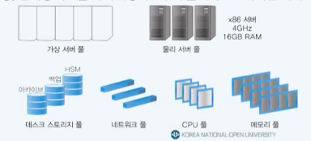
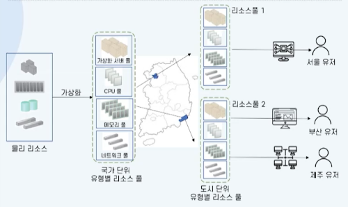
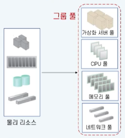
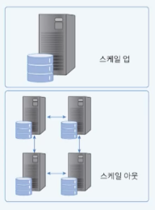
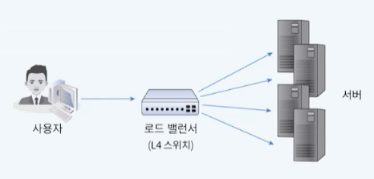
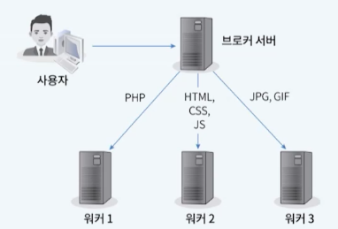

# 10강. 클라우드 아키텍처 1

## 1. 클라우드 아키텍처의 이해

### 클라우드 아키텍처 선행 개념

- 서비스 오케스트레이션
  - 자동화된 리소스 프로비저닝
  - 리소스 배치를 자동화하기위한 설정, 관리, 조정작업
- 클라우드 서비스 관리
  - 경영 지원
    - 리소스 과금, 감사 정책
  - 프로비저닝/구성
    - 리소스 배치, 변경, 모니터링, SLA 관리
  - 이식성/상호 운영성
    - 타 시스템으로의 데이터, 소프트웨어 이전
    - 2개 이상의 시스템 간의 원활한 정보교환

### 클라우드 아키텍처의 정의

- 클라우드 아키텍처링(Architecturing)
  - 클라우드 기반 정보 서비스 설계 시 서비스 오케스트레이션 및 클라우드 서비스를 고려하여 가장 먼저 수행
  - 안정적인 서비스를 위해 서비스 대상과 리스크를 분석하고 컴퓨팅 리소스를 적절하게 배치 및 설계하는 과정
- 클라우드 서비스의 효율성과 가용성을 높이는 아키텍처
  - 리소스 풀링
  - 로드 밸런싱
  - 오토 스케일링
  - 클라우드 버스팅

### 클라우드 아키텍처의 목적

- 클라우드 아키텍처링 없이 서비스를 진행할 경우
  - 서비스를 요청하는 사용자의 급작스러운 증가 대처 불가
  - 컴퓨팅 리소스의 문제 발생시 대처 불가
- 과도한 초기 컴퓨팅 리소스 설계 시
  - 클라우드 사용 비용 증가
- 소극적인 초기 컴퓨팅 리소스 설계 시
  - 사용자의 접속 폭증하는 경우 서비스 응답 지연, 접속 불능으로 서비스 만족도 저하

### 서비스 고가용성 전략

- 고가용성(HA: High Availability)
  - 서버와 네트워크, 프로그램 등의 시스템이 오랜 기간 동안 지속적으로 정상 운영이 가능한 ㅌ그성
  - 5nines(99.999%)는 1년에 5분 15초 이하의 장애시간만 허용하는 매우 높은 수준의 HA
- HA 확보 방안
  - 다중 애플리케이션 서버와 부하 분산
  - 데이터베이스 혹은 스토리지의 이중화
  - 여러 지리적 위치에 따른 서비스 배치

- 리소스 풀링, 로드 밸런싱, 클라우드 버스팅과 같은 기법사용

## 2. 리소스 풀링과 로드 밸런싱

### 리소스 풀링

- 사용자 요청 발생 시 즉시 리소스 풀로부터 리소스를 사용하고 사용 종료 후 리소스를 반환하는 과정

- 리소스 풀

  - **즉시 사용할 수 있는** 서버, 스토리지 등의 **리소스를 담아 두는 공간**
  - 확장, 탄력성 확보를 위해 사용자로부터 **물리적으로 가까운 위치**에 구성

  

### 리소스 풀링의 특징

- 리소스의 풀 내의 자원들의 특징
  - 물리적 위치를 알 수 없음(IDC의 특정 서버, 스토리지 내부의 지리적 위치 등)
  - 사용이 용이하도록 **추상화**되어 있음
  - 서비스나 프로그램에 의해 자유롭게 사용되고 해제됨
- 리소스 풀 구성
  - 도시, 국가 단위의 계층적 구조
  - 계층적 구성으로 사용자가 리소스를 요청했을 때 인접한 리소스를 즉시 사용하기가 용이

### 리소스 풀의 구조화

### 그룹 풀

- 리소스 유형별로 모아 놓은 풀 여러 개를 큰 풀로 묶는 것

  

  - 유연한 계층적 구성이 가능
  - 풀 간의 분리, 풀 내에서의 공유
  - 액세스 제어 및 위임
  - 리소스를 하드웨어에서 분리

### 리소스 풀 모니터링

- 클라우드에서 리소스를 빌려 쓰되 사용자는 사용한 만큼 비용을 지불

  - 리소스 풀의 사용량을 감시

- 리소스 풀에 있는 리소스의 가용성을 확인하는 역할

  

### 로드 밸런싱의 이해

- 사용자의 요청을 **여러 대의 서버로 분산**시키는 기법

  - 갑작스러운 이용자의 증가
  - 서비스의 확장/축소

- 운용중인 서버나 시스템의 용량과 성능을 확장/축소

  - 스케일링(scaling)

  - 일반적으로 스케일 아웃 방식

    

### 스케일링 방식 비교

| 수직 스케일링                                                |        | 수평 스케일링                                                |
| ------------------------------------------------------------ | ------ | ------------------------------------------------------------ |
|  | 구성   |  |
| - CPU 변경, RAM 추가 등으로 하드웨어 장비의 성능을 높임 - 수직확장이며, 성능 확장에 한계가 있음 | 확장성 | - 하나의 장비에서 처리하던 일을 여러 장비에 나누어 처리 - 수평확장이며, 지속적 확장 가능 |
| 성능증가에 따른 비용증가폭이 큼                              | 비용   | 비교적 저렴한 서버 사용으로 비용 부담이 적음                 |
| 한 대의 서버에 부하가 집중되어 장애 영향도가 큼              | 장애   | - 읽기 쓰기가 여러 대의 서버에 분산되어 처리 - 장애 시 전면 장애의 가능성이 적음 |

### 로드 밸런싱의 역할

- 로드 밸런서가 여러 대의 서버에 요청을 배분

  - 작업 부하를 분산 시켜 한 서버에 작업이 집중되지 않게 하는 기능

  

  

