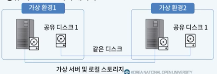

# 11강. 클라우드 아키텍처2

## 1. 오토 스케일링

### 오토 스케일링(auto scaling)의 개념

- 사용자의 증가/감소에 따라 스케일링을 통한 리소스의 유동적 변화가 필요
  - 수평 스케일링 자동화
  - 리소스 풀링 + 로드 밸런싱
- 요구 기술
  - **클라우드 사용량 모니터**
    - 리소스 사용량 감시
    - 임곗값 설정 및 수행 작업 지정
  - 자동 확장 리스너
    - 모니터링 중 특정 상황 발생시 이벤트를 전달
    - 갑작스러운 사용량 증가 시 리소스풀에서 사용하고 마무리시 반환

### 자동 확장 리스너 동작 예시

- CPU 사용률에 따른 자동화된 동작 지정
  - CPU 사용률 90% 초과 시 
    - 가상 서버 추가 및 로드 밸런서에 연결
  - CPU 사용률 30% 미만 시
    - 종료 스크립트에 따라 가상 서버 로드 밸런서에서 분리
    - 가상 서버 반환

## 2. 클라우드 버스팅

### 클라우드 버스팅(cloud bursting)의 개념

- 프라이빗 클라우드를 사용하는 환경에 적용
- 시스템이 **처리량을 감당할 수 없는 상황**에서 **일시적**으로 퍼블릭 클라우드에 이관하여 시스템의 처리 성능을 향상
  - 프라이빗 클라우드 환경의 서비스 구조와 동일한 구성을 퍼블릭 클라우드에 구성
  - 임곗값 등 **클라우드 버스팅 사용 조건 설정** 및 이관 대상 데이터와 애플리케이션 지정
  - 프라이빗 클라우드의 데이터 및 애플리케이션을 퍼블릭 클라우드로 전송

### 버스트 아웃 / 버스트 인

- 버스트 아웃: 퍼블릭 클라우드로 확장
- 버스트 인: 프라이빗 클라우드로 축소

### 클라우드버스팅 동작 단계

- 데이터 복제 시(주의)
  - 보안 및 규정 요구사항 준수 여부 확인
  - 대량의 데이터 이관으로 서비스 대기 시간 위험 고려

## 3. 무중단 서비스 재배치

### 정보 서비스 환경

- 포털 서비스, 금융 서비스 등과 같은 사용자가 상시 이용하는 기초 서비스는 시스템 중단이 없는 환경을 요구
  - 24/365 정책 수립
  - 사용자 접속 불능 시 서비스 품질 및 신뢰도 저하
- 불가피한 시스템의 중단
  - 사용자의 요청이 클라우드 서버가 처리 가능한 용량을 벗어난 경우
  - 유지 보수를 위한 일시적인 다운 타임이 필요한 경우
  - 신규 물리 서버로 이관하는 경우
- 무중단 서비스 재배치를 통해 다운 타임 **최소화**

### 무중단 서비스를 위한 대응

- 온프레미스 환경
  - 이중화 서버 구조 구축 => 서버 구매, 구성, 유지보수 비용 발생
  - **이중화 방식**
    - 액티브-액티브
      - 둘 다 활성화 상태로 서비스 제공이 가능한 상태로 유지
    - 액티브-스탠바이:핫/웜/콜드 스탠바이
      - 하나는 서비스 제공중이고, 하나는 스탠바이
      - 유지보수 비용이 상대적으로 절감됨
      - 대기시간이 일정 부분 일어날 수도 있음 => 따라서 핫 스탠바이(전원 켜진 상태로 대기)
- 클라우드 환경
  - 새 가상 서버를 생성하고 동작중인 서버를 복제
  - 이중화 구조를 지원하여 다운 타임 최소화

### 클라우드 환경에서의 무중단 서비스 재배치

- 다운 타임을 요구하는 작업 발생 시
  - 가상화 인프라 관리자가 새로운 물리 서버들에 있는 하이퍼바이저에게 새로운 VM 생성 요구
  - VM 생성 완료 시 기존 서버에서 동작하는 VM을 복제해 새로운 VM으로 사용자 프로그램을 이관

### 가상 디스크 이관

- 가상 디스크 2가지 구성 방식
  - 가상 서버 디스크가 로컬 스토리지 타입 또는 비공유 디스크인 경우
  - 가상 서버에 디스크가 원격 공유 디스크인 경우
- 로컬과 공유 디스크의 적절한 데이터 분배가 중요
  - 로컬: OS와 프로그램 코어 파일, 자주 접근되는 데이터, 데이터베이스 등
  - 공유 디스크: 그 외 데이터

