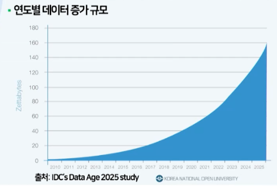
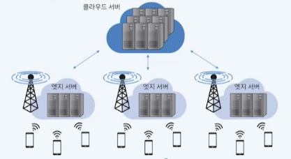
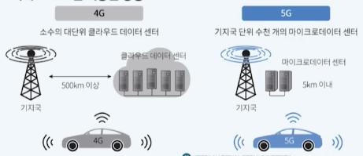
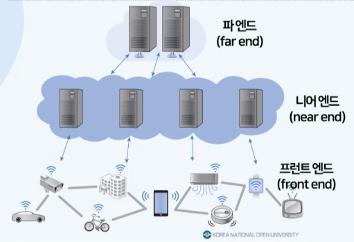
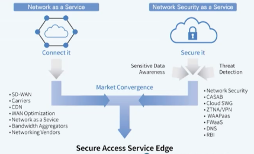
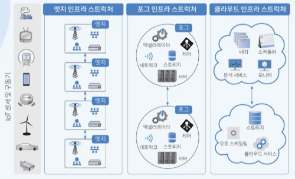
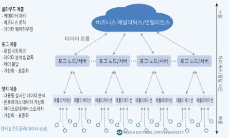
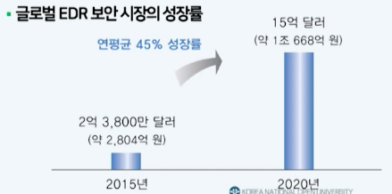
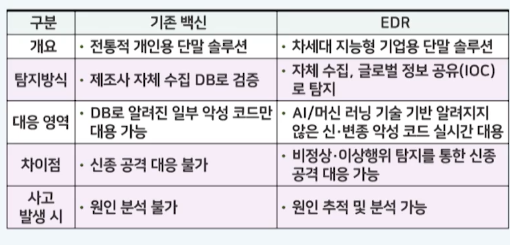

# 12강. 클라우드 컴퓨팅의 미래

## 1. 엣지 컴퓨팅

### 엣지 컴퓨팅의 배경

- 2025년 전 세계 데이터 생성 규모는 163제타 바이트로 추정

  - 연도별 데이터 증가 규모

    

### 데이터 관리 관점에서 클라우드의 단점

- 데이터 생성 규모가 막대해 이를 데이터 센터로 전송하고 결과를 받는 과정에서 지연현상이 발생
- 클라우드 환경의 IT 리소스로 모든 데이터를 처리할 경우 네트워크 등 과부하 발생
- 해결방안
  - 엔드포인트 단말기의 물리적 위치와 인접한 곳에서 컴퓨팅을 수행해 요청자에 대한 반응시간(response time)을 단축
  - 클라우드와는 다른 엔드포인트의 인접한 위치의 클라우드와 유사한 리소스가 요구

### 엣지(edge) 컴퓨팅의 정의

- 데이터 센터와 단말 기기 사이에 위치한 계층
- 데이터 폭증에 따라 단말 기기에 가까운 곳의 엣지 서버에서 일부 데이터를 처리하는 기술

### 엣지 컴퓨팅 응용 사례

- 구글 스태디아
  - 2019년 고사양 컴퓨터 없이 게임을 즐길 수 있는 클라우드 게임 서비스
  - 7,500개 이상의 엣지 노드를 구축하여 다운로드와 설치가 필요 없이 4k 화질의 고사양 그래픽 게임을 60프레임으로 개인 pc, 노트북, tv, 스마트폰 등에서 플레이 가능

- 자율 주행 자동차

  

  - 클라우드 컴퓨팅 기반의 경우 80ms 이상의 지연 현상 발생
    - 최소 1.2m 이상 이동한 상황
  - 엣지 컴퓨팅 기반의 경우 5ms 이내의 지연 현상 발생
    - 최대 10cm만 이동한 상황

### 엣지 컴퓨팅의 구조

### 엣지 컴퓨팅의 보안

- 클라우드 컴퓨팅 서비스를 도입한 기업 중 엣지 디바이스(IoT) 관련 데이터 유출 보고 15% -> 26% 증가

### SASE의 개념

- 2019년 가트너(Gartner)가 클라우드 환경에 적용하기 위한 네트워크 보안 기술
- NaaS와 NSaaS를 결합
- 엣지 계층의 WAN에 여러 가지 네트워크 보안 요소를 통합한 네트워크 아키텍처
  - 네트워크, 네트워크 보안 서비스 및 방화벽 서비스를 특화
  - 5가지 주요 기술: CASB, SWG, ZTNA, SD-WAN, FWaaS

## 2. 포그 컴퓨팅

### 포그 컴퓨팅의 개념

- 시스코 사에 의해 최초로 제안
- 포그(fog)는 사전적으로 지표의 온도 저하로 수증기가 작은 물입자의 상태로 공중 저지대에 분포
- 포그 계층은 사전적 의미와 유사하게 엣지와 클라우드 데이터 센터 사이에 위치
  - 컴퓨팅 리소스를 파 엔드와 프론트 엔드 계층 사이에 배치해 중간 단계에서 데이터를 처리하는 방식

### 포그 컴퓨팅의 구성

- 엣지 보다는 조금 더 고성능, 좀 더 넓은 구역을 처리하는 클라우드컴퓨팅이다

### 데이터 처리 스택

- 더 고성능의 컴퓨터 리소스가 필요할 경우 점차적으로 상위 계층으로 데이터를 전송

  

### 포그 컴퓨팅의 보안

- 인공지능 기반 EDR(Endpoint Detection and Response) 보안

  - 스마트 공장의 경우 단순한 행위가 반복되기 때문에 AI를 활용하여 엔드포인트의 위험을 탐지하고 대응한느 기술이 적합

  - 글로벌 EDR 보안 시장의 성장률

    

  

