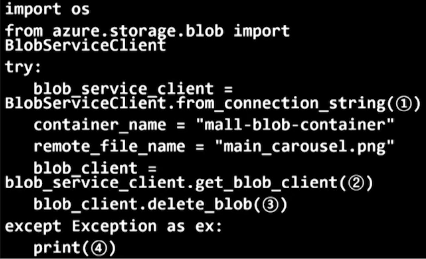
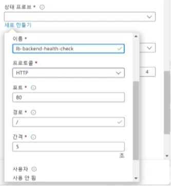
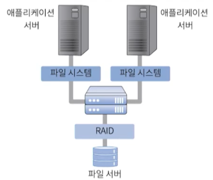
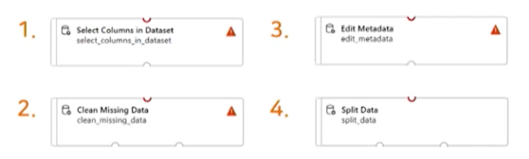

# 15강. 연습문제 풀이

## 1. 다음은 무엇에 대한 설명인가?

> 교재 4.1 | 10강

- 안정적인 서비스를 위해 서비스 대상과 리스크를 분석하고 컴퓨팅 리소스를 적절하게 배치 및 설계하는 과정
  - 클라우드 아키텍처링

## 2. 다음 중 클라우드 서비스의 효율성과 가용성을 향상시키는 아키텍처라고 할 수 없는 것은?

> 4.1절 | 10강

- 가상머신 ❌
  - 리소스 풀링 ✅
  - 로드 밸런싱 ✅
  - 클라우드 버스팅 ✅
  - 오토스케일링 ✅
  - 리소스 재배치 ✅

## 3. ML 수행 과정이 올바른 순서로 나열된 것은?

> 7.2절 | 13강

- 데이터 수집 > 데이터 전처리 > 데이터 학습 > 모델 평가

## 4. 다음 중 클라우드 버스팅에 대한 설명으로 올바르지 않은 것은?

> 교재 4.4절 | 10강

- 프라이빗 클라우드에 구성된 서비스 구조와 동일한 구성을 퍼블릭 클라우드에 구성한다 ✅
- 클라우드 버스팅을 실행해야 할 임곘값 설정 및 대상 데이터와 애플리케이션 설정한다 ✅
- 버스트 아웃을 통해 퍼블릭 클라우드의 데이터를 복제하여 프라이빗 클라우드로 전송한다 ❌
- 버스트 인을 통해 데이터 동기화를 진행한다. ✅

## 5. 엣지 계층에 NaaS(Network as a Service)와 NSaaS(Network Security as a Service)를 결합하여 제공하는 기술은?

> 교재 5.3 | 12강

- SNAT
- SASE ✅
- EDR
- 포그 컴퓨팅

## 6. 부하 분산 장치 만들기에서 IP 주소 및 포트 조합으로 전송되는 수신 트래픽을 백엔드 풀 인스턴스 그룹에 분산하려고 할 때 사용하는 것은?

> 교재 6.9.1절 | 11강

- 가상 네트워크
- NAT 규칙
- 프런트엔드 IP 주소
- 부하 분산 규칙 ✅

## 7. 다음은 Blob Storage에서 파일을 삭제하는 파이썬 코드이다. 연결 문자열이 위치하는 곳은?

> 교재 6.8 | 9강

- 1번

## 8. 부하 분산 장치 만들기 과정에서 설정하는 아래 그림과 같은 상태 프로브의 역할은?

> 교재 7.7절 | 11강

- 라우팅 과정
- NAT 설정
- 프런트엔드 IP 지정
- 리소스 상태 체크 ✅

## 9. 다음 어떤 스토리지 단위에 대한 설명인가?

> 교재 3.5절 | 9강

- 데이터가 객체 단위로 구조화되는 스토리지로 데이터와 메타데이터로 구성된다. 각각의 데이터 객체는 고유 ID로 구분된다
  - 파일
  - 블록
  - 데이터 세트
  - 오브젝트 ✅

## 10. 다음의 절차는 무엇에 대한 설명인가?

> 교재 4.5절 | 10강

- 기존의 VM을 복제하여 새로운 물리서버에 생성한 VM으로 이관하여 **다운타임을 최소화**하는 작업
  - 장애 방지 시스템
  - 호스트 가상화
  - 무중단 서비스 재배치 ✅
  - 로드 밸런싱

## 11. 고속의 데이터 접근 서비스를 제공하기 위해 아래와 같이 저장장치를 서버를 파이버 채널을 사용하여 연결한 네트워크는?

> 3.5.2절 | 9강

- SAN 

## 12. 리소스 풀링에 대한 설명으로 올바르지 않은 것은?

> 4.2절 | 10강

- 가용한 리소스를 담아두는 공간을 사용한다 ✅
- 리소스 풀의 리소스의 물리적 위치를 공개해 인접한 리소스를 사용자가 선택한다 ❌
  - 위치는 비공개
- 도시 국가 단위의 계층적 구조를 가진다 ✅
- 사용자는 리소스를 빌리고 사용한 만큼 비용을 지불한다 ✅

## 13. Azure ML Studio 에서 데이터의 데이터 형을 변경하기 위해 사용하는 블록은?

> 7.4절 | 13강

- 3번

## 14. 다음 중 로드 밸런싱이 요구되는 상황으로 올바르지 않은 것은?

> 4.3절 | 10강

- 갑작스럽게 이용자가 폭증하는 상황 ✅
- 서비스의 확장 및 축소가 필요한 상황 ✅
- 하나의 서버에 서비스 요청이 집중되는 상황 ✅
- 이용자의 증가량이 확정적으로 예측되는 상황 ❌

## 15. Blob Storage를 사용하여 데이터 관리 시 가장 선행되는 것은?

> 6.8절 | 9강

- 컨테이너 생성
- 가상 머신 생성
- Blob Storage에 파일 업로드
- 스토리지 계정 생성 ✅

## 16. Azure Functions(함수 앱)에서 트리거의 의미는?

> 8.1절 | 14강

- 사용자 요청을 분산처리하는 시점
- 리소스를 반환하는 방식
- 함수를 호출하는 이벤트 유형 ✅
- 애플리케이션이 시작되는 지점

## 17. 스토리지 다중화 및 확장 기술이 아닌 것은?

> 3.5.2절 | 9강

- NFV ❌
  - Network Function Virtualization
  - 네트워크 장비(방화벽 등)를 기능적으로 분리해서 가상화 하는 것(네트워크 가상화)
- NAS
- SAN
- RAID

## 18. 클라우드 서비스의 고가용성을 확보하기 위한 방안으로 올바르지 않은 것은?

> 4.1절 | 10강

- 다중 애플리케이션 서버와 부하 분산
- 데이터베이스 혹은 스토리지 이중화
- 중앙 집중식 서비스 구성 및 리소스 배치 ❌
- 리소스 풀링, 로드 밸런싱, 클라우드 버스팅 사용

## 19. 다음은 무엇에 대한 설명인가?

> 5.1절 | 12강

- 엔드포인트 단말기의 물리적 위치와 인접한 곳에서 컴퓨팅을 수행하여 요청에 대한 반응 시간을 단축시키는 기술
  - 포그 컴퓨팅
  - 엣지 컴퓨팅 ✅
  - 클라우드 컴퓨팅
  - 클라우드 버스팅