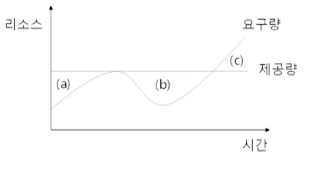
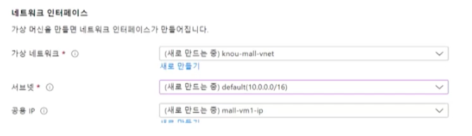
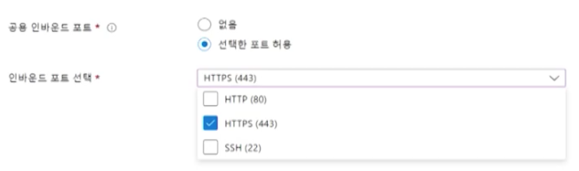
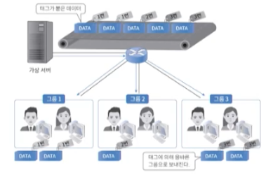
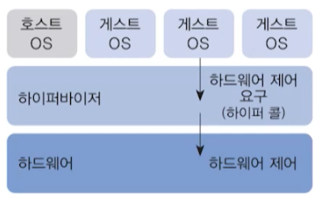

# 8강. 연습문제 풀이 1

### 1. 다음중 클라우드 컴퓨팅에서 사용하는 서버 가상화 방식이라고 할 수 없는 것은?

> 교재 3.3절, 강의 6강

1. 호스트 가상화
2. 하이퍼바이저 가상화
3. 컨테이너 가상화
4. **프로토콜 가상화**

### 2. 다음 중 클라우드 컴퓨팅의 특징이 아닌 것은?

> 교재 2.1절, 강의 4강

1. 서비스 사용량 측정
2. **온디맨드 클라우드 전문가 지원**
   - 전문가 없이도 할 수 있음
3. 리소스 풀링
4. 신속한 탄력성

### 3. IT 리소스를 대여하는 클라우드 서비스 제공자가 사용자에게 제공하는 서비스 수준을 정량화하여 명확하게 제시하고, 미달하는 경우 손해를 배상하는 것을 ___ 라고 한다.

> 교재 1.3절, 강의 2강

1. CapEx
   - Capital Expenditure
   - 장비 구입시 지출하는 비용
2. ARS
   - Automatic Response System
3. OpEx
   - Operational Expenditure
4. **SLA**
   - Service Level Agreement

### 4. 다음 중 클라우드 컴퓨팅 보급의 원인이라고 할 수는 없는 것은?

> 교재 1.2절, 강의 1강

1. **정부의 강압적 의무사용 정책**
2. 서버의 유휴 리소스 활용을 통한 효율성 향상
3. 규모의 경제에 따른 비용 절감
4. 유연한 IT 서비스 요구

### 5. 다음과 같이 리소스의 제공량과 요구량이 주어졌을 때, (a), (b), (c)에 들어갈 올바른 리소스 제공량의 상태는?

> 교재 1.3절, 강의 2강

- 잉여, 잉여, 결핍

### 6. 다음은 Azure에서 가상 머신 만들기의 '네트워킹' 탭의 일부이다. 네트워크 인터페이스 영역을 올바르게 설명한 것은?

> 교제 6.2절, 강의 4강

1. 공용 IP는 10.0.0.16 이다.
   - 지금 알 수 있는거 아님
2. 가상 네트워크 이름은 mall-vm1-ip이다
   - knou-mall-vnet
3. **가상네트워크의 IP 주소 범위는 10.0.0.0 - 10.0.255.255 이다**
4. 가상 네트워크에는 최대 256개의 IP가 포함될 수 있다.
   - 서브넷의 사이더가 16
   - 따라서 틀림 ( 24면 정답 )

### 7. IT 시스템에 요구되는 데이터 센터에 다수의 H/W 및 S/W 설비를 자체적으로 보유하고 운용하는 방식 

> 교재 1.3절, 강의 2강

1. 클라우드 서비스
2. 서버(Server)
3. IDC(Integrated Data Center)
4. **온프레미스**

### 8. 가상화 기술의 기본적 특성에 대한 설명으로 옳지 않은 것은?

> 교재 3.2.1절, 강의 6강

1. 파티셔닝 - 한 물리 머신에 여러 OS를 운영하고 리소스를 분할
2. 캡슐화 - VM은 폴더와 파일로 존재하며 구조화되어 이동 및 복사가 용이
3. 격리 - 캡슐화된 VM의 장애 및 보안 문제 발생 시 격리 및 리소스 제어로 성능 유지 가능
4. **H/W 독립성 - 각 VM은 유기적으로 연동되어 다른 가상화 시스템 또는 물리적 시스템으로 마이그레이션이 불가능**

### 9. 여러 조직의 업무와 기능이 유사한 경우, 파트너쉽을 맺고 연합된 조직이 공동으로 사용하는 클라우드 시스템 배포 모델은?

> 교재 2.3절, 강의 5강

1. 퍼블릭 클라우드
2. **커뮤니티 클라우드**
3. 하이브리드 클라우드
4. 프라이빗 클라우드

### 10.  다음은 Azure 에서 가상 머신 만들기의 '기본사항' 탭의 일부이다. 인바운드 포트 규칙의 기능을 올바르게 설명한 것은?

> 교재 3.3절, 강의 4강

1. 가상 머신에 접속할 수 있는 IP 주소(대역)을 허가/제한한다
2. **가상 머신에 접속할 수 있는 특정 포트(대역)를 허가/제한 한다**
3. 가상 머신에서 접속할 수 있는 외부 리소스의 특정 IP 주소(대역)을 허가/제한한다
4. 가상 머신에서 접속할 수 있는 외부 리소스의 특정 포트(대역)을 허가/제한한다

### 11. 다음 그림과 같이 라우터 포트에 태그 정보를 설정하여 태그에 상응하는 그룹으로 패킷을 전송하는 네트워크 가상화 기술은?

> 교재 3.4절, 강의 7강

1. **VLAN**
   - Virtual LAN
2. VPN
3. NFC
4. SDN

### 12. 각각의 사용자에게 실제 IT 리소스인 것처럼 CPU, 메모리, 저장장치를 할당이 가능하도록 물리적 컴퓨터 환경 상에 여러 가상 인스턴스를 만드는데 사용되는 기술은?

> 교재 1.7절, 강의 3강

1. 다각화 기술
2. 클러스터링 기술
3. 그리드 기술
4. **가상화 기술**

### 13. 자신의 컴퓨팅 역할을 충족시키기 위해 다른 일부 컴퓨터(서버)에 크게 의존하는 컴퓨너아 네트워크의 클라이언트

> 교재. 2.1.2절, 4강

1. 디펜던스
2. **씬 클라이언트**
3. 멀티 클라이언트
4. 팻 클라이언트

### 14. 다음 그림은 클라우드 컴퓨팅의 어떤 서비스 모델을 나타내는가?

> 교재 2.2절, 강의 5강

1. 온프레미스
2. IaaS
3. **PaaS**
   - Platform as a Service
4. SaaS

### 15. 온프레미스 시스템 구축 시 직접비용과 간접비용의 예시가 바르게 묶인 것은?

> 교재 1.3절, 강의 2강

1. 직접 - (H/W, 장비 관리 인력), 간접 - (유지보수, 항온, 항습)
2. **직접 - (H/W, S/W, 물리 보안), 간접 - (직무 교육, 장비관리 인력)**
3. 직접 - (직무교육, 백업장치), 간접 - (OS, H/W, 항온, 전력)
4. 직접 - (물리 보안, 장비 관리 인력), 간접 - (백업, 네트워크 장치, 로드밸런싱)

### 16. 다음 그림과 같은 서버 가상화 방식의 설명으로 옳지 <u>않은</u> 것은?

> 교재 3.3절, 강의 6강

1. 하이퍼바이저가 게스트 OS로부터 하이퍼콜을 기반으로 자원 요청을 받고 하드웨어를 제어함
2. 하이퍼콜을 위해 게스트 OS의 커널 수정이 요구됨
3. **하이퍼바이저가 모든 명령에 개입하여 중재하여 병목현상으로 인한 성능저하가 발생함**
   - 전가상화 방식 (나머지 3개는 반가상화 방식)
4. 오픈소스 이외의 OS에 해당 방식을 사용하기 어려움

### 17. 다음 클라우드 컴퓨팅의 단점이라고 할 수 없는 것은

> 교재 1.8절, 강의 3강

1. 과도한 비용 지출
2. 제한된 이식성
3. **H/W, S/W의 관리 및 유지보수의 어려움**
4. 책임 소재의 불분명