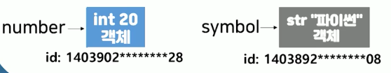
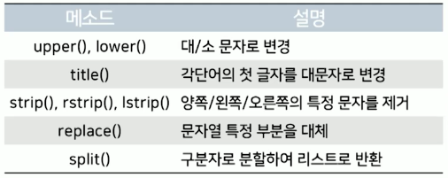
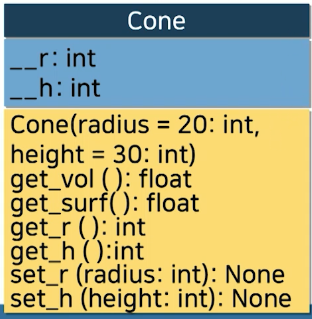
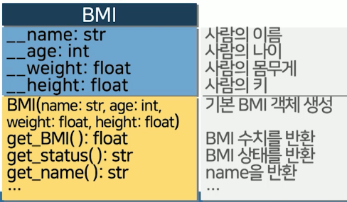

# 10강. 객체지향

## 01. 객체지향의 이해

### 유사성

- 공통적인 것은 미리 만들어 놓고, 서로 다른 점만 구현
- 훨씬 더 효과적인 대형의 프로그램을 만들 수 있음
- 하나의 프로그램 내부에서도 서로 다른 객체 사이의 공통점을 찾아내 구현 가능


### 객체지향의 개념

- 객체와 객체 사이의 상호작용으로 프로그램을 구성하는 프로그래밍 패러다임
- 프로그램을 유연하고 변경을 쉽게 만들어 대규모 소프트웨어 개발에 사용
- JAVA, C++, C# 등에서 자주 사용되는 개념
- 객체지향 패러다임의 특징
  - 추상화: 공통의 속성이나 기능을 도출
  - 캡슐화: 데이터 구조와 데이터 연산을 결합
  - 상속: 상위 개념의 특징이 하위 개념에 전달
  - 다형성: 유사 객체의 사용성을 그대로 유지


### 객체와 클래스

- 객체는 추상화와 캡슐화의 결과

- 실세게의 사물에 대한 상태(데이터)와 연산(메소드)을 표현한 단위

  - **멤버**(데이터 필드, 메소드)는 **클래스**에 의해 결정

    


### 클래스 정의

- 구문형식

  ```python
  class 클래스 이름:
    초기자 정의
    메소드 정의
  ```

- 메소드(method)

  - 객체에 대한 행동(연산)을 정의
  - 함수의 정의 및 사용 방법과 동일

- 초기자(initializer)

  - 객체의 상태를 초기화하는 특수 메서드
  - 항상 `__init__` 으로 명명


### 메소드의 정의

- 구문형식

  - 함수와 동일하게 정의되는 메소드

  ```python
  class 클래스 이름:
      def 메소드 이름(self, 매개변수 리스트):
          코드 블럭
  ```

- self 매개변수

  - 모든 메서드의 첫번째 매개변수
  - **메소드의 구현**에 사용되지만 메소드 호출 시 사용되지 않음
  - 객체 자신을 참조하여 클래스 정의에 포함된 멤버에 접근시 사용
    - 코드 블럭 내(데이터필드)에서 이 셀프를 가지고 여기 안에 접근하려고 할 때 사용하는 매개변수
    - 클래스 내부의 변수에 접근하려고 할 때 사용됨


### 원뿔 계산 프로그램 개선

- 객체지향 개념이 적용된 원뿔 클래스는?

  - 다양한 도형의 겉넓이, 부피 등을 계산하려고 할 때 묶어두지 않으면 함수가 너무 많으므로 헷갈림
  - 원뿔과 관련된 계산 모아두는 것, 원기둥과 관련된 계산 모아두는 것 처럼...

  ```python
  # 원뿔 겉넓이 계산
  def rtn_cone_surf(r, h):
    ...
    
  # 원뿔 부피 계산
  def rtn_cone_vol(r, h):
   ...
  
  # 원기둥 부피 계산
  def rtn_cylinder_vol(r, h):
    ...
  
  # 사각형 넓이 계산
  def rtn_rect_area(w, h):
    ...
    
  ```

- 예시

  ```python
  class Cone:
    def __init__(self, radius = 20, height = 30):
      self.r = radius
      self.h = height
    
    def get_vol(self):
      return 1/3 * 3.14 * self.r ** 2 * self.h
    
    def get_surf(self):
      return 3.14 * self.r ** 2. + 3.14 * self.r * self.h
  ```

  

### self 매개변수

- 변수의 스코프가 클래스 전체가 됨


### 클래스 설계

- UML 클래스 다이어그램 통해 데이터 필드, 생성자, 메소드 표현 방법 표준화
  - 데이터 필드 이름: 데이터 필드 타입
  - 클래스 이름(매개변수 이름: 매개변수 타입)
  - 메소디 이름(매개변수 이름: 매개변수 타입): 반환값 타입

- UML(Unified Modeling Language): 표준화된 모델링 언어
  - 클래스가 어떻게 구성되어 있는지 표기


### 원뿔 클래스의 표현

- UML 클래스 다이어그램

  


### BMI 계산 프로그램

- 이름, 나이, 몸무게, 키를 사용해 BMI 수치 및 상태를 반환하는 BMI 클래스 정의

  

- 예제

  ```python
  class BMI:
    def __init__(self, name, age, weight, height):
      self.name = name # 입력 파라미터에 들어온 값들을 데이터 필드에 넣어주는 작업
      self.age = age
      self.weight = weight
      self.height = height
      
    def get_BMI(self):
      return self.weight / (self.height / 100) ** 2
    
    def get_status():
      if self.get_BMI() >= 25:
        return "비만"
      elif self.get_BMI() >= 23 and self.get_BMI < 25:
        return "과체중"
      elif self.get_BMI() >= 18.5 and self.get_BMI < 23:
        return "정상"
      else:
        return "저체중"
  ```

  ```python
  # 메서드 변수에 넣기
  
  class BMI:
    def __init__(self, name, age, weight, height):
      self.name = name 
      self.age = age
      self.weight = weight
      self.height = height
      
    def get_BMI(self):
      return self.weight / (self.height / 100) ** 2
    
    def get_status():
      BMI = self.get_BMI() # 메서드를 변수에 넣을수도있음
      
      if BMI >= 25:
        return "비만"
      elif BMI >= 23 and BMI < 25:
        return "과체중"
      elif BMI >= 18.5 and BMI < 23:
        return "정상"
      else:
        return "저체중"
  ```

  

## 02. 클래스와 인스턴스

### 원뿔 클래스 활용

- 원뿔 클래스를 사용하려면?


### 객체와 인스턴스

- 구문 형식

  - 앞에서 정의했던 설계 도면대로 객체 생성
  - 값 저장, 변형 등이 가능

  ```python
  # 생성자 호출
  클래스 이름(초기자 파라미터)
  ```

  - 클래스의 **생성자(constructor)**를 통해 **클래스의 인스턴스 생성**
  - 객체와 인스턴스는 동일 개념
  - 클래스의 생성자는 클래스 이름과 동일
  - 클래스의 이름과 초기자의 매개변수를 사용해 생성자 호출


### 객체의 생성 과정

- 생성자를 통해 인스턴스(객체)를 생성
- `__init__` 을 호출하면 값이 내부의 데이터필드에 저장됨


### 객체의 사용

- 객체의 데이터 필드 접근 및 메소드 호출
  - 객체 멤버 접급 연산자(`.`) 사용
  
- 객체 접근
  
  ```python
  객체 참조변수.데이터필드
  객체 참조변수.메소드(파라미터)
  ```
  
- 객체 참조변수를 사용하여 객체를 생성

  - 생성자를 통해 만들어진 객체에 접근할 수 있는 지칭 도구 필요

  ```python
  객체 참조변수 = 클래스이름(초기자 파라미터) # 생성자를 통해 만들어진 객체
  ```


### 원뿔 클래스 활용

- 단위 원뿔과 반지름의 높이가 각각 50, 100인 원뿔의 높이와 겉넓이를 출력하는 프로그램

```python
unit_cone = Cone() # class 호출
big_cone = Cone(50, 100)

print("단위 원뿔의 겉넓이와 부피는", unit_cone.get_vol(), unit_cone.get_surf(), "입니다")
print("큰 원뿔의 겉넓이와 부피는", big_cone.get_vol(), big_cone.get_surf(), "입니다")
```


### BMI 클래스 활용

- 가상의 이름, 나이, 몸무게, 키를 사용해 BMI 객체를 사용하는 프로그램

```python
person1 = BMI("홍길동", 40, 78, 182)

print(person1.name + "님(" + str(person1.age) + "세)의 BMI 수치는", person1.get_BMI(), "결과는", person1.get_status(), "입니다.")


```


## 03. 객체지향의 활용

### 데이터 타입과 객체

- 실제 우리가 알았던 모든 변수는 객체!

  - 객체 지향형 프로그래밍 언어에서 모든 것은 **다 객체**를 통해 이루어진다!

  ```python
  "Korea National Open Uniersity".lower() # "korea national open university"
  ```

- 예제

  

  


### str 메소드




### 원뿔 클래스 개선

- 멤버 r 또는 h에 음수를 입력하면?

  - 악의적 사용자가 Cone 클래스에 접근하지 못하도록 제약을 줄 필요 있음

- 멤버 `__r`과 `__h`에 대한 접근자와 변경자 정의

  

- 예제

  ```python
  sample_cone = Cone(100, 200)
  
  sample_cone.get_vol()
  
  sample_cone.r = -50
  
  print(sample_code.get_surf()) # -23550.0 
  ```

  ```python
  class pCone: #privateCone
    def __init__(self, radius = 20, height = 30):
      if radius > 0 and height >0: # getter(접근자)
        self.__r = radius # 언더스코어 두개 붙이기
        self.__h = height
    
    def get_vol(self):
      return 1/3 * 3.14 * self.__r ** 2 * self.__h
    
    def get_surf(self):
      return 3.14 * self.__r ** 2. + 3.14 * self.__r * self.__h
    
    def get_radius(self):
      return self.__r
    
    def set_radius(self, radius): 
      if radius > 0: # setter(변경자)
        self.__r = radius
  ```

  


### BMI 클래스 활용

- 가상의 이름, 나이, 몸무게, 키를 사용해 BMI 객체를 사용하는 프로그램

  - 나이, 몸무게, 키는 private으로 지정해 변경 방지

  

- 예제

  ```python
  # 변경자, 접근자 만들어보기
  ```

  

### 데이터 필드 감추기

- 데이터 은닉(data hiding)
  - 데이터 필드의 직접 변경을 방지하기 위해 사용자의 직접적 접근을 차단
  - public과 다른 private 데이터 필드로 정의

- private 데이터 필드

  - **클래스 내부에서만 접근 가능**
  - 앞 두 밑줄(__)로 정의

  ```python
  self.__r
  self.__h
  ```


### 접근자와 변경자

- 반지름과 높이를 private로 바꾸면, 더 이상 이 값들은 변경을 못하는 건가?
  - 아님, 접근자 변경자 메서드 사용하면 가능!

- private으로 정의된 데이터 필드는 객체 외부에서 접근 불가능

  ```python
  File "<ipython-input-7-a73e9d167542>", line 13 print(unitcone.__r = -50)
  
  # SyntaxError: expression cannot contain assignment, perhaps you meant "=="?
  ```

- Private 데이터 필드에 접근하는 메소드

  - **접근자(accessor)**: 데이터 필드 반환
  - **변경자(mutator)**: 데이터 필드 설정
