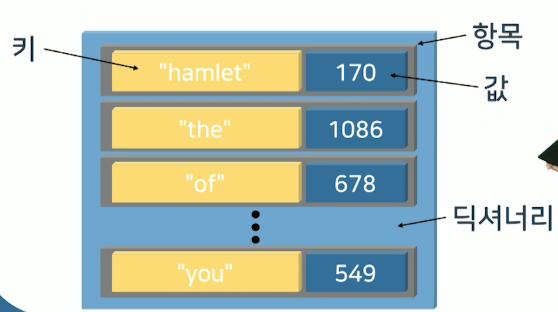

# 12강. 파일

## 01. 파일의 이해

### 파일의 역할


- 컴퓨터에 의해 처리될 또는 처리된 데이터와 정보가 임시적으로 저장된 상태
  - 일련의 연속된 바이트
  - 프로그램(파이썬 소스코드)에 읽혀 가공, 처리


### 파일의 구성


- 연속된 바이트의 파일의 시작, 파일 포인터, 파일의 끝으로 표현


### 파일의 종류

- 데이터가 저장되는 방식에 따라 구분

  - 텍스트 파일

    

  - 바이너리 파일

    - 대다수의 파일: 적은 데이터 용량으로 많은 값 저장 가능

    


### 파일 함수

- 파일의 시작, 파일 포인터, 파일 끝을 활용해 데이터 읽기, 쓰기를 위한 함수 및 메소드를 내장


### 파일 객체 생성

- 구문 형식

  ```python
  파일객체_참조변수 = open(파일이름, 모드)
  ```

  - 물리적인 파일과 연결된 파일 객체를 생성하고 참조변수에 할당


### 파일 이름

- 실제 파일에 접근하기 위한 모든 정보를 포함
  - 파일의 고유 식별자 역할 및 저장장치 내부에서 파일의 위치를 표현하는 파일경로를 내포


### 파일 읽기


- 특정 범위의 데이터를 파일에서 읽고 문자열로 반환
  - 파일 포인터의 이동을 동반
- `close()` 필요성
  - 하지 않았을 경우, 잘못된 연산이 이루어지거나 파일이 깨질 수도 있으니 주의할 것


### 파일 쓰기

- 문자열을 파일 포인터가 위치한 지점에 기록
  - w 모드로 존재하는 파일 오픈시 데이터 삭제
  - w모드 특징: 무조건 이름을 새로 생성하고, 파일 포인터를 맨 앞에 위치시킴


- `close()` 필요성
  - w모드에서 close()누락시 파일이 생성되지 않을수도있다


### 데이터 추가

- 파일의 끝에 데이터를 덧붙이는 작업
  - 파일 오픈 후 파일 포인터를 EoF로 이동
  - 존재하지 않는 파일은 write와 동일


### 파일 읽고 쓰고 수정하는 프로그램

- 'Khan.txt' 파일을 읽고 처리하는 프로그램을 작성하시오
  - 모든 내용을 출력하시오
  - 마지막에 '-칭기스 칸-'을 삽입하기

- https://github.com/jaehwachung/Python-Programming


## 02. 파일의 활용

### 데이터 분석 프로그램

- Hamlet_by_Shakespeare.txt 파일에 포함된 단어가 출현한 횟수를 출력하는 프로그램을 작성하시오


### 시퀀스의 개념


- 순서화된 값의 집합체를 저장할 수 있는 데이터 타입
  - 단일 식별자로 연속된 저장 공간 접근 수단 제공
  - 개별 원소의 값을 수정, 추가, 삭제 가능
  - 원소(element)의 나열을 저장할 수 있는 타입 
    - 리스트, 세트, 투플, 딕셔너리 등


### 딕셔너리의 이해



- 키와 값의 쌍(pair)을 저장하는 시퀀스

- 구문형식

  - 세트, 리스트, 딕셔너리는 키 불가능

  ```python
  딕셔너리_이름 = {키1: 값1, 키2: 값2, ..., 키n: 값n}
  ```

- 빈 딕셔너리 생성 구문형식

  ```python
  딕셔너리_이름 = {}
  ```

  ```python
  딕셔너리_이름 = dict()
  ```

- 항목의 추가

  ```python
  딕셔너림_이름[키] = 값
  ```

- 항목의 삭제

  ```python
  del 딕셔너리_이름[키]
  ```

  

### 딕셔너리 멤버


### 딕셔너리 순회

- 순회(traversal)

  - 각각의 항목을 순서대로 한 번씩만 방문하는 과정

- 순회 형식

  ```python
  for key in dictionary:
    print(key + ':' + str(dictionary[key]))
    key 사용 블록
  ```


### 실습

#### 데이터 분석 프로그램

'Hamlet_by_Shakespeare.txt' 파일에 포함된 단어가 출현한 횟수를 출력하는 프로그램을 작성하시오

#### 데이터 분석 프로그램 개선

'Hamlet_by_Shakespeare.txt' 파일에 출현 횟수가 100번 이상 되는 단어와 출력횟수를 정렬하여 출력하는 프로그램을 작성하시오

```python
h_fp = open("Hamlet_by_Shakespeare.txt", "r")

word_dict = dict()

for line in h_fp.readlines():
    for word in line.strip().split(): # 공백을 끊어내기
        word = word.strip(" .,:?[]\"\':-!").lower() # 인용 부호 나타낼 땐 "가 아닌 \" 라고 적어주어야 함

        if word_dict.get(word) is not None:
            count = word_dict[word]
        else:
            count = 0
        
        word_dict[word] = count + 1

word_r_dict = {v:k for (k,v) in word_dict.items()} # word_dict에서 리스트로 가져온 것들의 key, value를 뒤바꿔서 word_r_dict로 만들어라

word_dict = {k:v for (v, k) in sorted(word_r_dict.items(), reverse=True)}

for key in word_dict:
    if word_dict[key] >= 100:
        print("[" + key + "]", str(word_dict[key]) + "회")

h_fp.close()
```

