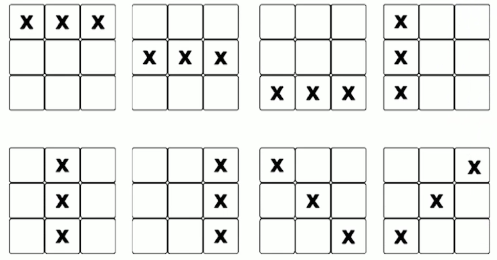

# 13강. 실전 프로젝트1

## 1. 게임 개발 준비

### 소프트웨어 개발 과정

- 대규모 소프트웨어 개발에 자원을 투입하여 초기에 예상한 결과물 구현을 목적
- 소프트웨어 개발 계획 수립부터 폐기까지 전체적인 흐름을 체계화하여 고품질의 소프트웨어 생산을 위한 체계
- 공장에서 제품을 생산하듯 소프트웨어 전체 개발 과정을 하나의 프로세스로 정의 > 소프트웨어 개발 라이프사이클


### 소프트웨어 개발 라이프사이클

- 6단계


### 프로그램의 진행과정

- 일괄적으로 모아놓은 대량의 데이터를 특정 시간에 지정한 처리 방법에 따라 처리 > **배치(batch) 프로세스**


### 이벤트 기반 프로그래밍

- EDP(Event Driven Programming)
  - 실행의 흐름을 예측하는 프로그램이 기법이 무의미한 GUI 환경에서 사용
  - 입력장치, 타이머, 프로그램 등으로부터 발생하는 이벤트 관점에서 생각하는 방식
- 이벤트(event)란 프로그램에 의해 감지되고 처리될 수 있는 동작이나 사건


### EDP 프로그램 구동 구조


### 게임의 진행과정


## 2. 게임 정의 및 설계

### 게임 정의

- 틱택토(Tic Tac Toe) 규칙
  - 한 플레이어가 아직 기록되지 않은 빈 칸에 자신의 기호로 표시한다
  - 다른 플레이어가 아직 기록되지 않은 빈 칸에 자신의 기호로 표시한다
  - 둘 중 한 플레이어가 가로, 세로, 또는 대각선을 자신만의 기호만으로 채움녀 승리한다
  - 게임은 한 플레이어가 승리하거나 빈 칸이 남지 않아 비길 때 까지 계속된다

- 게임 승리 상황(종료상황)

  


### 틱택토 요구사항

- 게임 시작 시 무작위로 시작할 플레이어가 선택
- 플레이어는 사용자가 컴퓨터이고 각각 O와 X 기호를 사용
- 빈칸의 행, 열 좌표를 입력하여 기호를 표시
  - 사용자는 사용자입력, 컴퓨터는 랜덤 선택
- 승리, 무승부 또는 종료 요청이면 게임이 종료
  - 종료 요청은 사용자가 "00" 입력시 발생

- 게임판을 텍스트로 출력하여 게임 진행


### 틱택토 설계

- 2차원 리스트를 사용해 게임판을 생성하고, 각각의 칸을 빈칸으로 초기화
  - 빈칸에 대한 지정한 기호(*)를 사용
- 게임판에 빈칸이 남아있는지 확인
  - 게임판 전체를 확인하고 T/F 반환
- 둘 중 한 플레이어가 승리했는지 확인
  - 8가지 승리 상황에 따른 가능성을 확인
  - 각각의 행, 열과 두개의 대각선 방향 확인
- 게임판의 현재 상태를 출력
- 게임 시작
  - 무작위로 선공할 플레이어 선택
- 게임 루프 기동
  - 게임판의 현재 상태를 출력하고 다음 플레이어가 빈칸을 선택
  - 플레이어가 선택할 빈칸의 위치(행과 열 번호)를 입력받음
    - 사용자일 경우 사용자 입력을 통해 행, 열 번호를 입력받음
    - 컴퓨터일 경우 무작위로 행 열 번호를 선택
  - 플레이어가 선택한 위치에 기호를 표시하고 게임판을 업데이트
  - 현재 플레이어가 승리했는지 확인
    - 승리 상황일 경우, 승리한 플레이어에 대한 메시지를 출력하고 게임 루프 종료
  - 게임판에 빈칸이 남아있는지 확인
    - 게임판이 가득찬 경우, 무승부 메시지를 출력하고 게임 루프 종료
  - 게임이 종료될 때까지 게임 루프를 무한 반복


### 실습

```python
class Tic_Tac_Toe:
  
  # 게임판 생성
  def __init__(self):
  
  # 게임판 초기화
  def create_board(self):
    
  # 첫 플레이어 선택
  def select_first_player(self):
    
  # 기호 표시
  def mark_spot(self, row, col, player):
    
  
  # 승리 상태 확인
  def is_win(self, player)
  	# 행 확인
    # 열 확인
    # 대각선 확인
    
  # 잔여 빈칸 여부 확인
  def is_board_full(self):
    
  # 플레이어 변경
  def next_player(self, player):
    
  # 현재 게임판 상태 출력
  def show_board(self):
    
  # 게임 시작
  def start_game(self):
  	# 새 게임판 생성
    
    # 첫 플레이어 선택
    
    # 게임 루프 시작
    while True:
    
    	# 다음 플레이어 안내
      
      # 현재 게임판 상태 출력
      
      # 사용자 입력 대기, 컴퓨터일 경우 랜덤 위치 반환
      
      # row, col 입력값이 0, 0인 경우 게임 종료
      
      # 입력된 위치 표시
      
      # 현재 플레이어가 이겼는지 확인
      
      # 게임판 가득참 확인
      
      # 플레이어 변경
      
    # 최종 게임판 출력
    
# 게임 생성
TTT = Tic_Tac_Toe()
# 게임 시작
TTT.start()
```

