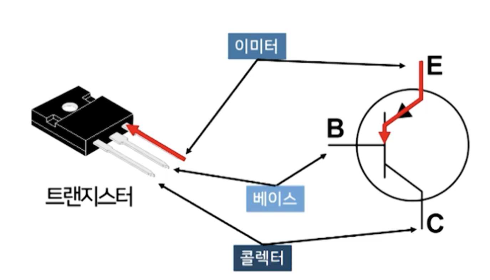
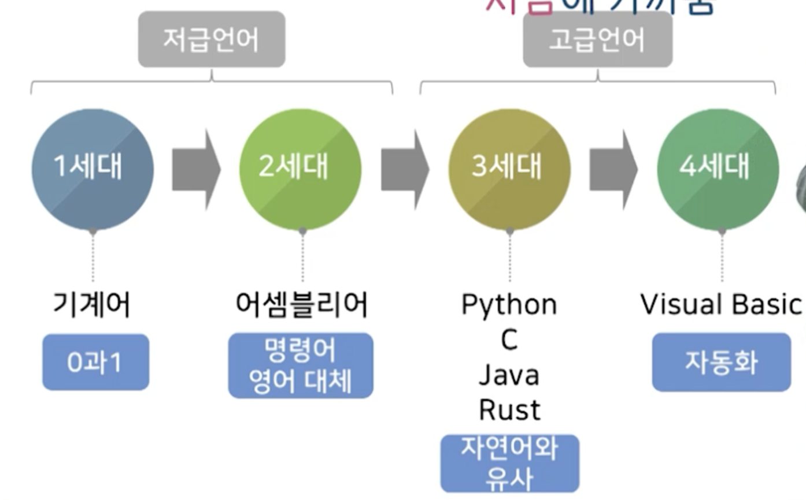

# 1강. 컴퓨터의 이해

# 1. 데이터와 정보

## 데이터의 개념

- 관찰이나 측정을 통해 얻은 수치, 문자 형태의 표현할 수 있는 질적 또는 양적 값
  - 질적데이터 / 양적데이터

## 정보의 개념

- 관찰과 측정을 통해 얻은 데이터를 처리(정렬, 합산, 군집화 등)하여 실제 문제 해결에 도움이 되는 데이터 또는 결과물

데이터와 정보 차이점 구분

## 정보 처리 과정

- 관찰과 측정
  - 연속적 데이터 (숫자 등)
  - 범주적 데이터
- 처리와 가공
  - 수집된 데이터의 집합을 정렬, 군집화, 계산 또는 표현방법 변경 등의 데이터를 변환하여 정보를 생산하는 과정

# 2. 컴퓨터의 개념

## 컴퓨터의 정의

- 정의된 방법에 따라 입력된 데이터를 자동으로 처리하여 정보를 생산하는 기계

## 데이터의 기본 단위

- 비트(bit: binary digit)
  - 두 개의 상태만을 갖는 가장 작은 단위
- 바이트(byte)
  - 8개의 비트를 겹쳐 표현
  - 총 2^8, 256가지의 경우의 수 표현이 가능

## 컴퓨터와 2진법

- 컴퓨터는 **트랜지스터**를 통해 **2진법 숫자**로 데이터를 표현하여 저장 및 처리

- 베이스에 특정 전압 이상의 전류가 흐르면, 콜렉터쪽으로 전류가 흘러 나옴
  - 트랜지스터에 전류가 흐르는 상태 1
  - 트랜지스터에 전류가 흐르지 않는 상태 0
- 트랜지스터: 하나의 비트를 표현하기 위해 사용하는 소자
  - 더 많은 데이터를 처리하기 위해서는 더 많은 트랜지스터가 필요
- CPU 내 50억개, M2 칩에는 570억개 트랜지스터 가지고있음

## 아날로그와 디지털

- 아날로그
  - 사물이나 개념을 **연속적인 물리량** 값으로 표현
  - 질적 또는 양적 데이터로 표현

- 디지털
  - 사물이나 개념을 **이산적인 값**으로 근사하여 표현
  - 양적 데이터로 표현

## 숫자/문자 데이터의 표현

- 숫자 데이터의 표현
  - 진법 변환
- 문자 데이터의 표현
  - 인코딩 체계
    - ASCII(American Standard Code Information Interchange)
    - 비트 **7개** 사용
    - 그럼 비트 1개는 어디에 사용할까?

# 3. 컴퓨터와 프로그램

## 프로그램의 이해

- 컴퓨터는 정보를 처리하기 위한 방법과 과정을 자의적으로 결정 불가능
- 처리 방법과 과정이 정의된 프로그램을 사용
- 프로그램이란 컴퓨터가 어떠한 작업을 자동으로 처리할 수 있도록 처리 방법 및 순서를 컴퓨터가 이해할 수 있는 언어 형태로 기술한 것
- 유사한 유형의 여러 문제를 추상화시킨 것을 **알고리즘**을 구현한 결과물

## 알고리즘의 정의

- 문제를 풀기 위한 단계별 절차를 체계적 명령의 형태로 기술한 것
- 주어진 명령어를 처리하는 컴퓨터에게 문제를 해결하도록 만드는 **정형화된 절차**

## 프로그래밍 언어

- 사람과 컴퓨터 사이의 의사소통 도구
- 프로그래머는 컴퓨터가 이해할 수 있는 언어를 사용하여 프로그램을 작성

## 프로그래밍 언어의 분류

## 프로그램의 실행

- 고급 언어로 작성된 프로그램은 기계어 밖에 인식할 수 없는 컴퓨터에 의해 실행이 불가능
  - 컴파일러 또는 인터프리터를 사용
  - 파이썬은 컴파일러, 인터프리터 중 어떤 것을 사용할까?
    - 인터프리터
