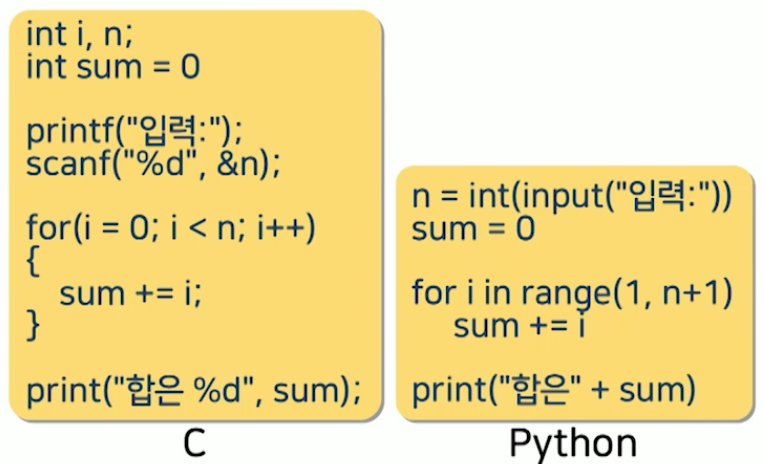
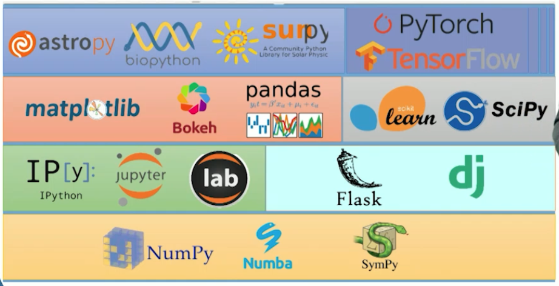
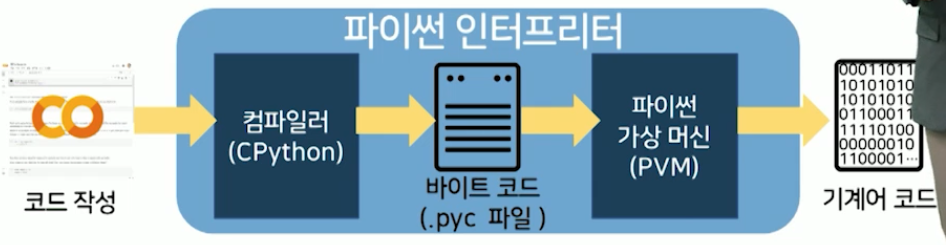
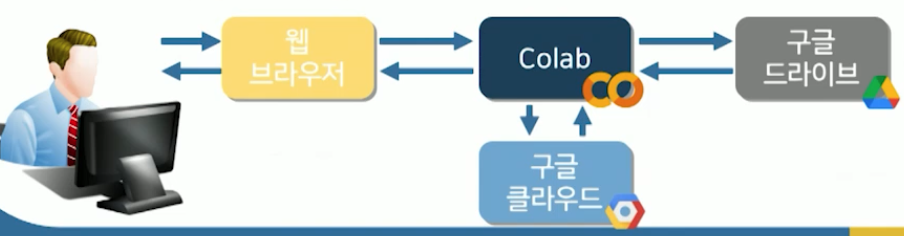

# 3강. 파이썬의 이해

## 1. 파이썬의 개요

### 파이썬의 탄생

- 히도 판로쉼(Guido van Rossum) 1991년 개발
- Monty Python's Flying Circus라는 최애 코미디 이름을 따서 만듬
- 크리스마스 시간동안 연구실이 잠겨서 할일이 없어서 만든 프로그래밍 언어
- 분산 운영체제(아메바)의 시스템 관리를 위한 쉘 스크립팅 언어로 개발
  - 쉘?
    - 사용자가 입력한 명령어를 해석해서 운영체제 내부의 **커널**에 전달하는 **명령 해석기 창**
  - 쉘 스크립팅 언어?
    - 명령어를 순차적으로 나열해서 운영체제가 어떤 순서로 동작해야 하는지 명령어를 집합으로 만들어 놓은 형태를 스크립트라고 하고, 이러한 목적으로 만들어진 언어가 파이썬


### 파이썬의 탄생: 왜 이렇게 인기가 많을까?

- **다중 프로그래밍 패러다임 채용**
  - 정의: 프로그램을 생성하는 접근 방식
  - **명령형** 프로그래밍, **절차적** 프로그래밍, 객체지향 프로그래밍, 함수형 프로그래밍 지원
- 다목적 활용
  - 응용 프로그램과 웹, 백엔드 개발, 사물 인터넷 분야 뿐만 아니라 교육적인 목적으로도 활용


### 파이썬의 발전 과정

- 1991년 ABC의 후속 프로그래밍 언어로 시작
- 1999년 DARPA에 "Computer Programming for Everybody" 제안
  - DARPA(국방기술연구소)
  - 미 국방성 연구 기관으로 이곳에서 최초의 인터넷이 탄생
- 2000년 파이썬 2.0 출시
  - 커뮤니티를 통한 개발 체계 시작
- 2008년 파이썬 3.0 출시 (2030년까지 쭉 쓸 예정)
  - 비 하위 호환성을 갖는 메이저 업데이트
  - 비 하위 호환성: 파이썬 2.0 문법을 사용하면 에러가 날 수 있음 


### 파이썬의 인기

- 2022년 2월부터 부터 C를 넘어 1위
- 데이터 과학 분야, 인공지능 분야에 많이 쓰임
- Most in-demand programming languages of 2022
  - Python 1위


### Pythonic

- 독립적
  - 운영체제를 가리지 않음
- 오픈소스
  - 모든 소스코드가 공개되어 있음
- 인간적
  - 사람이 쓰는 자연어와 많이 유사
- 신속성
  - 라이브러리, 프레임워크이 많아서 신속하게 개발 가능
- 직관적
  - 빠르게 코드화 가능


### 오픈소스

- 파이썬 관련 개선을 위한 제안(PEP)
  - 많은 개발자의 의견을 수용하고 토론하며 발전한 언어
  - 새로운 파이썬의 기능, 파이썬 프로세스, 환경에 대해 커뮤니티에 설계 문서나 정보를 제공
  - 파이썬 기능의 간결한 기술적 사양과 기능을 위한 근거를 제공
  - 커뮤니티 의견을 수집, 합의 도출, 반대의견 청취
- PEP8(스타일가이드)가 대표적


### 인간적 & 직관적

- 실행할 수 있는 의사코드(Executable pseudocode) 수준의 문법
  - 자연어에 가깝다

```python
if 3 in [1, 3, 5, 7]: print("3이 들어있습니다")
```


### 생산성 & 신속성

- 동일한 기능을 수행하지만, 훨씬 적은 라인을 작성해도 됨




### 대형 개발자 커뮤니티

- 큰 커뮤니티로 문제 해결이 용이


### 라이브러리와 프레임워크

- 주어진 라이브러리를 빠르게 import해서 사용가능




### 파이썬의 단점

- C나 자바 등으로 작성된 프로그램보다 느린 속도
- 완전한 애플리케이션 단독 개발이 불가능
  - 쉘 스크립트 언어 용으로 개발
  - 모바일 앱 등 응용 애플리케이션 개발 불가능
  - Rust, Go 고려


## 2. 파이썬 프로그램의 실행

### 파이썬 실행 환경

- 플랫폼에 독립적, 인터프리터식 객체지향적, **동적 타이핑(dynamically typed)** 대화형 언어
  - 윈도우, 리눅스, 유닉스, 맥OS등 다양한 운영체제에서 별도의 컴파일 없이 실행 가능
  - CPython, PyPy, Cython, Jython등 다양한 인터프리터 환경 사용 가능
  - 프로그램을 객체로 모델링


### CPython

- C언어로 개발된 파이썬 인터프리터
  - C 구현 라이브러리와의 연동을 통한 확장에 최적
- 컴파일러의 유형
  - 셀프 호스팅 컴파일러: 부트스트래핑 단계를 통해 자신의 언어로 작성한 컴파일러
  - 소스 대 소스 컴파일러: 타 언어로 작성한 컴파일러


### 파이썬 프로그램 실행과정

- 파이썬 애플리케이션은 소스 코드 형태로 배포
  - CPython이 컴파일 후 **바이트코드** `.pyc`파일 생성
  - 파이썬 프로그램이 플랫폼 독립적으로 실행될 수 있도록 파이썬 인터프리터가 동작하는 과정에서 중간언어로 만든 것
  - 다시 시스템을 재시작해도, 컴파일러단계부터 거치지 않고 바이트 코드로부터 바로 시스템 재가동이 가능해 신속
  - 


## 3. 파이썬 프로그래밍 환경

### IDLE

- 기본으로 포함된 파이썬의 통합 개발 환경
  - 파이썬과 Tkinter GUI 툴킷으로 개발
  - 구문 강조, 자동 완성, 스마트 들여쓰기 등이 포함된 단순한 IDE 지향
  - stepping, breakpoint, call stack 을 확인할 수 있는 통합 디버거 환경 가능
- 파이썬 홈페이지에서 다운로드 가능


### 주피터 노트북

- 오픈 소스 기반의 웹 플랫폼
- 파이썬을 비롯한 40개의 프로그래밍 언어 지원
- 인터프리터로 IPython 사용
- 전통적인 소스코드-컴파일-실행방식에서 벗어나 웹 기반 대화형 개발 및 실행 환경 제공
- 문서화하여 다름 사람과 공유하기 편리
- 마크다운(Markdown)을 이요하여 코드 관련 타이틀, 설명 등을 작성 가능


### 구글 Colab



- 2017년 과학 연구와 교육을 목적으로 개발
- 클라우드 기반 주피터 노트북 개발 환경
  - 주피터 노트북 + 구글 드라이브를 결합
  - 데이터 분석 및 딥러닝 연산 등 고성능 컴퓨팅 리소스 활용 가능