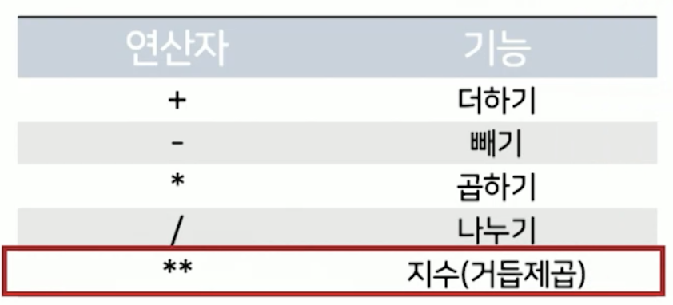
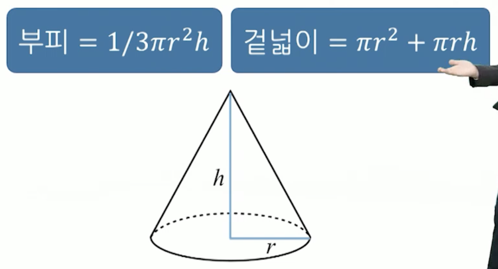
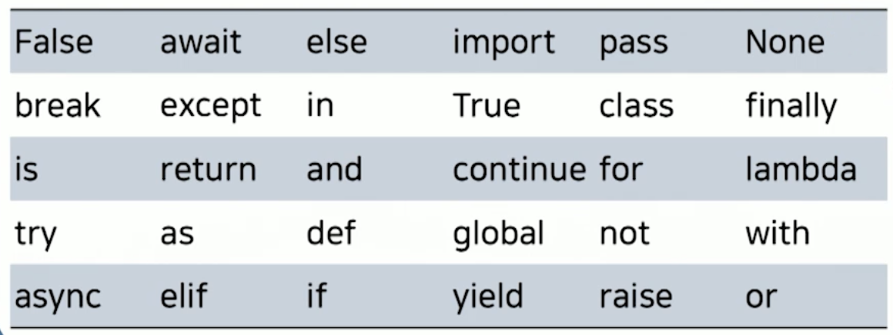
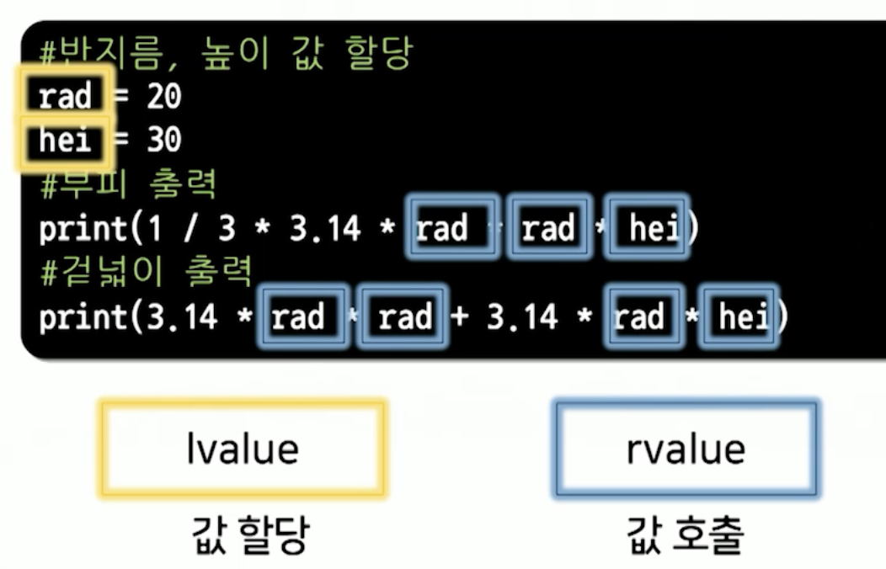

# 4강. 파이썬 시작하기

## 1. 프로그래밍 기초

### 숫자와 문자

- 숫자
  - 정수(int): 소수점이 없는 숫자
  - 실수(float): 소수점이 포함되는 숫자
- 문자
  - 유니코드 기반의 문자 또는 문자열
    - 전세계 모든 문자 표현을 위해 가변 길이의 4바이트 문자로 표현하는 코드 체계
    - 파이썬 3.0부터는 모든 문자를 유니코드로 처리
  - 인용 부호 `"` 또는 `'`를 사용해 표현
  - 문자가 하나든 여러개든 모두 문자 타입


### 기본연산자와 표현식

- 피연산자와 연산자를 이용한 표현식은 파이썬 인터프리터에 의해 자동 계산

  


### 함수(function)

- 프로그래밍 근간을 이룸

- 특정 작업을 수행하는 코드의 집합으로 함수의 이름만으로 실행할 수 있는 단위

  - print 함수: 화면에 데이터를 출력

- 함수의 기본 구조

  ```python
  print("Hello World!")
  # print: 함수 이름
  # "Hello World": 입력값(파라미터)
  ```


### 들여쓰기

- 파이썬은 들여쓰기에 읜존적인 언어
  - 타 프로그래밍 언어에서는 가독성 향상
  - 파이썬에서 코드의 논리적 집합인 **블록**을 표현
- 들여쓰기는 스페이스 4칸(PEP8)
- 블록 중첩 시 추가적인 4칸 들여쓰기 삽입


### 문서화

- 주석(comment) 사용
  - 가독성 증대로 개발 속도 향상, 유지보수 용이
- 주석의 종류
  - 한 라인 주석에는 `#`
  - 여러 라인 주석에는 `"""` or `'''` 를 연달아 사용


### Google Colab


## 2. 데이터 저장

### 원뿔의 부피 & 겉넓이 계산 프로그램

- 원뿔의 부피 & 겉넓이 계산 알고리즘

  

   ```python
   # 반지름 20, 높이 30
   # 부피 출력
   print( 1 / 3 * 3.14 * 20 ** 2 * 30)
   # 겉넓이 출력 
   print(3.14 * 20 ** 2 + 3.14 * 20 * 30)
   ```


### 변수(variable)

- 명령형 패러다임 언어의 특징
  - 처리할 데이터와 처리된 결과를 임시 저장
  - 변수의 값을 변경하는 할당연산자(=) 이용

```python
rad = 20
# rad: lvalue(지속되는 대상)
# 20: rvalue(임시적인 대상)
```


### 값의 할당

- 프로그램이 실행되는 과정에서 처리되는 값이 어떤 행위(입력, 연산 등)에 따라 그 값이 변할 수 있는 메모리 내의 저장 공간 지정
- 식별자, 저장 공간, 값으로 구성


### 식별자

- 프로그램 내부에 정의된 객체(변수, 함수 등)의 이름

- 어떤 저장 공간을 어떤 명칭으로 부르기 위한 것

  - 문자, 숫자, 밑줄로 구성
  - **문자 또는 밑줄**로만 시작 가능
  - 예약어와 동일할 수 없음
  - 길이 제한이 없음

- 예제

  - 식별자가능

  ```python
  volumn, Surface, _50, x, y, __name
  ```

  - 식별자로 사용 불가능

  ```python
  $D$, 1-a, 2023y, else, class, r+h, 77#R
  ```


### 예약어(reserved word)

- 파이썬 인터프리터에 의해 이미 문법적인 용도로 사용되어 식별자로 사용이 불가능한 단어

  


### 변수의 사용

```python
# 반지름, 높이 값 할당
rad = 20
hei = 30
# 부피 출력
print(1/3 * 3.14 * rad * rad * hei)
# 겉넓이 출력
print(3.14 * rad * rad + 3.14 * rad * hei)
```




## 3. 산술 연산자

### 산술연산자의 정의

- 피연산자(operand)에 대해 지정된 산술 연산을 지시하는 기호
  - 단항 연산자(unary operator) 
    - 예: `-5`
  - 이항 연산자(binary operator)
    - 예: `5 * 2`


### 특수연산자

- 프로그래밍 언어에서만 사용되는 연산 또는 부호
  - 정수 나눗셈 연산자(`//`)
  - 모듈로 연산자(`%`)


### 연산자 우선순위

- 표현식에 사용된 여러 연산자의 연산 순서 결정
  - 괄호 내부의 수식
  - 지수 연산자(**)
  - 곱셈, 실수 나눗셈, 정수 나눗셈, 나머지 연산
  - 덧셈, 뺄셈
  - 할당 연산자(항상 젤 마지막!)

```python
avg = 1 // 3 * 3.14 * 20 ** 2 * (30 + 20 % 10)
```


### 파이썬 내장 함수

- 파이썬 인터프리터에서 사용자 편의를 위해 기본적으로 지원하는 함수
  - 별도의 모듈이나 패키지 없이 사용 가능
  - 예:  `print()`, `max()`, `min()`, `abs()`, `pow()`, `round()`,...