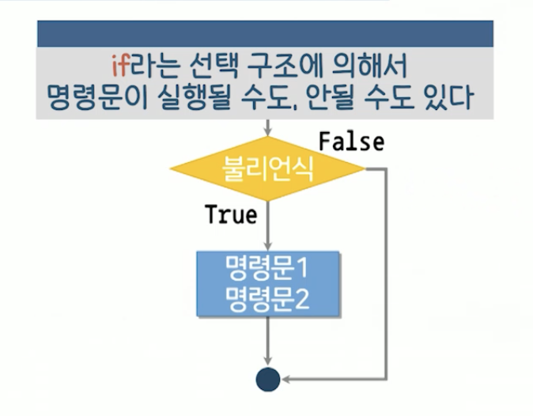
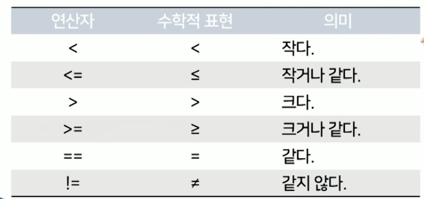
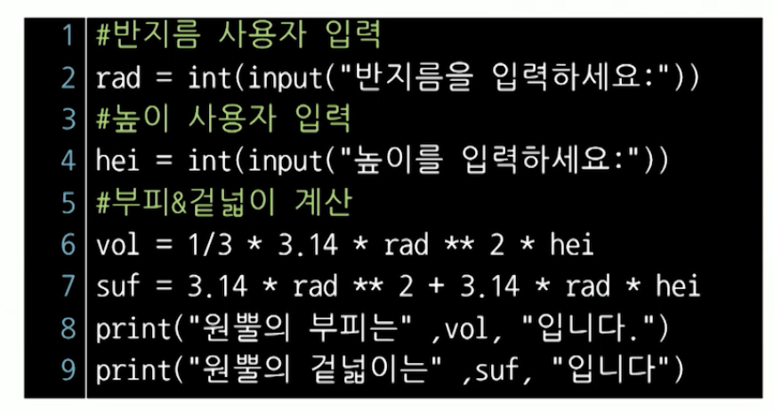
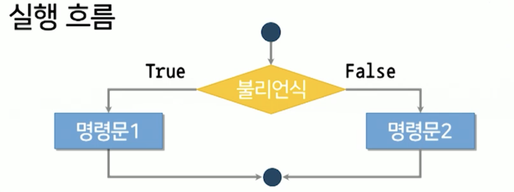
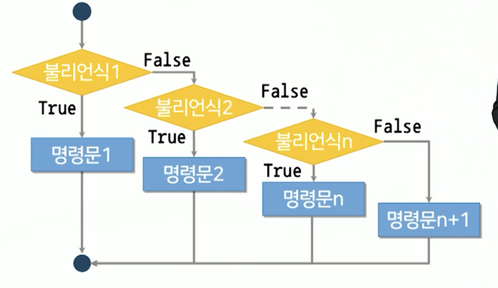
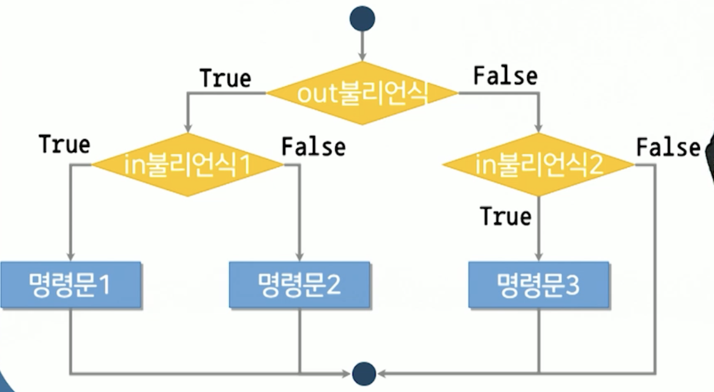

# 6강. 선택 구조

## 01. 선택구조

### 선택 구조의 개념

- 특정 영역 내의 명령문에 대한 실행 여부를 판단에 따라 결정하는 구조
  - 실행 여부는 조건에 따라 결정


### 선택 구조의 구문형식

- 구문형식

  ```python
  if 불리언식:
    명령문1
    명령문2
  ```

- 들여쓰기

  - 특정 동작을 수행하는 한 라인 이상의 명령문의 집합
  - 스페이스 4칸 권고(PEP-8)


### 선택구조의 실행흐름




### 불리언식

- 비교연산자를 사용한 결과가 불리언 타입으로 생성되는 표현식

  


### 불리언 타입

- George Boole

- 논리값이 참(True)과 거짓(False)의 값만 표현할 수 있는 데이터 타입
  - True 또는 False 예약어를 사용해 표현
  - 비교 연산자를 사용한 표현식의 결과로 생성


### 원뿔 계산 프로그램 개선



- 이상한 값이 들어왔을 때, 프로그램이 어떻게 동작해야 하는지
  - 사용자가 반지름 값에 음수를 입력하면?

```python
# 반지름 사용자 입력
rad = int(input("반지름을 입력하세요: "))

# 높이 사용자 입력
hei = int(input("높이를 입력하세요: "))

if rad > 0 :
		# 부피 & 겉넓이 개선
    vol = 1/3 * 3.14 * rad *8 2 * hei
    suf = 3.14 * rad ** 2 + 3.14 * rad * hei
    print("원뿔의 부피는", vol, "입니다.")
    print("원뿔의 겉넓이는", suf, "입니다.")
```


## 02. 논리연산자

### 논리연산자의 개념

- 참, 거짓을 구별할 수 있는 명제를 대상으로 명제의 집합을 위해 고안한 연산자
- 두 개의 논리값(불리언식)을 연산하여 참 또는 거짓을 결과로 얻는 연산자
  - 두 개의 피연산자를 갖는 이항 연산자
  - AND, OR, NOT
  - 왼쪽 > 오른쪽


### AND

- 두 논리값이 모두 True일 때, True이고 어느 하나 False인 경우 False반환


### OR

- 두 논리값이 모두 False일 때 False이고, 어느 하나 True인 경우 True를 반환


### NOT

- 피 연산자가 하나밖에 없는 단항 연산자
- 논리값을 반전하여 False는 True, True는 False로 반환


### 단락평가

- Short-circuit evaluation
- 첫 번째 논리값만으로 전체 연산 결과가 판별 가능할 때 두번째 논리값은 확인(평가)하지 않는 기법
  - C, Java에서 예상치 못한 결과 나타나게 할 수도

- 예시

  ```python
  temp >= 27 and season == "summer"
  ```

  ```python
  temp >= 27 and season == "summer"
  ```


### 원뿔 계산 프로그램 개선

- 사용자가 높이에 음수를 입력하면?

```python
# 반지름 사용자 입력
rad = int(input("반지름을 입력하세요: "))

# 높이 사용자 입력
hei = int(input("높이를 입력하세요: "))

if rad > 0 and hei > 0:
		# 부피 & 겉넓이 개선
    vol = 1/3 * 3.14 * rad *8 2 * hei
    suf = 3.14 * rad ** 2 + 3.14 * rad * hei
    print("원뿔의 부피는", vol, "입니다.")
    print("원뿔의 겉넓이는", suf, "입니다.")
```


## 03. 선택구조의 확장

### 원뿔 계산 프로그램 문제

- 삿용자가 반지름과 높이 값에 양수를 입력할 경우 부피 겉넓이 출력, 음수를 입력할 경우 실행안됨


### 이분 선택 구조의 구문형식

- 구문형식

  ```python
  if 불리언식:
  	명령문1
  else:
  	명령문2
  ```

- 실행흐름




### 다분 선택 구조의 구문형식

- 구문형식

  ```python
  if 불리언식1:
    명령문1
  elif 불리언식2:
    명령문2
    ...
  elif 불리언식n:
    명령문3
  else:
    명령문4
  ```

- 실행흐름

  


### 중첩 선택 구조의 구문형식

- 구문형식

  ```python
  if out불리언식:
    if in불리언식1:
      in명령문1
    else:
      in명령문2
    else:
      if in불리언식2:
      	in명령문3
  ```

- 실행흐름




### 가장 큰 수를 찾는 프로그램

- 세 수 ABC를 입력받고, 그 중 가장 큰 수를 출력하는 프로그램

  ```python
  # ABC 사용자 입력
  A = int(input("A 입력: "))
  B = int(input("B 입력: "))
  C = int(input("C 입력: "))
  
  # A, B, C 중 가장 큰 수 출력
  if A > B:
    if A > C:
      print(A)
    else:
      print(C)
    else:
      if B > C:
        print(B)
      else:
        print(C)
    
  ```

  

### 원뿔 계산 프로그램 개선

- `else` 추가

```python
# 반지름 사용자 입력
rad = int(input("반지름을 입력하세요: "))

# 높이 사용자 입력
hei = int(input("높이를 입력하세요: "))

if rad > 0 and hei > 0:
		# 부피 & 겉넓이 개선
    vol = 1/3 * 3.14 * rad *8 2 * hei
    suf = 3.14 * rad ** 2 + 3.14 * rad * hei
    print("원뿔의 부피는", vol, "입니다.")
    print("원뿔의 겉넓이는", suf, "입니다.")
else :
  	print("반지름의 높이의 값을 모두 양수로 입력해주세요")
```


