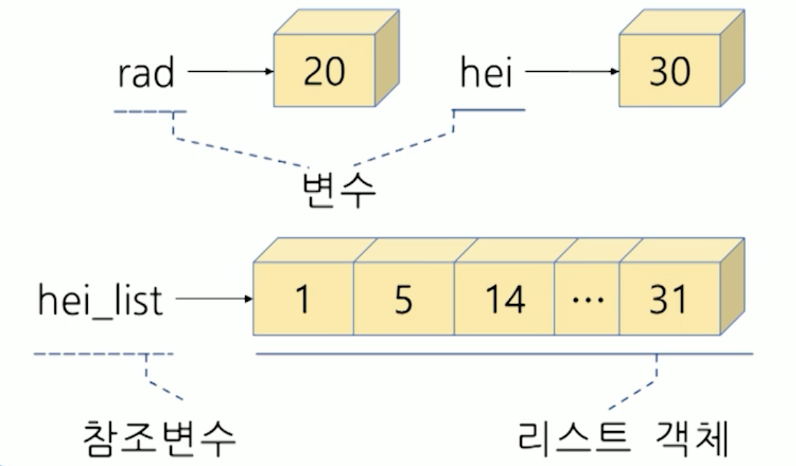
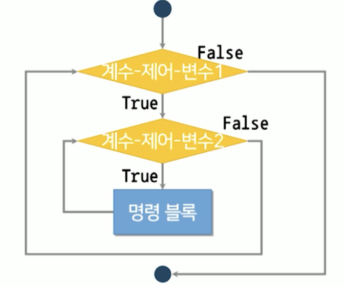
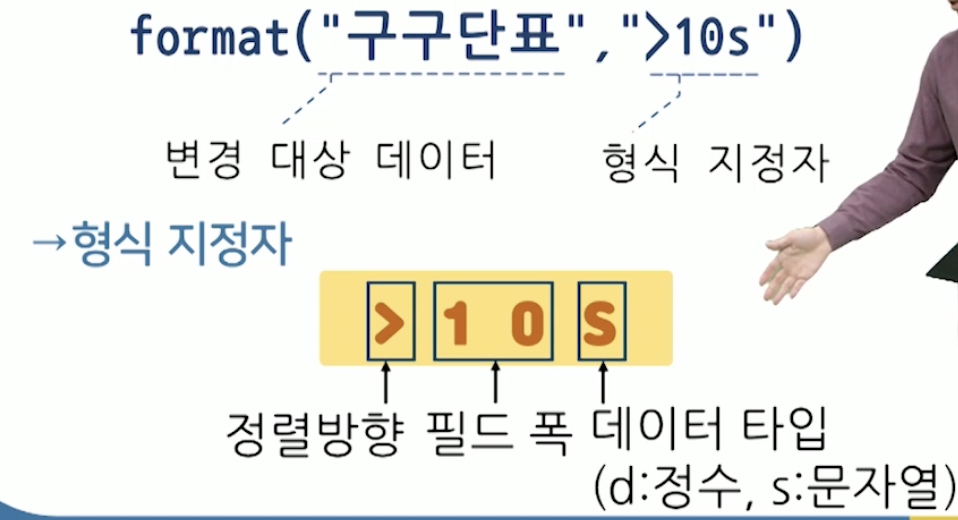
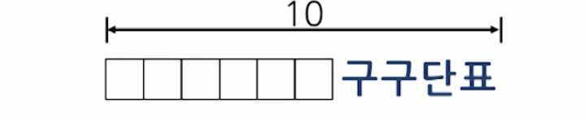
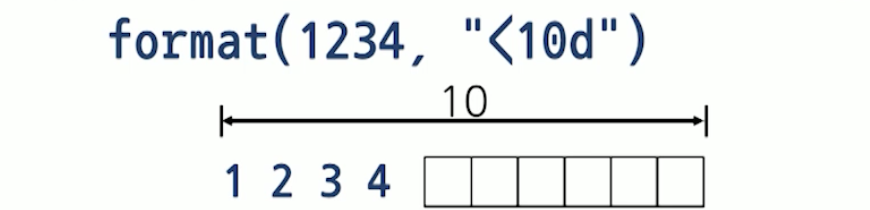

# 7강. 반복 구조

## 반복 구조의 정의

### 반복 구조의 개념

- 특정 영역의 명령문을 여러 번 실행하는 구조
  - 반복 횟수를 조건에 따라 결정
  - loop, iterate, repeat 용어가 혼용


### 반복 구조의 구문형식

- 구문형식: 조건 제어 반복

  - 반복 여부를 매번 판단

  ```python
  while 반복-계속-조건:
    코드 블록
  ```

- 구문형식: 계수 제어 반복

  - 반복 횟수를 미리 제시

  ```python
  for 계수-제어-변수 in 시퀀스:
    코드 블록
  ```


### 반복 구조의 실행 흐름

- 조건 제어 반복

  

  - 반복 출력 프로그램

    ```python
    msg = "저는 파이썬을 잘 다룰 수 있습니다."
    
    count = 1
    while count <= 5:
      print(msg)
      count = count + 1
    ```


### 반복 구조 설계 전략

1. 반복되어야 하는 명령 블록을 작성

2. 반복되어야 하는 명령문을 다음과 같이 반복 구조로 작성

   ```python
   while True:
     	명령 블록
   ```

3. 반복-계속-조건을 작성하고 반복 구조를 제어하기 위해 반복 제어 명령문을 추가

   ```python
   while 반복-계속-조건:
     	명령 블록
     	반복 제어 명령문
   ```


### 반복 구조 설계 전략 적용

- 1부터 사용자가 입력한 값 n까지 합을 구하는 프로그램을 작성하시오

```python
sum = sum + i
```

```python
while True:
	sum = sum + i
```

```python
sum = 0 # 초기화
i = 1
last = input("어디까지 더할까요?: ")
while i <= last:
  sum = sum + i
  i = i + 1
```

```python
num = int(input("어디까지 더할까요?: "))

sum = 0
i = 1

while i <= num:
  sum = sum + i
  i = i + 1

print(sum)
```


### 구구단 출력 프로그램

- 사용자가 입력한 단의 구구단 출력
  - 출력할 단을 입력하세요: 9
  - 9 X 1 = 9
  - 9 X 2 = 18
  - ...
  - 9 X 9 = 81

```python
base = int(input("출력할 단을 입력하세요: "))

i = 1
while i <= 9:
	print(base, "X", i, "=", base * i)
  i = i + 1
```


## 리스트

### 리스트의 개념

- 순서화된 값의 집합체를 저장할 수 있는 데이터 타입
  - 단일 식별자로 연속된 저장 공간 접근 수단 제공
  - 개별 원소의 값을 수정, 추가, 삭제 가능
  - 원소(element)의 나열을 저장할 수 있는 시퀀스 타입 중 하나
    - 리스트, 세트, 튜플, 딕셔너리 등


### 리스트의 구성

- 원소들의 순서를 표현

  


### 리스트의 생성

- 구문형식

  ```python
  list([원소 시퀀스])
  ```

  - 인용부호 [] 를 사용
  - 원소는 콤마(,)로 나열
  - 숫자, 문자 등 여러 개의 데이터 타입이 들어갈 수도 있음


### 인덱스 연산자

- 시퀀스 타입의 원소에 접근하는 연산자
  - 접근 연산자 `[]` 사용
  - 원소에 부여된 인덱스 번호로 지칭

- 리스트 안에 있는 특정 원소 몇 개에만 접근하고 싶을 때 사용


### 계수 제어 반복의 사용

- 구문 형식

  - 계수-제어 변수와 시퀀스 사용
  - 반복시 계수-제어-변수에 시퀀스의 변수 할당

  ```python
  for 계수-제어-변수 in 시퀀스:
    코드 블록
  ```

  ```python
  hei_list = [1, 5, 14, 26, 31]
  
  for hei in hei_list:
    print(hei)
  ```

  

### 원뿔 계산 프로그램 개선

- 반지름은 10이고 높이가 1, 5, 14, 26, 31인 원뿔의 부피와 겉넓이를 각각 출력하시오

```python
rad = 10
hei_list = [1, 5, 14, 26, 31]

for hei in hei_list:
  print(hei)
  # 부피 & 겉넓이 계산
  vol = 1/3 * 3.14 * rad ** 2 * hei
  surf = 3.14 * rad ** 2 + 3.14 * rad * hei
  
  print("반지름", rad, "높이", hei, "원뿔")
  print("원뿔의 부피는", vol, "입니다.")
  print("원뿔의 겉넓이는", surf, "입니다.")
```


## 반복 구조의 확장

### 리스트 생성 자동화

- 리스트 내 원소에 규칙성이 있는 경우 생성 자동화를 위해 함수 사용 가능

  `range(a, b, k)`

  - a 생략시 기본값 0

  - k의 경우, 생략시 기본값 1

- a부터 b보다 작은 값까지 k씩 증가시켜 시퀀스 생성


### range함수의 사용

- `range(1, 100, 1)`
  - 1, 2, 3, 4, ... , 99
- `rad_list = range(10, 40, 10)`
  - 10, 20, 30


### 중첩 반복 구조

- 반복 구조 내 다른 반복구조를 내포한 형식

- 구문형식

  ```python
  for 계수-제어-변수1 in 시퀀스1:
  		for 계수-제어-변수2 in 시퀀스2:
        		명령 블록
  ```

- 실행흐름

  

#### 중첩 반복 구조의 공포

- 프로그램 실행에 많은 부하가 걸릴 수 있음


#### `format` 함수

- 데이터를 양식에 맞춰 형식화

  - `format("구구단표", ">10s")`

    

- 문자열 형식

  - `format("구구단표", ">10s")`

  - 기본정렬: 왼쪽정렬

    

- 정수 형식

  - `format(1234, "<10d")`

  - 기본정렬: 오른쪽정렬

    

### 반복 출력 프로그램 개선

- 계수 제어 반복으로 변경시

```python
# msg
msg = "저는 파이썬을 잘 다룰 수 있습니다."

# 5번 반복 출력
for count in range(1, 6):
  print(msg)
```


### 원뿔 계산 프로그램 개선

- 반지름과 높이가 (10, 1), (20, 5), (30, 14)인 원뿔의 부피와 겉넓이를 각각 출력하시오

```python
rad_list = range(10, 31, 10)
hei_list = [1, 5, 14, 26, 31]

for rad, hei in zip(rad_list, hei_list): # zip 함수
  # 부피 & 겉넓이 계산
  vol = 1/3 * 3.14 * rad ** 2 * hei
  surf = 3.14 * rad ** 2 + 3.14 * rad * hei
  
  print("반지름", rad, "높이", hei, "원뿔")
  print("원뿔의 부피는", vol, "입니다.")
  print("원뿔의 겉넓이는", surf, "입니다.")
```


### 구구단 출력 프로그램 개선

```python
print(format("구구단표", ">20s"))

# 표 머리 출력
print("  |", end = "")
for j in range(1, 10):
  print("  ", j, end = "")

# 새로운 행 삽입
print()
print("----------------------------------------")

# 구구단 표 출력
for i in range(1, 10, 1):
  print(i, "|", end="")
  for j in range(1, 10, ):
    print(format(i * j, ">4d"), end = "")
  print()
```

