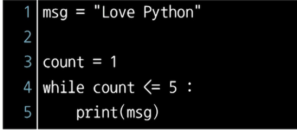
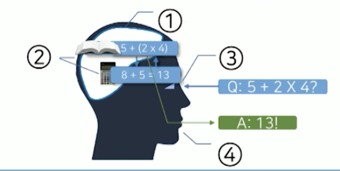
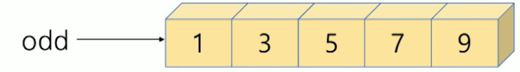
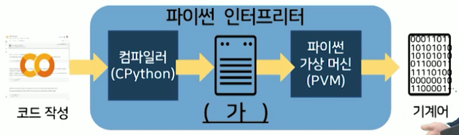
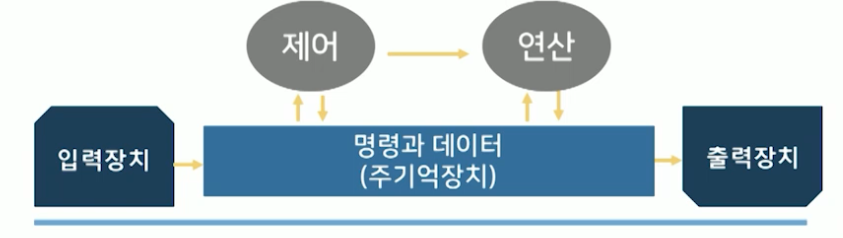
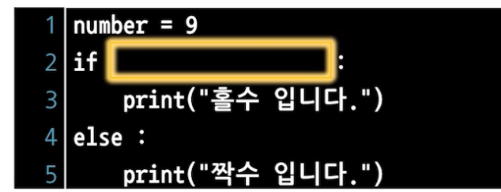
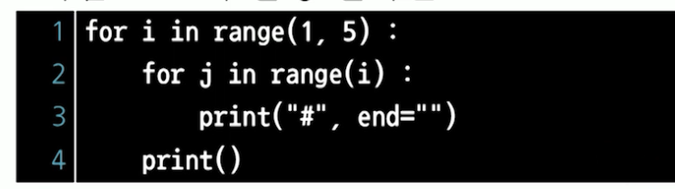
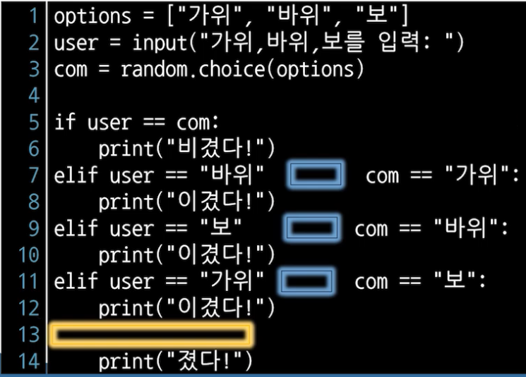

# 8강. 체크포인트

1. 파이썬 인터프리터에서 기본적으로 지원하는 함수는 무엇인가?
   - 내장함수

2. 구조적 프로그래밍 패러다임에서 제안된 제어구조가 아닌 것은?

   - 구조적 프로그래밍 패러다임
     - 순차구조, 반복구조, 선택구조

3. 다음 코드 실행 시 에러의 원인에 대한 설명으로 올바른 것은?

   

   - 무한반복(종료없음)

4. 다음은 무엇에 대한 사전적 정의인가?

   > 이론을 세우는 데 기초가 되는사실
   >
   > 관찰이나 실험, 조사로 얻은 사실

   - 데이터

5. 고급 언어로 작성된 소스코드를 컴퓨터가 이해할 수 있는 기계어로 변환해 주는 프로그램은?

   - 인터프리터

6. 아래 그림의 신체기관과 동일한 기능을 수행하는 컴퓨터 장치로 바르게 짝지어진 것은?

   

   ① 메모리

   ② CPU

   ③ 논리연산

   ④ 출력(HMD)

7. 아래와 같은 시퀀스를 생성하는 코드로 올바른 것은?

   

   - odd = range(1, 10, 2)

8. 파이썬 프로그램 실행과정에서 다음 밑줄 친 (가)에 들어갈 알맞은 말은?

   

   - 바이트 코드

9. 파이썬에 대한 설명으로 올바르지 않은 것은? (아래는 옳은 보기 only)
   - 명령형, 절차적, 객체지향 프로그래밍 등 다양한 패러다임을 지원한다
   - 실행할 수 있는 의사 코드 수준의 문법을 지향한다
   - 많은 개발자의 의견을 수용하고 토론하며 발전한 언어

10. 다음의 명령문에서 함수의 입력인 "Hello World!"를 무엇이라고 하는가?

    ```python
    print("Hello World!")
    ```

    - 파라미터

11. 아래와 같은 명령문으로 생성된 리스트의 "black"값을 "purple"로 수정하는 명령문은?

    ```python
    body = [181, 78, "dark brown", "black"]
    ```

    - Body[3] = "purple"

12. 다음중 식별자로 사용할 수 없는 것은?

    - or ( 예약어 )

13. 파이썬 개발 환경 중 오픈소스이며 문서화가 쉽고 전통적인 소스코드-컴파일-실행 방식에서 벗어나 클라우드 기반 대화형 개발 및 실행 환경을 제공하느 ㄴ것은?

    - 주피터 노트북

14. 다음 코드의 실행결과로 올바른 것은?

    ```python
    print("나는 !")
    		print("파이썬을 할 수 있다.")
    ```

    ```
    구문에러(error) 발생
    ```

15. 다음과 같이 5개의 장치를 통해 컴퓨터를 구성하는 방식을 무엇이라고 하는가?

    

    - **폰노이만 구조**
      - 명령과 데이터를 같은 주기억장치에서 실행
    - 하버드 구조
      - 명령을 저장하는 주기억장치와 데이터를 저장하는 주기억장치를 분할해 놓은 것

16. 다음 중 실행 결과가 나머지와 다른 하나는?

    ```python
    rad = input( )
    rad = int(rad)
    print(rad)
    ```

    ```python
    rad = input("숫자 입력:")
    rad = int(rad)
    print(Rad)
    ```

    ```python
    print(int(input("숫자 입력:")))
    ```

    ```python
    # 얘가 다름
    rad = int(rad)
    print(input("숫자 입력:"))
    ```

17. 여러 프로그램 실행이 요청되면 한정된 자원을 효과적으로 사용하도록 조율하는 운영체제의 기능은?

    - 프로세스 관리

18. 다음은 홀짝 여부를 판별하는 프로그램의 일부이다. 빈칸에 들어갈 올바른 표현식은?

    

    ```python
    number % 2 == 1
    ```

19. 다음 코드의 실행 결과는?

    

    ```python
    #
    ##
    ###
    ####
    ```

20. 아래는 가위바위보 게임 소스코드의 일부이다. 다음 물음에 따라 답하시오

    

    - 파란 네모에 들어갈 내용은
      - `and`
    - 노란 네모에 들어갈 내용은
      - `else`