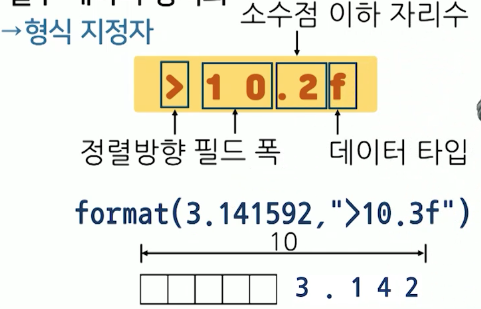
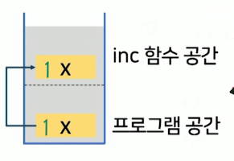

# 9강. 함수

## 1. 함수의 이해

### 함수의 개념

- 특정 작업을 수행하는 명령문의 집합
  - 특정 작업을 함수의 이름으로 대체
  - 유사한 유형의 문제를 해결할 수 있도록 고려
- 사용자 정의 함수
  - 내장 함수와 달리 사용자의 목적에 따라 정의된 함수
- 반환값에 따른 함수의 종류
  - 반환값이 없는 함수: print
  - 반환값이 있는 함수: input, format, int 등


### 반환값이 없는 함수 정의

- 구문 형식

  ```python
  def 함수이름(매개변수 리스트):
    명령 블록
  ```

  - 함수 이름은 식별자
  - 매개변수 리스트는 0개 이상의 값을 함수 내부로 전달
  - 함수 내부에서 매개변수 리스트는 변수와 동일하게 사용


### 원뿔의 부피 계산 함수 정의 및 호출

```python
def prt_cone_vol(r, h) :
  if rad > 0 and hei > 0:
    vol = 1/3 * 3.14 * rad ** 2 * hei
    print("원뿔의 부피는", vol, "입니다")
  else:
    print("반지름과 높이 값에 양수를 입력하세요")
```

```python
radius = 20
height = 30

prt_cone_vol(radius, height)
```


### 숫자 역순 출력 프로그램

- 숫자를 입력받고 역순으로 출력하는 함수를 사용한 프로그램을 작성하시오
  - 역순으로 출력할 숫자를 입력하세요: 4567

```python
digits = 34567

def reverse_number(num) :
  while num != 0:
    digit = num % 10
    num = num // 10
    print(digit, end="")
    
reverse_number(digits)
```


## 2. 반환값이 있는 함수

### 01. 원뿔 계산 프로그램 개선

- 원뿔 계산 결과 출력결과 형식을 상황에 따라 변경하고 싶으면?

- 소숫점이 길게 표시된 데이터 값을 원하는 형태로 형식화 하는 방법?


### 반환값이 있는 함수 정의

- 구문형식

  ```python
  def 함수이름(매개변수 리스트):
    명령블록
    return 반환값 리스트
  ```

- 실행 후 결과값을 남기는 함수

  - `return` 명령어와 반환값을 열거
  - 함수 내부에 여러 개의 `return` 사용 가능
    - 단 첫번째 return 이후에는 그 뒤의 코드들은 실행되지 않는다


### `format` 함수

- 실수 데이터 형식화

  - 형식 지정자

    


- 예시

```python
def rtn_cone_vol(r, h) :
  if r > 0 and h > 0 :
    # r, h 모두 양수일 때
    vol = 1/3 * 3.14 * r **2 * h
    return vol
	else :
		# r, h 음수일 때
    print("반지름과 높이 값에 양수를 입력하세요")
    
print(format(rtn_cone_vol(10, 20), "입니다") # 2093.3333333333 입니다
```

- format

```python
print(rtn_cone_vol(10, 20), "<20.3f"), "입니다") 
# 2093.333                    입니다
```


### 02. 원뿔 계산 프로그램 개선

- 부피와 겉넓이를 모두 반환하려면?


### 동시 할당의 개념

- 시퀀스의 개념을 사용해 하나의 할당연산자만으로 여러 값들을 한 번에 전달

  - 변수의 개수에 상응하는 값을 콤마로 나열

  ```python
  temp, season = 27, "summer"
  ```

  

### 교환(swap)

- 복수 개의 변수에 할당하는 값을 맞바꿈

  ```python
  temp = ehi
  hei = rad
  rad = temp
  ```

  ```python
  rad, hei = hei, rad # pythonic!
  ```


### 원뿔 계산 프로그램 개선 실습

```python
def rtn_cone_vol_surf(r, h) :
  if r > 0 and h > 0 :
    # r, h 모두 양수일 때
    vol = 1/3 * 3.14 * r **2 * h
    surf = 3.14 * r ** 2 + 3.14 * r * h
    return vol, surf
	else :
		# r, h 음수일 때
    print("반지름과 높이 값에 양수를 입력하세요")
    
vol1, surf1 = print(rtn_cone_vol_surf(50,100))  # 동시할당
print(vol1, "입니다") # 261666.6666666 입니다
print(surf1, "입니다") # 23550.0 입니다
```


### 정렬 프로그램 실습

- 세 개의 사용자 입력을 오름차순으로 정렬하는 함수를 이용하여 정렬된 값을 출력한느 프로그램을 작성하시오 (feat. 동시할당)

```python
a = int(input("첫 번째 숫자를 입력하세요: ")) # 34
b = int(input("두 번째 숫자를 입력하세요: ")) # 12
c = int(input("세 번째 숫자를 입력하세요: ")) # 100

def sort3(a, b, c) :
	if a > b :
		a, b = b, a
  if a > c :
		a, c = c, a
  if b > c :
		b, c = c, b # c가 가장 큰 숫자
    
  print(a, b, c)
  
sort3(a, b, c) # 12 34 100
print("출력이후", a, b, c) # 출력이후 34 12 100

# 함수 내부에는 값만 전달되므로, 변수에는 영향없음
```


## 3. 함수의 확장

### 값의 전달

- 함수가 호출될 때 값이 형식 매개변수에 전달(변수가 전달되는 것이 아님)

- 값에 의한 전달 예제

  

  - `inc` 함수공간에 있는 1은 프로그램 공간에 있는 값, 1이 복사되어서 넘어가는 것
  - 저 네모 파이프는 "호출스택"

  ```python
  x = 1
  print("x의 값은", x)
  inc(x)
  
  def inc(x):
    x = x + 1
    print("x의 값은", x)
  
  print("x의 값은", x)
  ```

  

### 변수의 스코프

- 프로그램에서 변수가 참조될 수 있는 영역
  - 전역변수: 프로그램 전체 영역에서 접근
  - 지역변수: 선언된 함수 내부에서만 접근
- 예제
  - 변수 x 의 스코프는 전역
  - 변수 y 의 스코프는 지역(함수 내)

```python
x = 1 

print("x의 값은", x)
inc(x)

def inc1( ):
  y = x + 1
  print("y의 값은", y)

inc1( )
print("x의 값은", x)
print("y의 값은", y)
```


### 01. 원뿔 계산 프로그램 개선

- 단위 원뿔(반지름 20, 높이 30)의 부피와 겉넓이를 출력하려면?


### 기본 매개변수

- 함수 호출 시 매개변수가 전달되지 않을 경우 기본값이 전달되는 매개변수

- `print` 예시

  ```python
  print("Hello", "I am Python")
  ```

  ```python
  print("Hello", "I am Python", sep = "") # 여기서 sep=""이 기본
  ```


### 기본 매개변수의 정의

- 구문 형식

  - 일반 매개변수 앞에 위치할 수 없음

  ```python
  def 함수이름(매개변수 리스트, 매개변수 = 값 리스트):
    	명령 블록
      return 반환값 리스트
  ```


### 02. 원뿔 계산 프로그램 개선

- 반지름은 10이고 높이가 1, 5, 14, 26, 31인 원뿔의 부피와 겉넓이를 각각 출력하시오.


### 가변 매개변수

- 함수 호출 시 매개변수를 사용자가 원하는 개수만큼 지정할 수 있는 매개변수

  ```python
  x = 10
  y = 20
  z = 30
  
  print("x는", x, "y는", y, "z는", z)
  ```

- 구문형식

  ```python
  def 함수이름(매개변수 리스트, *가변 매개변수):
    명령 블록
    return 반환값 리스트
  ```

  - 일반 매개변수 앞에 위치할 수 없음
  - 가변 매개변수는 1개만 사용 가능
  - 가변 매개변수는 실제 전달될 때 리스트(`[]`)형태로 전달됨


### 원뿔 계산 프로그램 개선 실습

- 기본값 설정

```python
def rtn_cone_vol(r=20, h=30) : # 기본값 설정
  ...
print(format(rtn_cone_vol(10, 20), "입니다") 
```

- 파라미터 개수가 가변적인 함수

  - 예시: 여러개의 수를 입력받고 합과 평균을 반환하는 `var_sum_avg` 함수를 사용하여 (20, 25, 10, 85, 100, 150)에 대한 합과 평균을 출력하는 프로그램을 작성하시오

  ```python
  def var_sum_avg(*numbers) : # 몇개들어오는지 모를때 앞에 파라미터 앞에 '*' 
    sum = 0
    count = 0 
  
    for i in num_list :
      sum = sum + i
      count = count + 1
  
    return sum, sum/count
  
  print(var_sum_avg(10, 20, 30, 40))  # 100, 25.0
  print(var_sum_avg(20, 25, 10, 85, 100, 150)) # 390, 65.0
  ```

  