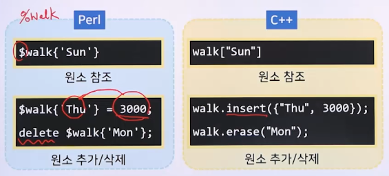
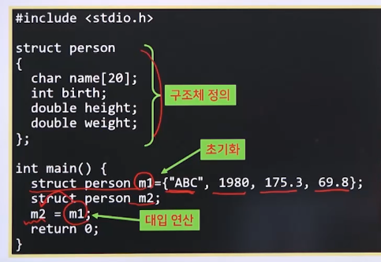
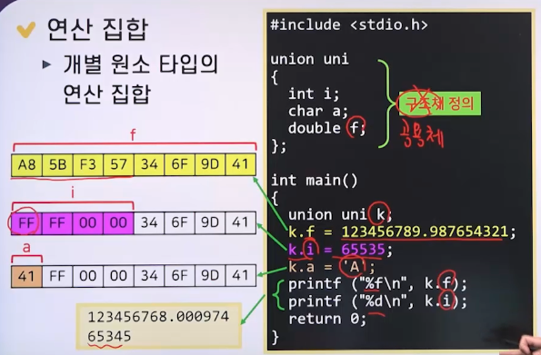
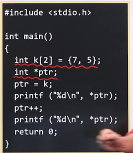
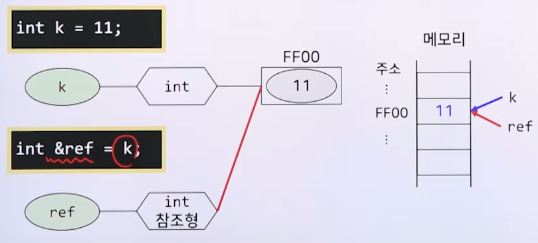

# 10강. 복합타입

## 1. 배열

### 배열(Array)

- 동질형 데이터의 모음으로 구성된 타입

  - 원소 element
    - 배열의 각 데이터
  - 배열의 크기
    - 배열이 가지는 원소의 갯수

- 각 원소는 첨자로 구분

  - 첨자(subscript/index)
    - 첫 원소와의 상대적 위치

- 데이터 집합

  - 원소의 타입에 해당하는 데이터 집합이 배열의 크기만큼 모인 집합

  - 원소의 타입과 배열의 크기에 따라 다양한 타입 존재

    - 원소의 타입: 단순타입 및 복합타입 모두 가능

    - 배열의 크기: 양의 정수 범위 * 차원

- 차원(dimension)

  - 배열에 사용되는 첨자의 개수

    - 1차원, 2차원, 3차원 배열..

    - 1차원: 크기

    - 2차원: [행]\[열]

    - 3차원: [면]\[행]\[열]

      


### 배열의 구현

- 저장 공간 확보
  - 정적 변수
  - 스택 동적 변수
    - 배열의 크기는 정적 바인딩 또는 동적 바인딩
  - 힙 동적 변수
    - 배열의 크기도 동적 바인딩
    - Java
- 첨자를 통한 원소의 주소 계산

- 크기 N인 1차원 배열 A

- 크기 M x N 인 2차원 배열 B

  - 행우선 저장 > 대부분의 언어

    ```
    주소 (B[i][j] = 주소(B[0][0]) + i*N*원소 크기 + j*원소크기)
    ```

- 연산 집합

  - 배열 전체를 다루는 연산들의 집합
  - 개별 원소 연산은 원소 타입의 연산 집합에 의존
  - 배열 전체에 대한 연산은 PL에 따라 다름
  - C, C++, Java > 초기화 연산만 기본적으로 제공
  - Ada, Perl, Python > 대입 연산 등이 포함

  

## 2. 문자열형

- 문자열 데이터를 다루는 타입
  - 문자열 > 문자들의 나열
  - "KNOU", "good morning", "123", "a"
- 데이터 집합
  - 모든 문자열이 모인 집합
  - C, C++ > 문자형의 1차원 배열
  - Java > String 클래스 타입
- 연산 집합
  - PL 마다 많이 차이가 존재
  - C, C++ > 기본적인 문자열 연산 없음
  - Java
    - 대입 연산 -> str2 = str
    - 연결 연산 -> "good" + "morning" = "good morning"


## 3. 연관배열과 해싱

### 연관배열(Associative Array)

- 동질형 데이터의 순서 없는 모음으로 구성된 타입
  - 원소 간의 위치 관계는 의미 없음
- 각 원소는 키(key)로 구별
  - 키 -> 각 원소의 절대 위치
  - 키는 중복 불가, 원소는 중복 가능
- 데이터 집합
  - 키의 데이터 집합과 원소 타입의 데이터 집합 쌍이 모인 집합
  - 키의 타입과 원소의 타입에 따라 다양한 타입 존재
    - 키의 타입 > 정수, 문자열 등
  - Perl -> `hash` 타입
  - C++ -> `map` 타입
- 연산 집합
  - 원소 참조, 원소 추가, 원소 삭제 등
  - 


## 4. 구조체와 공용체

### 구조체(structure type)

- 레코드형(record type)

- 데이터의 모음으로 구성된 타입

  - 원소 > 동질형/이질형 모두 가능

- 각 원소는 이름으로 구별

  - 이름 > 각 원소의 타입으로 선언된 변수명

- 데이터 집합

  - 각 원소의 타입에 해당되는 데이터 집합들이 모인 집합
  - 원소의 개수와 각 원소의 타입에 따라 다양한 타입 존재
    - 각 원소의 타입 > 단순타입, 복합타입 모두 가능

- 연산 집합 > 초기화, 대입 연산

  


### 공용체(union type)

- **저장 공간을 공유**하는 데이터의 모음으로 구성된 타입
- 원소들의 구성 형태는 구조체와 유사
  - 각 원소는 이름으로 구별
- 한 원소의 값이 변경되면, 다른 원소들이 영향을 받음(위험)
- 데이터 집합
  - 각 원소의 타입에 해당하는 데이터 집합의 합집합
  - 각 원소의 타입에 따라 다양한 타입 존재
    - 각 원소의 타입 -> 단순 타입, 복합 타입 모두 가능
  - C, C++ -> union
- 연산 집합
  - 개별 원소 타입의 연산 집합
  - 


## 5. 포인터형과 참조형

### 포인터형(pointer type)

- 특정 데이터가 저장되는 주소 자체를 데이터로 다루는 타입
  - 특정 데이터 아입은 사용자가 지정(단순/복합타입)
- 데이터 집합
  - 가용한 범위의 주소를 포함
    - 32비트 시스템 => 2^32 이내
    - 64비트 시스템 => 2^64 이내
- 연산집합
  - 대입 연산
  - 덧셈, 뺼셈
  - C, C++
    - 역참조 연산자
    - 


### 참조형(reference type)

- 사용자가 지정하는 타입의 데이터가 저장된 주소 자체를 자신의 주소로 사용하는 타입

- C, C++

  

- 데이터 집합
  - 지정한 타입의 데이터 집합
- 연산 집합
  - 지정한 타입의 연산 집합