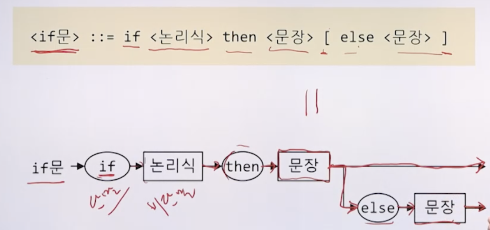
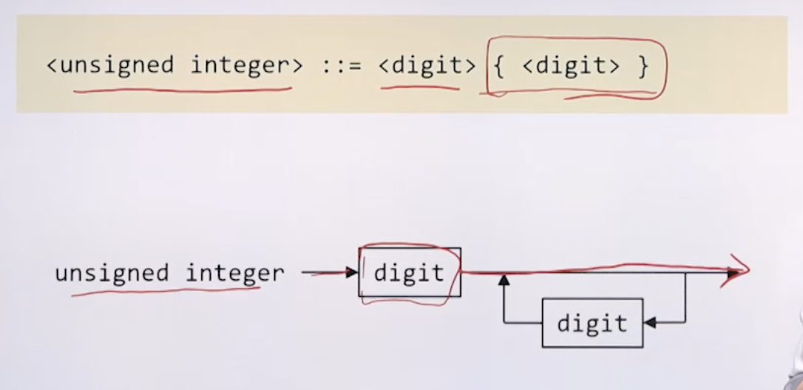
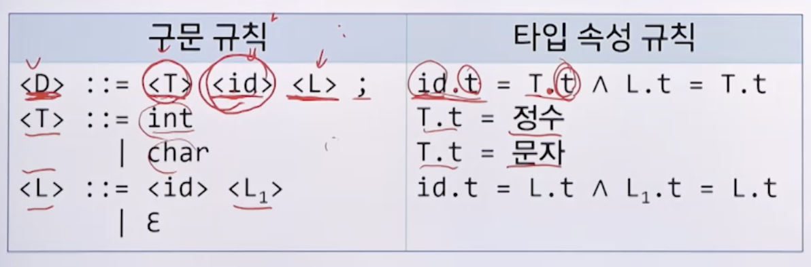

# 4강. 구문론과 의미론

## 1) 구문론과 의미론

### 언어의 형식적 정의

- 구문론과 의미론을 통해 언어를 엄밀하게 정의
- 구문론(syntax)
  - 문장이 **구성**되는 방식에 대해 연구
- 의미론(semantics)
  - 문장이 나타내는 **의미**에 대해 연구

- 예시
  - 나는 너를 사랑한다
    - 구문: 주어 + 목적어 + 서술어
    - 의미: 화자가 청자를 몹시 아끼고 귀중히 여긴다
  - I love you
    - 구문: 주어 + 동사 + 목적어
    - 의미: 화자가 청자를 몹씨 아끼고 귀중이 여긴다. 


### 프로그래밍 언어의 형식적 정의

- 프로그래밍 언어의 명확한 구문과 의미를 정의

- 이를 통해 명확한 사용체계를 제공

- 예

  - `PRINT "GCD is"; A` 
    - 구문: PRINT "출력할 내용"; 변수
    - 의미: 출력할 내용과 변수의 값을 순차적으로 출력하라
  - `PRINT "GCD is %d", a);`
    - 구문: `printf`("출력할 내용", 변수);
    - 의미: 출력할 내용의 %d 자리에 변수의 값을 대신 넣어 내용을 출력하라

- 형식적 정의의 필요성

  - 컴퓨터: 프로그램 해석의 모호함 제거
  - 작성자: 프로그램의 동작 예측 가능

- 예시

  ```c
  int x12;
  x12 = 1 + 5 * 2;
  if x12 > 10 then ...
  ```

  - 프로그램의 구조
    - 문자: 영어 알파벳, 아라비아 숫자, 특수 기호 등
    - 어휘(토큰): 문자의 모임. 최소한의 의미를 갖는 단어 
    - 구문: 프로그램을 작성하는 규칙
      - 토큰을 모아 프로그램을 구성

| 구문론                                                | 의미론                                                    |
| ----------------------------------------------------- | --------------------------------------------------------- |
| 프로그램의 표면적인 구조를 정의                       | 프로그램의 내용적인 효과를 정의                           |
| 프로그램 **작성 시 어떤 형태**로 작성해야 하는지 기술 | 프로그램 **실행 시 어떤 일**이 일어나는지, 그 의미를 기술 |


## 2) 구문의 표현

### 구문론

- 프로그램의 표면적인 구조를 정의
- 정의된 구문을 통해 모든 정상적인 프로그램을 도출
- 작성된 프로그램이 정의된 구문에 맞는 프로그램인지 확인
- 구문의 표현
  - 구문의 정의는 문법을 활용해 명확하게 표현
  - 일반적으로 프로그래밍 언어에서는 **문맥 자유 문법**을 이용


### 문맥 자유 문법(CFG: Context-Free Grammar)

- 구성 요소
  -  `<if문> ::= if <논리식> then <문장>`
  - 비단말 기호: 정의가 될 대상 `<if문>`, `<논리식>`, `<문장>`
  - 단말 기호: 언어에서 직접 사용되는 표현 `if`, `then`
  - 시작 비단말 기호: 언어에서 독립적으로 사용될 수 있는 단위 `<if문>`
  - 규칙: 비단말 기호를 단말 기호와 비단말 기호의 조합으로 정의
    - 각 규칙은 하나의 비단말 기호만을 정의


### 문맥 자유 문법의 다양한 표현 방법(BNF, EBNF, 구문 도표)

#### BNF(Backus-Naur form)

- Algol의 구문을 정의하기 위해 사용된 표현법

- 세 가지 메타 기호

  - `::=` 정의
  - `|` 택일
  - `<>` 비단말기호

- `<if문> ::= if <논리식> then <문장> else <문장> | if <논리식> then <문장>`

  - 비단말 기호: `<>`로 묶인 기호

  - 단말 기호: 비단말 기호 및 메타 기호가 아닌 기호

  - 규칙: `::=`를 기준으로 왼쪽 부분을 오른쪽 부분으로 정의


#### EBNF(Extended BNF)

- BNF에 추가적인 메타 기호를 사용하여 규칙을 보다 간결하게 표현
- 추가된 메타 기호
  - `[]` 생략 가능
  - `{}` 0번 이상 반복
  - `()` `|`와 함께 쓰여 한정된 범위의 택일
  - `''` 메타 기호를 단말 기호로 사용

- **`[]` 생략 가능**
  - `<if문> ::= if <논리식> then <문장> [ else <문장> ]`
  - BNF 표현
    - `<if문> ::= if <논리식> then <문장> else <문장> | if <논리식> then <문장>`
- **`{}` 0번 이상 반복**
  - `<unsigned integer> ::= <digit> { <digit> }`
    - 여러 자리의 수를 나타낼 수 있는 것 = 100자리 수를 표현할 수 있음
  - BNF 표현
    - `<unsigned integer> ::= <digit> | <unsigned integer><digit>`
    - 재귀
- **`()` `|`와 함께 쓰여 한정된 범위의 택일**
  - `<수식> ::= <수식> ( + | - | * | / ) <수식>`
  - BNF 표현
    - `<수식> ::= <수식> + <수식> | <수식> - <수식> | <수식> * <수식> | <수식> / <수식>`
- **`''` 메타 기호를 단말 기호로 사용**
  - `<BNF 규칙> ::= <왼쪽 부분> '::=' <오른쪽 부분>`


#### 구문 도표(Syntax diagram)

- 초기 Pascal의 사용자 설명서에 사용된 표현됨

- 순서도와 유사하게 그림으로 구문을 표현

  

- EBNF 표현

  - 예제 1 `[]`

    

  - 예제 2 `()`

    

  - 예제 3 `{}`

    


## 3) 의미의 표현

### 의미론

- 프로그램의 내용적인 효과를 정의
- 프로그램 실행 시 어떤 일이 일어나는지 그 의미를 기술
- 구문으로 표현하기 어려운 제약사항을 기술하기도 함
- 의미의 표현
  - 일반적으로 자연어 문장으로 표현하나, 명확성이 부족
  - 의미의 엄밀한 표현을 위한 다양한 기법 개발(형식 의미론)


### 형식 의미론

- 정적 의미론
  - 프로그램을 수행하기 전 의미가 맞는지 파악하는 방법
  - 주로 타입 검사 수행에 활용
  - 대표적인 방법: 속성 문법
- 동적 의미론
  - 프로그램 수행 시 나타나게 될 의미를 표현하는 방법
  - 대표적인 방법: 기능적 의미론, 표기적 의미론, 공리적 의미론 등


### 정적 의미론: 속성 문법

- 비단말 기호마다 타입 속성이 있다고 가정하고, 이에 대한 규칙을 정의

  

  


### 동적 의미론: 기능적 의미론

- 추상 기계의 상태를 바꾸는 것으로 수행 의미를 표현

  - 프로그램이 수행(기능)되면 컴퓨터의 상태가 바뀜

- 상태: <수행할 명령어, 메모리 상태>

  


### 동적 의미론: 표기적 의미론

- 구문 요소를 **수학적 표기**에 대응시켜 수행 의미를 표현

- 의미 함수: 대응시키는 함수

  

  

### 공리적 의미론

- 프로그램의 효과로 수행 의미를 표현

- 효과: 프로그램 S가 실행됨으로써 사전조건 P를 사후조건 Q로 변화시킴 {P} S {Q}

  

  

### 의미론의 한계 및 효과

- 한계
  - 프로그래밍 언어 전체에 대한 의미 표현은 너무 복잡
- 효과
  - 프로그램의 구현 및 분석 등에 유용하게 사용됨
  - 속성 방법
    - 인터프리터 및 컴파일러 구현 시
    - 트리 생성, 타입 검사, 코드 생성 등을 할 때 
  - 수학적 표기
    - 언어의 특성을 명확하게 정의해야 할 때 
  - 공리적 의미론
    - 프로그램의 특정 조건 만족 여부를 확인할 때 


