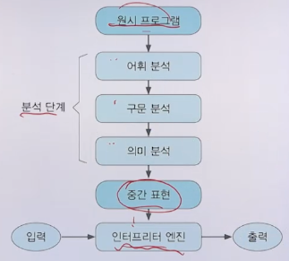

# 6강. 프로그래밍 언어의 구현

## 1. 프로그래밍 언어 정의와 구현

### 프로그래밍 언어 정의

- 구문 규칙과 의미 규칙

  - 구문 규칙: 어떤 프로그램이 올바른 형태인지 규정하는 것

  - 의미 규칙: 올바른 형태의 프로그램을 실행하였을 때 어떻게 실행되는 것이 올바른 것인지 규정하는 것

- 구문 규칙 정의
  - 문맥 자유 문법, BNF, EBNF, 구문도표 등
  - 문맥 자유 문법과 EBNF를 주로 사용
- 의미 규칙 정의
  - 기능적 의미론, 표기적 의미론, 공리적 의미론
  - 자연어를 주로 사용


### 프로그래밍 언어 정의 예: 로봇 제어 언어

- 구문 규칙

  ```
  <program> ::= { forward | left | right }
  ```

- 의미 규칙

  - forward: 로봇이 향하고 있는 방향으로 1만큼 이동
  - left: 로봇이 왼편으로 90도 회전
  - Right: 로봇이 오른편으로 90도 회전


### 프로그래밍 언어 구현

- 그 언어로 작성된 프로그램을 수행하는 프로그램
- 프로그래밍 언어 L의 구현
  - 다음을 수행하는 프로그램
  - PL이 L의 **구문 규칙**을 따르는 올바른 프로그램인지 검사
    - PL: 언어 L로 작성된 프로그램
  - 올바른 경우, PL을 입력으로 받아서 L의 **의미 규칙**에 따라 실행

- CPU의 함수 모형

  

- 프로그래밍 언어 구현의 함수 모형

  

- 인터프리터의 함수 모형

  

- 컴파일러의 함수 모형

  


## 2. 프로그래밍 언어 구현 방법

### 프로그래밍 언어 구현 개요

- 전통적인 프로그래밍 언어 구현
  - 대상: 명령형 언어, 절차형 언어, 객체지향 언어
  - 기계어를 확장하는 형태로 구현
- 새로운 패러다임의 언어 구현
  - 대상: 함수형 언어, 논리 언어
  - 구현 모델을 추상기계로 만들어 징검다리 삼아 구현


### 전통적인 프로그래밍 언어 구현

- 명령형 언어
  - 저급언어의 연산과 명령어를 확장하는 형태로 구현
- 절차형 언어
  - 명령형 언어 + 사용자 정의 연산(함수)과 사용자 정의 명령어(프로시저)를 지원하는 형태로 구현
- 객체지향 언어
  - 절차형 언어 + 사용자 정의 자료형을 지원하는 형태로 구현

 

### 새로운 패러다임의 프로그래밍 언어 구현

- 언어별 계산 모델
  - 함수형 언어: 람다 계산법
  - 논리 언어: 연역 논리
- 저급언어와의 연관성을 직접 파악하기 어려움
- 계산 모델과 하드웨어 사이에 중간 기계(추상 기계)를 하나 더 놓은 형태로 구현
  - 프로그램을 추상기계가 알아듣는 형태로 변경
- 추상 기계
  - 함수형 언어: CPS, G-machine, TIM 등
  - 논리 언어: WAM 등
- 가상 기계
  - 추상기계가 구체적인 구현물로 제시되고 코드를 독자적으로 수행할 수 있는 경우


### 컴파일러 구현 단계


- 분석 단계
  - 프로그램의 구조 파악
  - 중간 표현 생성 -> 프로그래밍 언어에 종속적
- 생성 단계
  - 목적 기계에 적합한 명령어 생성
  - 효율적인 목적 코드 생성 -> 목적 기계에 종속적


### 인터프리터 구현 단계



- 컴파일러 구현 단계를 그대로 포함
- 중간 표현을 순회하며 프로그램을 수행
- 프로그래밍 언어의 문장 단위로 해석


### 언어 구현에 필요한 자료 구조

- 구문 트리
  - 언어 구현 단계의 중심을 차지
  - 분석 단계의 전 과정을 관통
- 심볼 테이블(컴파일러 구현)
  - 식별자 정보(타입, 선언 위치 등)를 저장
- 환경(인터프리터 구현)
  - 값 정보를 포함한 식별자 정보를 저장

- 실행 환경
  - 실행을 지원하기 위한 메모리 구조
    - 정적 세그먼트: 코드, 정적 데이터
    - 동적 세그먼트: 스택, 힙
  - 메모리 및 실행 상태를 관리하기 위한 **레지스터** 
    - PC, SP, FP 등 전용 레지스터
    - 여러 범용 레지스터


## 3. 언어 구현 실제

### 어휘 분석기 구현

- 어휘 분석기는 프로그램의 어휘를 구별해 내고 속성을 구하여 구문 분석기에 전달
  - 어휘: 예약어, 리터럴, 연산자 등
- 유한 상태 기계(FSM)를 구성하여 구현


### 어휘 분석기 구현 예


### 구문 분석기 구현

- 구문 분석기는 토큰 열로부터 구문 트리를 생성

- 구문 트리의 형태: 파스 트리, 추상 구문 트리

  

- 구문 트리를 순회하는 여러 프로시저로 구성된 프로그램

- 순환 하강 구문 분석기

  - 문법 규칙을 그대로 코드로 바꾼 형태
    1. 각 비단말 기호의 문법 규칙에 대해 하나의 프로시저 생성
    2. 우변을 모사할 때 단말 기호는 일치 검사, 비단말 기호는 해당 프로시저 호출


### 순환 하강 구문 분석기 예

- 괄호가 맞는 문자열을 생성하기 위한 문법

  


- 

