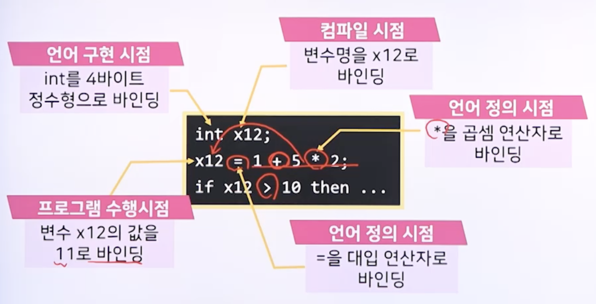
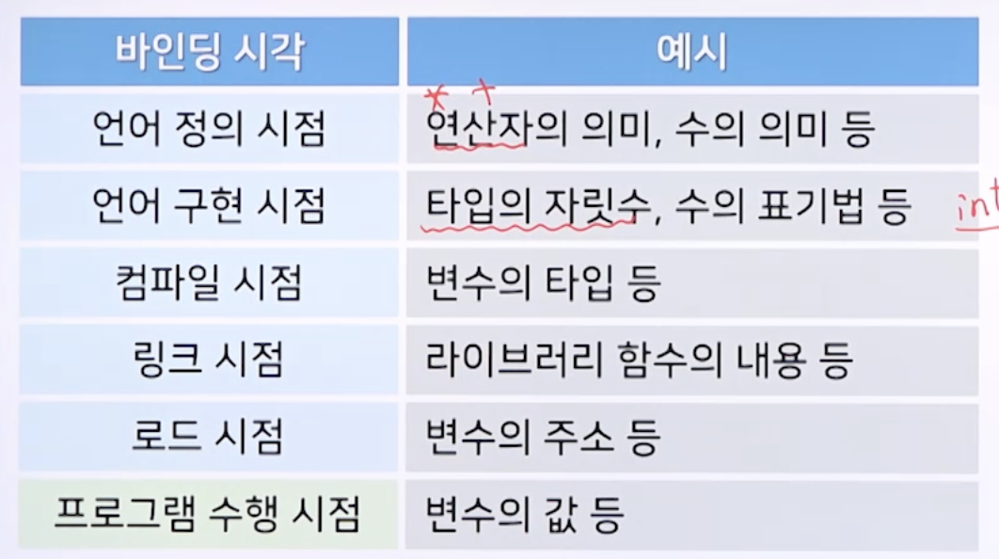

# 7강. 변수와 바인딩

## 1. 변수의 개요

### 변수(variables)

- 프로그램에서 처리할 데이터를 저장, 관리할 수 있도록 메모리를 추상화 한 것

### 변수의 속성

- 변수명
  - 변수의 이름, 식별자 identifier
- 타입
  - 변수에 저장할 수 있는 데이터 집합의 종류. 자료형
- 주소
  - 변수가 사용하는 메모리의 위치
  - 참조
- 값
  - 변수에 저장된 데이터
  - 수행시간 동안 변경될 수 있음

### 배런(Barron)의 표기법

## 2. 바인딩

###  바인딩(binding)

- 언어 구성 요소의 속성이 구체적으로 결정되는 것

- 바인딩이 일어나는 시점

  - 언어 정의 시점
  - 언어 구현 시점
  - 컴파일 시점
  - 링크 시점
  - 로드 시점
  - 프로그램 수행 시점

- 언어의 구성 요소 혹은 속성에 따라 달라짐

  

### 바인딩 시각에 따른 예시

### 바인딩 시각의 구분

- 정적 바인딩 static binding
  - 프로그램 수행 시점에 바인딩의 변화가 없는 경우
- 동적 바인딩 dynamic binding
  - 프로그램 수행 시점에 바인딩의 변화가 있는 경우

### 정적 바인딩

### 동적 바인딩

## 3. 변수의 바인딩