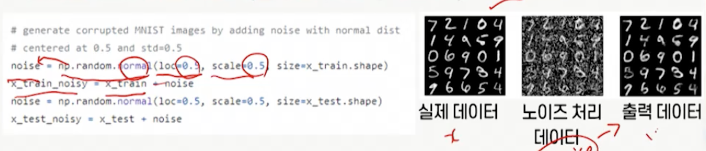
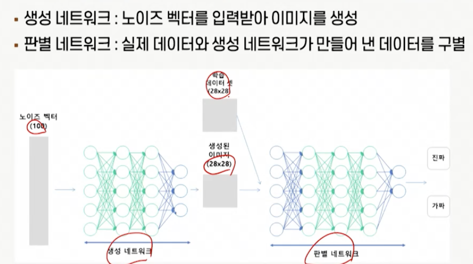

# 10강. 오토인코더와 적대적 생성 신경망

## 1. 오토인코더의 이해

- 오토인코더란?

  

  

  - 데이터 압축

    

### 2. 오토인코더의 특징

- 데이터 시각화
  - 고차원 데이터를 저차원으로 변환
- 고차원 데이터 문제인 차원의 저주 방지
  - 차원이 높아질수록, 데이터간의 공간이 커짐
  - 차원의 저주는 고차원일수록 성능이 저하되는 현상으로, 데이터가 존재할 공간에 비해 데이터의 밀도가 낮아지는 문제
  - 오토인코더는 특징의 개수를 줄임으로써 데이터 차원 축소 가능
- 중요한 특징 추출
  - 비지도학습을 통해 중요한 특징이나 의미적으로 가까운 데이터를 찾을 수 있음
  - (예) 숫자 이미지에 대해 매니폴드를 잘 찾았다고 가정하면, 숫자별 회전, 두께, 크기 등 특징 추출 가능
- 매니폴드
  - 고차원 공간에 내재한 저차원 공간
  - 매니폴드 학습은 고차원 공간의 데이터를 잘 표현할 수 있는 저차원 공간으로 맵핑시키는 함수를 찾는 과정

### 3. 오토인코더의 유형

- 기본 오토인코더

  - 입력 데이터를 압축하고, 재구성

- Stacked 오토인코더

  - 특징 추출을 더욱 정교하게 수행하기 위해 여러 개의 층으로 구성된 오토인코더
  - ReLU

- 노이즈 제거(Denoising) 오토인코더

  

  

  - 입력 데이터에 노이즈 추가 후, 이를 제거해 더 정확한 재구성 만듦
  - 고라니 안개 예제 

- 변이형(Variational) 오토인코더

  

  

  

  - 입력 데이터의 잠재적 분포를 학습하고, 재구성된 이미지가 원래 이미지와 유사한 분포를 가지도록 하는 오토인코더
  - 다른 오토인코더와 다르게, 학습 데이터에서 샘플링된 것 같은 새로운 데이터를 만들기 때문에 생성모델로 분류됨(Generative Model)

## 2. 적대적 생성 신경망의 이해

### 1. 적대적 생성 신경망의 구조

- 적대적 생성 신경망(Generative Adversarial Networks: GAN)이란?
  - 실제 이미지와 비슷해 보이는 이미지를 생성하는 모델
  - 적대적이라는 단어에서 유추 가능하듯, 데이터를 생성하는 네트워크와 데이터를 판별하는 상반된 두 개의 네트워크로 구성
  - 생성된 데이터는 정답 없음, 비지도 학습 기반 생성모델로 분류
- 2 개의 네트워크
  - 생성 네트워크(Generator): 노이즈 벡터 입력받아 이미지 생성
  - (Discriminator): 실제 데이터와 생성 네트워크가 만들어낸 데이터 구별

- 생성 모델의 목표
  - 모델은 실제 데이터 분포를 근사할 수 있도록 학습
  - GAN은 생성 네트워크가 실제 데이터의 분포를 근사할 수 있도록 학습
    - 1/2(균형점, 판별 네트워크가 구분할 수 없도록)

### 2. 적대적 생성 신경망의 학습

- 학습 과정

  - 생성 네트워크는 입력받은 노이즈 벡터를 통해 생성 네트워크가 실제 데이터의 분포에 가까운 데이터를 생성함으로써 판별 네트워크를 속이려고 함
  - 반대로, 판별 네트워크는 실제 데이터와 생성 네트워크로부터 만들어진 데이터가 진짜인지 가짜인지 판별하려고 함

- 판별 네트워크(D)의 학습

  

  - 실제 데이터를 진짜로 인식하고, 생성된 데이터를 가짜로 분류할 수 있도록 학습
  - 판별 네트워크가 V(D,G)를 최대화한다고 가정하면, 
    - 수식을 최대화하기 위해서는 우변의 첫 번째 항과 두 번째 항 모두 최대가 되어야 함. 
    - 실제 데이터라고 분류할 확률 logD(x)는 1에 가까워야 하며, 
    - 이는 실제 데이터를 진짜라고 분류할 수 있도록 학습하는 것을 의미
  - Log(1-D(G(z)))가 최대가 되기 위해서는,
    - 생성된 가짜 데이터(G(z))가 실제라고 분류될 확률이 0에 가까워야 됨
    - 이를 통해 1-D(G(z))는 1에 가까워짐
    - 노이즈 벡터로 생성된 데이터가 가짜라고 분류되도록 학습

- 생성 네트워크(G)의 학습

  

  - 실제 데이터로 분류할 만큼 유사한 데이터를 생성할 수 있도록 생성네트워크 학습
  - 생성 네트워크가 V(D,G)를 최소화한다고 가정하면, 
    - 우변 첫째항은 생성 네트워크(G)에 영향을 주지 않기 때문에 생략가능
  - 최소화하기 위해서는 생성된 데이터가 실제라고 분류될 확률인 D(G(z))가 1에 가까워야 함
    - 즉, log(1-D(G(z)))가 0에 가까워지는 것에 의미

### 3. 적대적 생성 신경망 개념도

