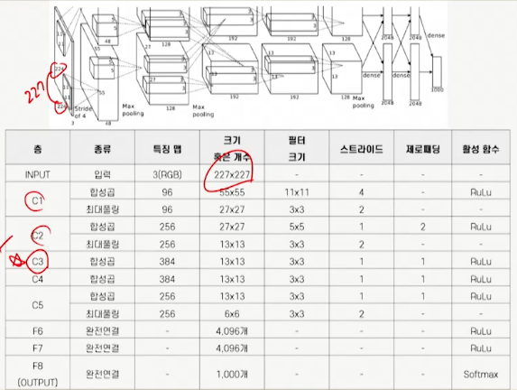

# 8강. 심층 합성곱 신경망(1)

## 1. AlexNet 모델의 구성 및 특징

### 1. ILSCRC

- ILSVRC(ImageNet Large Scale Visual Recognition Challenge)
  - ILSVRC는 이미지 인식(분류) 경진대회
  - 2010년부터 2017년까지 개최
  - 2010년과 2011년도 우승 모델은 전통적 컴퓨터 비전 기법 사용
    - 정확도 70-75%
  - 2012-2015 우승 모델은 딥러닝 사용
    - 정확도 85-95%

- 2012년 우승한 AlexNet은 에러율 16.4%
  - 2위랑 10%이상의 압도적 성능으로 1위


### 2. AlexNet이란?

- 5개의 합성곱 층과 3개의 완전연결층으로 구성
- 2개의 GPU로 연산을 처리할 수 있는 병렬적인 구조로 설계
- ReLU, LRN, Overlapping Pooling, Data Augmentation, Dropout 적용
- 마지막 층에는 1,000개의 클래스를 분류하기 위해 소프트맥스 사용


### 3. AlexNet의 특징

- ReLU Nonlinearity
  - ReLU가 나오기전에 Tanh 또는 Sigmoid 사용
  - 연구진은 Tanh보다 ReLU를 사용하는 것이 학습속도 측면에서 훨씬 빠르고, 필수적이라 말함
    - 에러율 25%, 학습시간 6배 단축
- Training on Multiple GPUs
  - 기존의 CPU로 학습했다면 50-60일 
  - 2개 GPU를 이용한 병렬처리 기법으로 학습시간 단축
  - GTX 580 3GB GPU 사용해 5-6일로 단축
- LRN(Local Response Normalization)
  - LRN은 AlexNet에서 처음 도입
  - 현재는 배치 정규화로 대체된 정규화 기법
  - LRN은 특정 위치의 픽셀값이 높을 때, 인접한 픽셀에 영향을 주는 것을 방지하고자 다른 특징 맵의 동일 위치에 있는 값을 통해 정규화

- Overlapping Max Pooling

  - 오버래핑 최대풀링은 이전 풀링 영역과 겹치는 부분을 포함해 풀링 수행

  


### 4.  Reduce Overfitting

- Data Augmentation - Mirroring
  - ILSVRC-2010에서 활용된 이미지는 256*256 컬러 이미지로, 1,000개의 다양한 카테고리로 구성
  - **좌우 반전**을 적용히 이미지 양을 2배로 증가(Mirror image)
- Data Augmentation - Random Crops
  - 이미지를 임의로 자르면 이미지 추가 생성 가능
  - 256*256 이미지 일부를 227\*227로 잘라내는 크롭 적용
  - 크롭 통해 데이터 크기 2048배 증가
- Data Augmentation - PCA Color Augmentation 
  - PCA Color Augmenation은 PCA(주성분분석)를 통해 이미지 특성은 유지하고, 컬러 값 이동 및 변경
  - 이미지의 채널 및 분산 활용

- Dropout
  - 2012년 힌튼에 의해 소개된 드롭아웃 기술
  - Dropout은 은닉층 노두의 일부 연결을 생략


## 2. AlexNet 모델의 구현

### 1. AlexNet 개념도

- 개념도



- F6, F7, F8
  - F6에서는 6*6\*128(병령 256개) 특징 맵을 1차원 벡터로 변형
  - 9,216개(6*6\*256)의 1차원 벡터를 4,069개(병렬 2048개)의 뉴런과 완전연결 시킴
  - F7은 F6과 같이 4,096개의 뉴런이 완전연결로 구성, ReLU 적용
  - F8은 소프트맥스 적용해, 1,000개의 카테고리에 포함될 확률로 출력


### 2. AlexNet 구현

- 패키지 불러오기

  - cifar10에서 데이터셋 로드
  - np_utils

  ```python
  from tensorflow import keras
  from keras.models import Sequential, Model
  from keras.layers import Dense, Flatten, Conv2D, BatchNormalization
  from keras.datasets import cifar10
  from keras.utils import np_utils
  ```

- 데이터 준비 및 전처리
  - CIFAR-10 데이터 다운로드 및 데이터셋 구분
  - 데이터 타입을 float32로 변화 후 255로 정규화
  - np_utils.to_categorical()이 주어진 데이터를 one-hot encoding
- 모델 정의하기
- 학습하기
  - 생성 모델에 categorical_crossentropy손실 함수, adam 옵티마이저, 정확도 지표 설정
  - 학습은 10번 에포크 진행,  verbose=1은 학습 과정의 로그 출력
- 정확도 확인하기
  - x_test, y_test 사용해 모델 평가 및 정확도 출력


## 3. VGGNet 모델의 구성 및 특징

### 1. VGGNet의 구조

- VGGNet이란?
  - 2014년 옥스퍼드 대학의 Visaul Geometry Group(VGG) 연구소에서 개발된 모델로 ILSVRC-2014대회에서 준우승
  - 다양한 층으로 구성된 모델, 가중치 포함하는 층수를 모델명에 붙여 불림
  - 합성곱 층인 conv(X)-(Y)는 필터의 크기(X)와 필터 수(Y)의미
  - A구조와 A-LRN 모델 성능 비교헀을 때, 정확도 향상에 큰 효과 업승ㅁ
  - 더 깊은 층 활용하는 구조에는 LRN 적용하지 않음
  - 층이 깊어지면서 에러율 감소 확인(4 > 7> 11> ...)
- VGGNet 16(D) 
  - 입력된 


## 2. VGGNet 모델의 구현