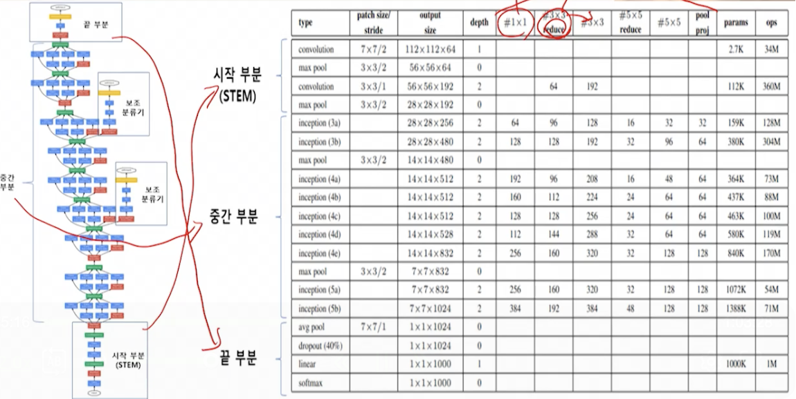

# 9강. 심층 합성곱 신경망 (2)

## 1. GoogLeNet 모델의 구성 및 특징

### 1. GoogLeNet이란?

- 구글에서 개발된 모델
  - 2014년 ILSRC 대회에서 우승(에러율 6.7%)
  - 인셉션 모듈을 통해 층을 깊게 해(22층) 성능 향상
    - Flatten 없이, global average pooling으로 동일한 효과 냄
  - 패치 사이즈 > 커널의 크기(풀 사이즈)

- GoogLeNet의 개념도

  

  - 파랑이 convolutional layer
  - 복잡해서, 많이 활용은 안됨

### 2. GoogLeNet의 특징

- 일반 인셉션 모듈
  - 인셉션 모듈은 세 개 합성곱 층(1x1, 3x3, 5x5)과 3x3 크기의 최대 풀링층으로 구성
  - 각 합성곱 층의 결과와 최대 풀링 층의 결과를 연속된 하나의 값으로 연결해 다음 단계의 입력으로 활용
  - 병렬로 서로 다른 크기의 합성곱 필터를 사용해 다양한 특징을 추출
  - 효율적인 특징 추출을 목표로 적용됨
- 차원 축소가 적용된 인셉셜 모듈
  - 일반 인셉션 모듈에 1x1 크기의 합성곱 층을 **추가**로 배치
  - 합성곱 층의 결과를 연속된 하나의 값으로 연결
  - 인셉션 모듈 적용을 통해 2~3배 성능 빨라짐
- 1x1 합성곱 층의 효과
  - 차원 축소는 고차원의 데이터로부터 저차원의 데이터로 변환하는 방법으로, 1x1의 합성곱 층은 **특징 맵의 수를 줄이는 목적**으로 사용
  - **특징 맵의 수가 줄어들수록 연산량이 작아짐**
  - 구글 연구팀에 따르면, 차원축소를 통해 적당한 수의 특징 맵을 사용했을 경우, **성능에 영향을 미치지 않았다**고 언급

### 3. GoogLeNet의 부분별 구조

- 시작 부분
  - 메모리의 효율적 사용을 위해 기본적 합성곱 모델
  - 시작 부분에 인셉션 모듈을 사용하지 않는 이유는 시작 부분에 인셉션 모듈을 배치했을 때 성능개선 효과가 없었기 때문
- 중간 부분
  - 기존 합성곱 모델에서 사용하지 않았던 새로운 구조인 **보조 분류기**를 중간 부분의 두 곳에 배치
  - 층이 깊어지면서 발생되는 경사소멸 문제를 해결하기 위함
  - 해당 위치에서 보조 분류기의 역전파 결과를 확인함으로써, 기울기 조정 및 정규화 효과가 나타나도록 함
- 끝 부분
  - 최대 풀링 대신 **전역 평균 풀링**을 사용
    - Flatten 역할을 함
  - 최종적으로 이미지 분류를 위해 소프트맥스를 적용해 결과 출력

- 전역 평균 풀링
  - 이전 층에서 추출된 특징 맵의 각각 평균을 연속적인 1차원 벡터로 만듦

## 2. GoogLeNet 모델의 구현

### 1. GoogLeNet 개념도

### 2. GoogLeNet의 구현

- 패키지 불러오기
- 데이터 준비 및 전처리
- 인셉션 모듈 정의
- decay 함수 구현 및 가중치 및 바이어스 초기화

- 모델 정의
  - 시작 부분에는 입력에 Conv2D(), MaxPool2D()를 통해 특징 추출
- 모델 정의하기
- 학습하기
  - SGD 옵티마이저와 3개의 categorical_crossentropy 손실 함수 사용
- 정확도 확인하기

## 3. ResNet 모델의 구성 및 특징

### 1. ResNet의 구조

- ResNet이란?

  - 2015년 마이크로소프트 북경연구소에서 개발된 모델, ILSVRC-2015에서 우승(에러율 3.57%)

  - 2015년의 ResNetdms 152개 층의 구조로, **잔차학습** 방식 도입

- VGG19, **숏컷연결** 여부에 따른 ResNet34 개념도

### 2. ResNet의 특징

- 모델층의 깊이

  - 연구진은 기존의 합성곱 층의 구조를 기반으로 20층과 56층 모델의 성능을 실험
  - 좌측의 학습 에러와 우측의 테스트 에러 모두 56층의 결과가 나쁘게 나오는 것을 확인할 수 있음
  - 깊은 층을 갖는다고 해서, 모델 성능이 우수하다는건 아님

- 잔차 학습(Residual Learning)

  - 기존 학습층

    

    - 기존 신경망 학습 위한 목적은 목적 함수를 모델링하는 것
    - 기존 학습층은 하나의 입력이 두개의 층을 거치게 됨
    - 학습한 정보를 보존하지 않고, 변형시키게 되며 출력을 산출

  - 잔차 학습 블록

    

    - 기존 학습층에서 출력과 입력의 차를 얻을 수 있도록 목표 수정
    - 입력에서 바로 출력으로 연결되는 **숏컷 연결(스킵연결)**추가
    - **숏컷 연결**을 통해 각각의 블록들이 작은 정보만을 추가적으로 학습하도록 구성

## 4. ResNet 모델의 구현

- 패키지 불러오기
- 데이터 준비 및 전처리
- 잔차 클래스 정의하기
  - Residual Unit class 정의
- 모델 정의하기

- 학습하기
- 정확도 확인