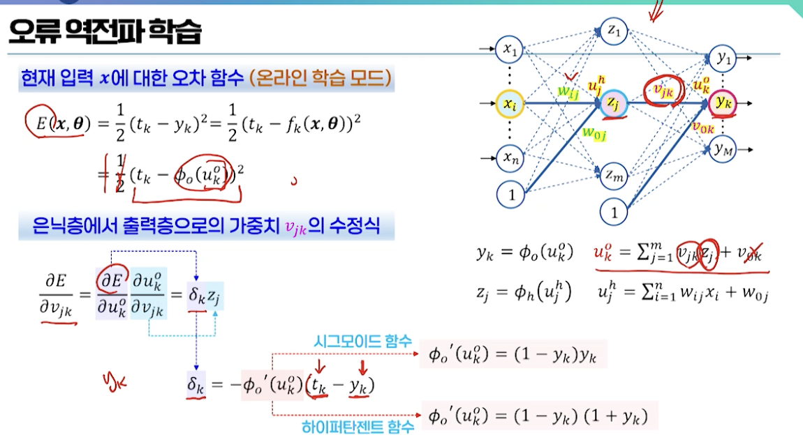
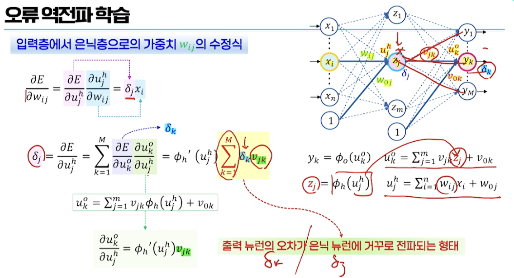
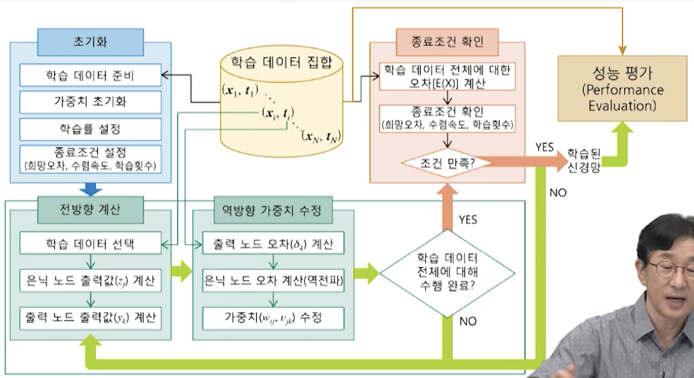
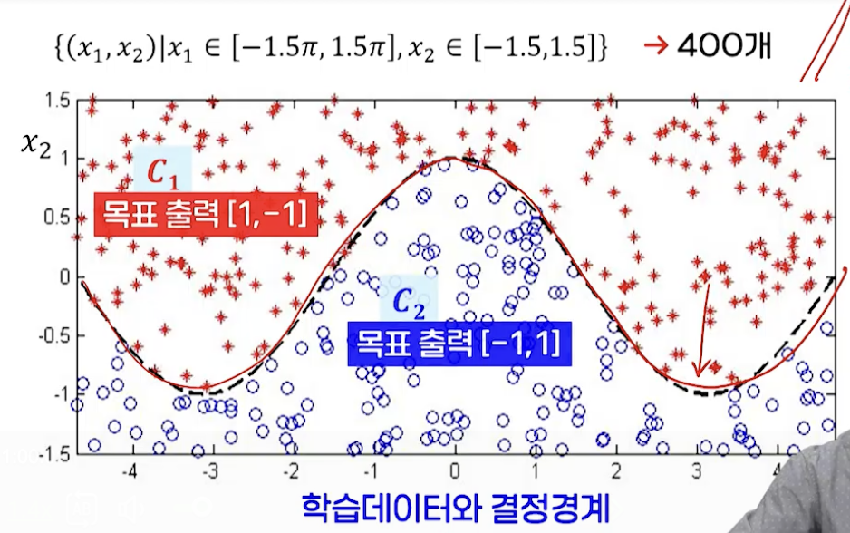
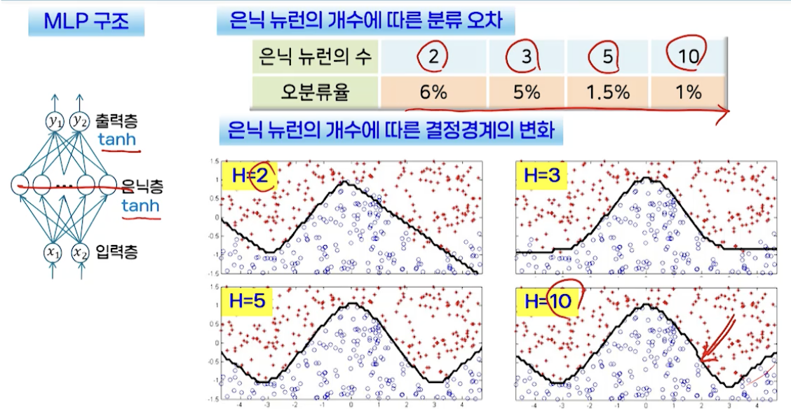
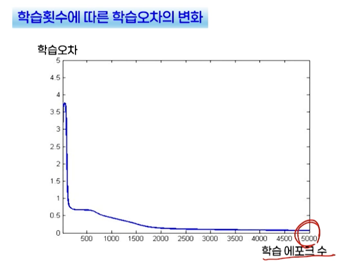
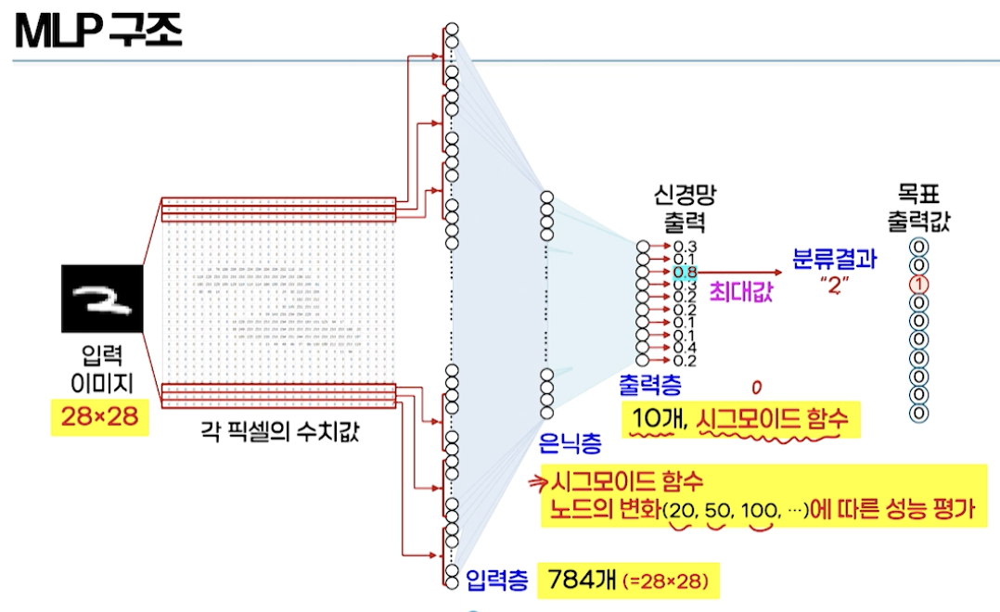
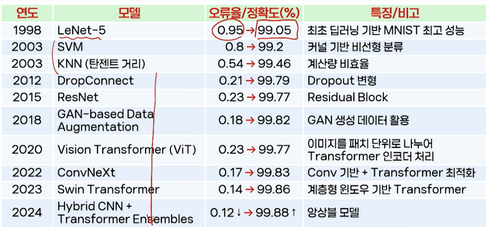

# 10강. 신경망 (2)

## 1. 다층 퍼셉트론의 학습

### 다층 퍼셉트론의 수학적 표현

### MLP의 학습

- 신경망에서 학습이란?
  - 원하는 함수 y=f(x, θ)를 나타내는 가중치 θ를 찾는 것
- MLP의 학습
  - 지도학습 → 학습 데이터 집합 
  - 학습의 목적
    - 입력 xi에 대한 신경망의 출력 yi와 목표 출력 ti의 차이 최소화
  - 오차함수 → 평균 제곱 오차
    - 오차함수를 최소화하는 θ

- 오차함수 E(θ)의 일반적인 형태

  - 매우 복잡한 형태의 비선형함수

     

  - 기울기 강하 학습법 → 오류 역전파 학습 알고리즘

    - 비선형적인 함수의 최소값을 찾아가는 반복적인 방법
    - 오차함수 E(θ)의 기울기를 이용해 감소하는 방향으로 조금씩 이동(미분값 이용)

### 기울기 강하 학습법

- 기울기 강하 학습법의 일반식

  

  

### 오류 역전파 학습

- 오차가 거꾸로 전파가 되어서 내려오는 것
  - 실제로 어떻게 유도가 되는지?

- 출력을 계산한 다음에, 잘못된 가중치들을 수정(역방향 계산 - 가중치 수정)

  - 따라서 오류 "역전파" 학습

  

  

### 다층 퍼셉트론의 전체적인 학습 과정

### MLP 학습의 고려사항

#### (1) 지역 극소의 문제 local minima problem

- 학습률을 적응적으로 조정
  - 에타(η)를 변경하는 것
- 시뮬레이티드 어닐링 기법
  - 에타(η)가 크다는 것
  - 공을 세게 굴리는 거라고 생각하면 됨

- 현실적인 해결책
  - 탐색의 시작점을 결정하는 초기치 변화시키면서 여러 번 학습 시도
  - 충분히 많은 수의 은닉 노드를 사용하는 방법

#### (2) 수렴 속도의 문제

- 원하는 해에 수렴하기까지 긴 학습 시간 필요
  - 기울기가 완만(플라토)
  - "플라토 문제"
- 다양한 가속화 방법들 존재
  - 모멘텀 방법 - 관성
  - 뉴턴 방법 - 2차 미분
  - 자연 기울기 방법 등 - 새로운 형태의 기울기 정의

#### (3) 학습 종료점의 문제

- 과다적합을 피할 수 있는 적절한 학습 종료 시점의 결정이 필요

- 검증 데이터 집합을 사용하는 방법 - 검증 오차도 함께 계산해서 비교

  

#### (4) 은닉 뉴런의 수

- 실제 문제에서 학습의 속도와 찾아지는 해의 성능 좌우
  - 은닉층 → 기본적으로 1개 사용
  - 입력 노드와 출력 노드의 수 →  주어진 데이터와 문제에 의해 결정

- 문제에 맞게 적절히 결정
  - 입력 데이터 차원과 데이터의 개수 등에 비례해 결정
  - 휴리스틱하게 결정할 수 밖에 없다

### MLP의 학습 전략

- 학습 모드의 결정
  - 온라인 모드 → 각 데이터에 대해 가중치 수정
    - N개의 데이터 → N번의 가중치 수정
    - 오차 감소 속도는 빠르나, 학습이 불안정적
  - 배치 모드 → N개의 모든 데이터에 대한 오차를 모두 더한 후 한 번의 가중치 수정
    - N개의 데이터 → 1번의 가중치 수정
    - 오차 감소 속도는 느리나, 학습은 안정적
  - 미니 배치 모드 →  데이터를 작은 부분집합으로 나누고, 각 부분집한은 배치 모드 처리
    - N 개의 데이터를 m개의 그룹으로 나눔 → m번의 가중치 수정
    - 데이터 규모가 큰 경우에 적합
- 모델 설정
  - 은닉 노드의 수
    - 많을수록 표현 가능한 함수가 다양해지고 복잡해짐
    - 계산 비용과 일반화 성능(많으면 과다적합 가능성 높아짐)을 고려해서 문제에 맞게 적절히 결정
  - 초기 가중치 설정
    - 초기 가중치 → 작은 범위의 실수값으로 랜덤하게 설정
    - 학습률 → 1보다 작은 값에서 시작해 진행 상황에 따라 조정
  - 활성화 함수
    - 은닉 노드
      - 비선형 함수 사용해야 함
      - 시그모이드, 하이퍼탄젠트, ReLU
    - 출력 노드
      - 목표 출력값이 임의의 실수값("회귀 문제") → 선형 함수
      - 목표 출력값이 클래스 레이블("분류 문제") → 시그모이드, 소프트맥스
- 오차함수(손실함수)
  - 제곱오차함수 squared error function
    - 목표 출력값이 연속적인 실수값을 갖는 회귀 문제에 적합
  - 교차엔트로피 오차함수 cross entropy error function
    - 목표 출력값이 0 또는 1의 값을 갖는 분류 문제에 적합
    - 출력 노드의 활성화 함수로는 소프트맥스 함수를 주로 사용

## 2. 응용 문제: 숫자 인식

### MLP를 이용한 간단한 분류 실험

### 숫자 인식 digit recognition

- 데이터 준비
  - 필기 숫자인식
  - 벤치마크 데이터 MNIST 데이터

- 데이터 셋팅
  - 입력값 전처리: 정규화
    - 데이터가 가지는 값이 일정 범위 안에 있도록 조정
    - 필요성: 신경세포의 입력값이 크면 셀포화의 가능성이 높아짐. 학습 어려워짐
    - 0 ~ 255 범위의 값을 0~1 범위의 값으로 조정
- 목표 출력값 설정
  - 출력 뉴런의 수 = 클래스 레이블의 수로 설정
  - i번째 클래스에 속하는 데이터의 목표 출력값
    - i번째 출력 뉴런은 1, 나머지는 0의 값으로 설정
  - 데이터 집합의 구성
    - 학습 데이터 60,000개
    - 테스트 데이터 10,000개

### MLP 구조

### 학습 곡선 learning curve

- 학습 곡선을 이용한 학습 상황 관찰

  - 한 에포크가 끝날 때 마다 학습 오차를 계산하여 그 변화를 살펴보는 그래프

- 은닉 노드 수에 따른 학습 성능의 비교

   

### 성능 평가

- 일반화 성능

  - 학습에 사용되지 않은 새로운 데이터에 대한 신경망 출력의 정확도
    - 평가 방법 → 테스트 데이터 집합을 별도로 수집해 오차 계산

- 오차함수와 은닉 노드 수에 따른 성능(오분류율 %) 변화

   

### LeNet-5

- 1998 Yann LeCun → 합성곱 신경망(CNN)

### MNIST 숫자 인식 성능 비교

- MNIST는 사실상 해결된 문제로 간주 → 새로운 아키텍쳐 검증용 벤치마크로 활용

