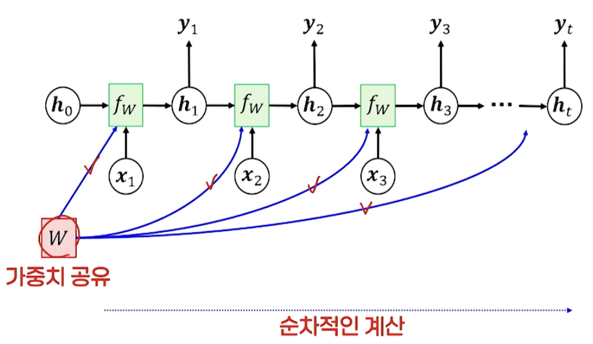
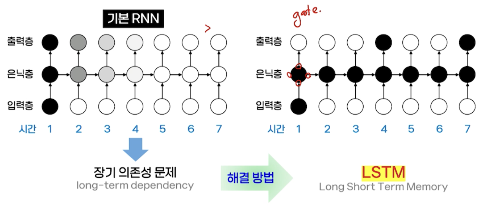

# 12강. 딥러닝 (2)

## 1. 기본 순환 신경망 Recurrent Neural Network

### 순환 신경망의 필요성

- 순차 데이터 sequential data
  - sequence를 가진 데이터 → 음성, 문장, 동영상, 주식 시세 등
- 특징
  - 데이터의 출현 순서 중요
  - 데이터 길이 가변적
  - 데이터 요소 사이 문맥적 의존성 존재 → 이전 내용을 기억/활용 하는 것이 중요
- 순환 신경망
  - 시간에 따라 순차적으로 제공되는 데이터
  - 응용분야 → 시퀀스 형태의 데이터 처리(텍스트 처리, 음성 처리, 기계번역 등)

### 기본적 RNN의 구조

- vanilla RNN

  

### RNN의 표현 방법

- 축약된 표현

  

- 전개된(펼친) 구조

  

### RNN의 계산 과정

### RNN 셀의 구조

- 은닉층의 활성함수로 하이퍼탄젠트 사용
- 출력층의 활성화 함수로는 소프트맥스 주로 사용 

### 응용 목적에 따른 RNN의 구조

- 입출력 요소 대응 관계에 따른 다양한 구조와 응용

   

- 구조의 확장

   

### RNN 학습

- 학습 데이터 집합 D = {(xi, yi)}i=1, ..., N → 지도학습
- 손실함수를 최소로 만들어 주는 최소의 매개변수 W를 찾는 것
  - 시간 역전파 학습 알고리즘 BPTT: Backpropagation Through Time
  - https://arxiv.org/pdf/1610.02583

### RNN 학습의 문제

- 기울기 소멸 문제 gradient vanishing
  - 활성화 함수의 미분값이 1보다 작은 경우
  - 시점 1에서 시점 t까지의 길이(timestep)에 영향 받음
- 기울기 폭발 문제 gradient explosion
  - 활성호 함수의 미분값이 1보다 큰 경우
  - 기울기 클리핑으로 해결 가능
    - 기울기가 주어진 임계치보다 크면 그 값을 일정 범위에 있도록 조정 가능

## 2. LSTM과 GRU (LSTM 단순화 → GRU)

### LSTM

- 시간에 따른 입력 신호의 민감도

### LSTM 셀 구조

- 기본 RNN 셀 vs LSTM 셀

  

  - 게이트 구조
    - 3가지 게이트: 망각, 입력, 출력

### LSTM 셀의 기능

- 망각 게이트 forget gate
  - 셀 상태 정보를 어느 정도 잊어버릴 것인가를 결정하는 부분
- 입력 게이트 input gate
  - 셀 상태에 새로운 정보를 추가하는 정도를 조정하는 부분
- 셀 상태 갱신 cell-state update
  - 새로운 셀 상태 ct로 갱신하는 부분
- 출력 계산 - 출력 게이트 output gate
  - 출력 게이트 ot와 셀의 출력 ht를 계산하는 부분

### GRU(Gated Recurrent Unit, 게이트 순환 유닛)

- LSTM 셀 구조를 단순하게 개선
  - 2개의 입력, 1개의 출력
    - 셀 상태 ct는 없음 → 셀 출력 ht에 통합됨
  - 2개의 게이트
    - 갱신 게이트 update gate
    - 리셋 게이트 reset gate

### GRU 셀의 구조

### GRU 셀의 기능

- 리셋 게이트

  - 이전의 출력을 어느 정도 받아들일지 조정하는 부분

- 갱신 게이트

  - 현 시점의 출력을 위해 받아들일 새로운 내용과 이전의 출력 내용의 비율을 조정하는 부분

- 출력 게이트

  - 출력 ht 계산

    

