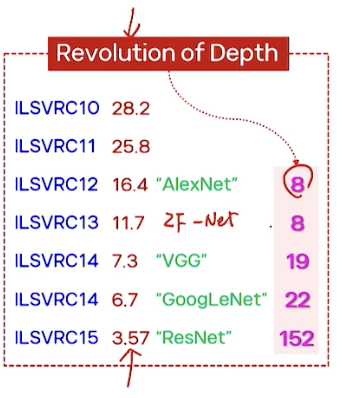
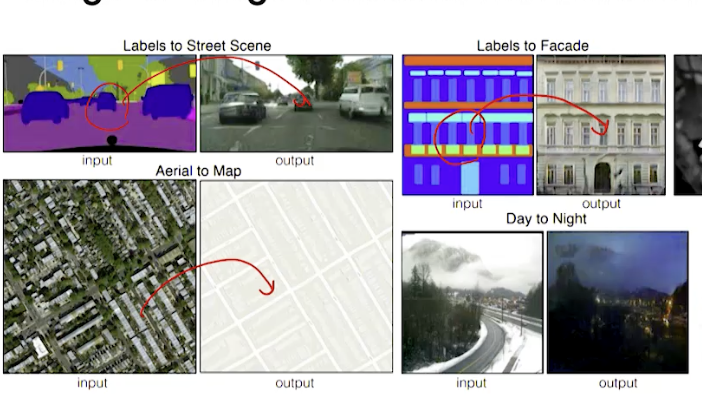
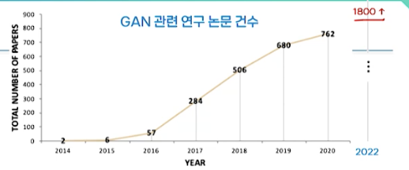

# 13강. 딥러닝 응용 (1)

## 1. 컴퓨터 비전 응용

### 컴퓨터 비전?

- 영상 데이터를 주요 처리 대상으로 해 인간의 다양한 시각적 정보처리를 기계에 구현하려는 분야
  - 카메라, 적외선 카메라, 레이더, X-ray, 초음파, cctv, 블랙박스 등의 모든 입력 가능
- 딥러닝 모델의 입력, 출력을 기준으로 CV의 응용 구분도 가능
  - 영상 이해, 변환, 생성, 다양한 입력 형태로의 확장

### (1) 영상이해

- 하나의 영상을 입력받아, 그 안에 포함된 의미적 정보를 분석해 추상적 개념이나 정량적 정보량을 출력

  - 정량적 정보량 → 객체 정보, 패턴 클래스, 두 영상 간의 의미적 유사도 등

  

### (2) 영상 변환

- 하나의 영상을 입력받아, 그 안에 포함된 정보를 분석해 원하는 형태로 변환된 새로운 영상을 출력하는 문제

  

- 영상 분할(image segmentation)
  - 의미적 영상분할 semantic
    - 각 화소가 여러 범주 중 하나에 속하도록 분류
    - 의료 영상에 많이 활용됨(치과 xray)
- 영상 변환(Super resolution)
  - 저해상도 영상을 고해상도 영상으로 복원
    - SRCNN, VDSR, SRGAN, EDSR, DBPN
      - DBPN(ICCV2018) → The winner of super resolution challenges(NTRIE2018)

### (3) 영상 생성

- 출력으로 새로운 영상 생성 → 일종의 창작 과정
  - GAN → 영상 생성을 위해 개발된 대표적인 딥러닝 모델

### (4) 다양한 입력 형태로의 확장

- 좀 더 다양한 형태의 입력을 다루는 모델들이 등장
  - 동영상, 3D 입체 영상 → 순환 연결을 가진 CNN, 3D CNN등장
- Visual Question and Answering 시각적 문답
  - 영상 신호와 자연어 결합
  - VGG NET, LSTM...

## 2. 객체인식을 위한 CNN 모델(4가지)

### 객체인식과 ILSVRC

- ImageNet Large-Scale Visual Recognition Challenge(2010)
  - 객체 분류 및 위치 탐지를 위한 일종의 객체인식 경진대회 만듦
  - ImageNet 이라는 영상 DB를 활용해서
    - 1000개 클래스
    - 120만개의 영상 + 클래스 레이블

### ILSVRC

- 2010 시작 → 2012년 부터 딥러닝 모델이 우승 차지
  - 기존 방식들을 이겨버린 AlexNet → 그래서 관심 올라감

### (1) AlexNet, Winner of 2012

- Krizhevsky et. al.
  - 2개의 CNN 구조 → 메모리 한계로 인해 듀얼 네트워크 → 현재는 1개로 합쳐짐
  - 5개의 콘볼루션층, 3개의 완전연결층
  - 구조상으로는 LeNet과 큰 차이 없었음 - 층이 좀 더 많아지고, 필터가 좀 더 많아짐..

- 모델 학습을 위한 상세 정보
  - 학습 전략을 공개함
  - 미니 배치 모드 → 크기 128
  - 모멘틈 → 0.9
  - 드롭아웃 → 0.5
  - 학습률 → 0.01
    - 검증 오차가 증가하면 1/10씩 감소
  - 정규항의 조정 파라미터 → 0.0005
  - 가중치 초기화 → 가우시안분포(평균 0, 표준편차 0.01)
- 인식 결과
  - 사람도 충분히 틀릴만한 것만 틀림

### VGG Net 

- 2014 ILSVRC 2위
  - 가장 많이 사용됨
- 다양한 층수를 가진 여러 버전을 제공

### GoogLeNet

- 인셉션 모듈이라는 특이 구조 → Inception Net
  - 한 층에서 서로 다른 크기의 필터들의 사용과 효과적인 결합 모듈
  - 1x1 콘볼루션 사용 → 차원 축소를 통해 계산 비용을 줄임
  - 역전파 학습이 용이하도록 보조 분류기 사용
  - 22개층
  - 1/12 파라미터 of AlexNet(효과적 학습)

### 층수와 성능?

- 층수가 더 많아지면 성능도 더 향상되는가??

  - AlexNet은 8층 

  - VGG는 19층

  - GoogLeNet 22층

- 층수와 성능이 비례한다고 할 수 없음

  - 역전파시 기울기 소멸 문제 등으로 인해 층수가 더 많음에도 성능이 떨어짐

### 잔차모듈 ResNet (Residual Net)

- 이점
  - 매우 깊은 층을 가진 네트워크도 성능 저하 없이 학습 가능
  - 잔차 블록(residual block)의 학습이 용이
  - 스킵 연결을 통해 오차 신호가 소멸되는 현상이 완화되는 등으로 인해 효과적인 역전파 가능

## 3. 영상 이해를 위한 딥러닝

### 객체 검출을 위한 모델

- 다중 객체 검출
  - 기본적인 접근 방법: sliding window

### R-CNN, Faster R-CNN

- R-CNN
  - 특징맵 만들어서 분류
- Faster R-CNN
  - 특징맵과 후보 영역을 병렬적으로 처리
  - 하지만 여전히 느림 - 실시간 영상에는 적용하기 어려움

### YOLO

- You Only Look Once(2016)
  - 객체 탐지와 인식을 한 번에 수행
  - R-CNN과 달리 ROI(Region of Interest) 또는 영역 제안(region proposal)이 사용되지 않음
  - 간단하고 빠름 → 실시간 동영상에서 사용 가능
  - R-CNN보다 성능은 떨어짐(정확도)

### 영상설명 모델

- 자연어와 Vision 결합 모델

  - Show and Tell

  - Show, Attend and Tell

## 4. 영상변환 및 생성을 위한 딥러닝

### 오토 인코더 모델

- 기본 구조

  

  - 구성 → 인코더, 디코더
  - 목적 → 축약된 특징 z를 얻는 것

### U-Net

- CNN 기반의 변형된 오토인코더 구조를 가짐 → 의료영상에 대한 영상분할을 위해 개발
- 구조적 특징
  - Contracting path(인코더)
  - expanding path(디코더)
  - skip connection

### GAN 모델

- Generative Adversarial Networks
  - 생성적 적대/대립 신경망
  - Ian Goodfellows 등, NIPS 2014
  - 영상생성 모델 → 영상변환 모델로 확장
- 다른 딥러닝 모델과 구조적으로 차이가 있음
  - 2개의 네트워크로 구성
    - Generator(생성기, G) 
      - 주어진 랜덤 입력으로부터 영상 생성 → 목표 출력값 없음
    - Discriminator(판별기, D)
      - 입력 영상이 실제 영상인지, 아니면 생성기 G에 의해만들어진 가짜 영상인지 판별 → G의 출력값을 판별해 손실(오류) 신호를 만들어주는 역할
  - 학습의 목적
    - 판별기를 속일 수 있는 최대한 진짜 같은 영상을 만드는 것

### GAN의 학습

- 두 네트워크의 상반된(adversarial) 학습
  - G와 D가 서로 상반된 학습을 번갈아 가면서 수행
    - G는 D를 속이고, D는 G를 구분

### GAN을 활용한 영상 변환

- Image-to-Image Translation with conditional GAN(cGAN)
  - Pix2pix

### Cycle GAN(ICCV 2017)

- Unpaired Image-to-Image Translation

  

### Coupled GAN "CoGAN"

- 이미지의 속성 변환

  - 아직은 어색

  

### Progressive GAN(ICLR 2018)

- Karras

- 고해상도 영상 생성을 위해 G/D를 층별로 학습

  

### Style GAN(CVPR 2019)

- 스타일 조정을 위한 매핑 모듈 추가

  - 성별, 포즈, 머리색, 피부색 등

  

### GAN 관련 연구들

- 단일 영상 생성 모델에서 벗어나, Trnasformer, Self-Attention, Diffusion 같은 최신 생성 모델들과 융합되고 있음