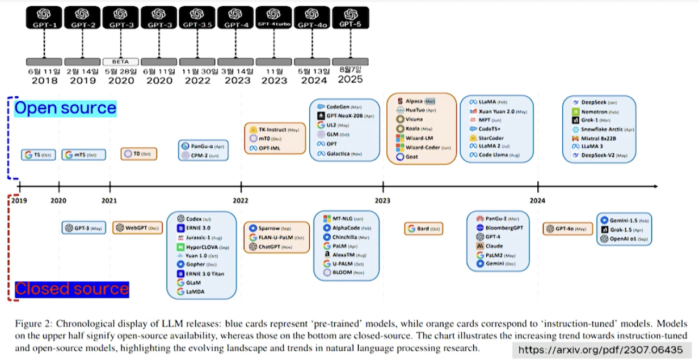

# 14강. 딥러닝 응용(2)

## 1. 자연어처리 응용

### 자연어처리

- NLP, Natural Language Processing 
- 자연어 
  - 인간언어
  - 정보 전달의 수단으로 인간 고유의 능력
- 인공언어
  - 특정 목적을 위해 인위적으로 만든 언어
  - 프로그래밍 언어
  - 자연어보다 엄격한 문법
- 자연어처리
  - 컴퓨터로 자연어를 이해하고 번역/해석하고 조작하기 위한 인공지능의 한 분야

### 자연어처리 응용

- 음성 신호처리 speech signal processing 
- 대화 수행 dialogue action
- 텍스트 분석 text analysis 

### 음성 신호처리

- 사람의 목소리로 발화된 음성 신호에 포함된 언어 정보 처리 분야

- 엄밀한 의미의 자연어 처리에는 포함 안됨

- 인식 종류
  - 음성인식
  - 화자 인식 
  - 음성 합성 TTS

### 대화 수행

- 상대방과 문장을 주고받는 형식으로 진행되는 작업
  - AI 스피커, 챗봇 등 핵심 기술
- 종류
  - 정보 검색
  - 질의응답 시스템
  - 목적 지향 대화 시스템

### 텍스트 분석

- 일련의 텍스트 정보를 입력으로 받아 의미적 내용과 문맥 등을 분석해 원하는 결과를 도출하는 것
  - 텍스트 분류
    - 주어진 일련의 텍스트를 미리 정해진 몇 개의 클래스로 나누는 것
    - 감성인식, 주제분류, 스팸 필터링 등
  - 기계번역
    - 문장을 입력받아 같은 의미를 가진 다른 언어의 문장 생성
  - 텍스트 요약
    - 긴 분량의 텍스트를 입력 받아 짧게 요약된 문장으로 출력

- 텍스트 분류
  - 감성인식
  - 주제분류
  - 스팸필터링
- 텍스트 요약
  - 추출 요약 → 가장 적절한 문장을 선택해 조합
  - 추상적 요약 → 새로운 문장을 사용하여 요약

- 텍스트 분석: 기계 번역
  - 고전적 접근법
  - 딥러닝 기반의 접근법(NMT: Neural Machine Translation 신경망 기반 기계번역)
    - 인코더 디코더 

## 2. 자연어처리를 위한 머신러닝 기법

### NLP 응용을 위한 ML 시스템의 개발 단계

- 데이터 수집
  - Corpus collecton
- 데이터 전처리
  - Tokenization
  - Cleaning
  - Normalization
- 데이터 표현
  - One-hot vector
  - Bag of Words(BoW)
  - TF-IDF
- 데이터 분석(학습)
  - Word Embedding
  - Language model
    - Sentence similarity
    - text classification
    - sentence generation

### 데이터 수집

- 텍스트 말뭉치(text corpus)
  - 일반적으로 사용되는 문장들로부터 얻어진 크고 구조화된 텍스트 데이터 집합
- 주요 말뭉치
  - 구글 n-gram 말뭉치
  - COCA(Corpus of Contemporary American English)
    - 4억 2,500만개 단어, 무료 온라인 검색 서비스 제공
  - 국립국어원 모두의 말뭉치
- WordNet
  - A lexical database for English(단어의 의미, 품사, 동의어 관계 등 다양)

### 텍스트 전처리

- 토큰화 Tokenization
  - 말뭉치를 의미 있는 기본 단위(토큰)으로 나누는 작업
    - 토큰의 기준 → 문장, 구, 단어, 형태소 → 목적/응용에따라 달라짐
  - 고려사항
    - 구두점, 특수 문자 처리
    - 줄임말, 단어 내 띄어쓰기
    - 한국어 → 조사, 어간과 어미 분리

- 정제 cleaning, 정규화 normalization
  - 정제 → 말뭉치로부터 데이터 분석에 방해되는 노이즈 데이터 제거
    - 불필요한 단어 제거
      - 등장빈도가 적거나, 길이가 짧거나
    - 정규표현식을 사용해 특정 표현 제거 
      - 해시태그, 기사날짜 등
  - 정규화 → 표현 방법이 다른 단어들을 하나의 단어로 통합시키느 ㄴ것
    - 표기가 다른 단어들의 통합 US, USA 
    - 대소문자 통합
  
- 토큰의 품사 태깅 작업
  
   
  
  - 같은 단어지만, 품사에 따라 의미가 달라지므로 품사 태깅 중요함

### 데이터 표현

- **원핫인코딩 one-hot encoding**

   

  - 말뭉치로부터 획득한 단어집합의 각 단어를 고유 정수로 매핑한 후 원핫벡터로 표현
  - m개의 단어가 있는 경우 → m차원 원핫벡터
  - 한계점: 단어 수가 많아지면 차원이 높아짐. 단어간 유사도 반영이 어려움

- **BoW (Bag of Words)**

  - 단어의 출현 빈도 수를 고려한 텍스트 표현 방법
    - 단어집합에 포함된 각 단어에 고유한 정수 인덱스 부여
    - 주어진 입력 텍스트에 대해 각 단어의 출현 횟수를 계산
    - 각 단어의 대응 위치(인덱스)에 출현 횟수를 정수값으로 표현
  - 문서에 자주 출현하는 단어가 잘 표현됨. 단어의 발생 위치는 고려되지 못함

- **TF-IDF (Term Frequency-Inverse Document Frequency)**

  - Document-Term Matrix
    - 다수 문서에 등장하는 각 단어의 빈도수를 표현한 행렬
  - Document Frequency
    - 각 단어가 나타나는 문서의 빈도수를 계산

  - 문서 내의 각 단어의 빈도수와 문서의 빈도를 함께 고려한 표현 방식
    - 단어  t가 등장하는 문서의 개수 DF(t)에 반비례하는 값

- **워드 임베딩(word embedding)**

  - 단어의 의미를 포함하는 벡터(임베딩 벡터)로 표현하는 방법

    - 원핫벡터를 저차원 실수 공간의 벡터로 변환

       

    - 목적 → 유사한 의미의 단어를 벡터 공간에서 가까운 위치에 표현, 단어 간의 의미적 유사성을 벡터화

    - 방법 → Word2Vec(CBOW, Skip-gram), LSA(잠재 의미 분석), Glove등

### Word2Vec

- 원핫벡터를 저차원의 벡터로 변환하는 선형변환행렬 W를 학습으로 찾고, 이를 이용해 입력 단어를 사영함으로써 임베딩 벡터를 구함
  - 말뭉치의 문맥 정보를 활용해 학습 수행
  - 은닉층이 1개인 간단한 구조의 신경망 사용
- 학습 방식에 따라 두 가지 모델 존재
  - CBow (continuous Bag of Words)
    - 주변 단어(문맥 앞뒤의 n개 단어)를 입력으로 받아 중심 단어를 예측
  - Skip-gram
    - 중심 단어를 입력으로 받아 주변 단어들을 예측

## 3. 언어모델을 위한 딥러닝

### 언어모델(Language model)

- 단어 시퀀스를 입력으로 받아 **확률값**을 출력하는 일종의 함수
  - 확률값: 주어진 단어의 시퀀스가 자연어 표현으로서 얼마나 적절한지를 평가하는 값
  - 구현 방법
    - 조건부확률을 이용
    - 신경망(딥러닝)을 이용 → 주로 RNN 사용

- 언어 모델의 활용
  - 문장 생성(요약, 번역 등)
  - 오타 교정

### RNN 기반 언어 모델

- 활용 → 텍스트 분류(감성 분류, 주제 분류 등), 기계번역 등

### Seq2Seq 모델

- Sequence-to-sequence model
  - 입력된 시퀀스로부터 다른 도메인의 시퀀스를 출력
    - 응용 → 기계번역, 대화, 질의응답, 요약, STT
  - 구성 → 인코더와 디코더 → 각각 RNN(LSTM) 구조를 가짐
    - 인코더
      - 입력: 임베딩 벡터로 표현된 단어 시퀀스
      - 출력: 입력 시퀀스를 하나의 벡터로 압축한 문맥 벡터
    - 디코더
      - 입력: 인코더에서 출력된 문맥 벡터
      - 출력: 단어 벡터를 순차적으로 출력

- 문제
  - 인코더로부터 얻어진 정보를 하나의 고정된 특징벡터로 요약/압축해 표현
    - 정보 손실 발생
  - 입력 문장의 길이가 긴 경우 성능 저하 초래

### Attention 모델

- Attention 모듈을 이용한 해결
  - 디코더에서 출력 단어를 생성할 때마다 인코더의 전체 상태에 대한 선택적 주의를 통해 각 셀의 정보를 읽어오는 방식

### Transformer 모델

- 2017 "Attention is all you need"
  - Seq2Seq 모델의 인코더-디코더 구조 사용
  - RNN 구조를 없애고 여러 개의 인코더와 Attention 만으로 구현
  - 인코더
    - 한 번에 전체 시퀀스 입력
    - 단어의 순서 정보를 나타내기 위해 positional encoding 사용
  - 디코더
    - 한 번에 하나씩 순차적으로 생성
  - 빠른 학습, 우수한 성능 → BERT, GPT

### BERT

- Bidirectional Encoder Representation from Transformers
  - 구글에서 만든 언어 모델
  - 3종류의 임베딩 수행
  - 사전 학습(pre-training) 단계
    - 방대한 양의 데이터를 이용해 학습한 언어 모델 구축
    - 책 말뭉치(800M 단어)와 Wikipedia(2500M)으로 학습
  - 미세 조정(fine tuning) 단계
    - 사전에 학습된 모델을 특정 NLP 문제에 맞춰 추가 학습
    - 12개 자연어처리 문제에 대해 당시 최고 성능을 기록
  - Transformer의 인코더 모델에 기반

- 4가지 구성 방식

  

## 4. 대규모 언어 모델

### 대규모 언어 모델(LLM, Large Language Models)

- 사전 학습된 언어 모델(PLM)의 규모를 확대해 대용량의 데이터를 학습한 언어 모델
  - 100억 이상의 파라미터를 가짐
  - 대표적 모델 → GPT3/3.5/..., LLaMA
  - PLM vs LLM
    - BERT, GPT2
    - GPT3, PaLM, LLaMA
  - LLM의 창발적 능력(emergent ability)
    - 소규모 PLM이 가지지 못하는 새로운 능력/특성을 보여줌
    - 문맥/맥락 내 학습(In-context learning)을 통해 새로운 태스크 수행 가능

### 대규모 언어 모델 타임라인

- 파랑색은 pre-trained
- 주황색은 instruction-tuned

### LLM 개발 및 활용의 4단계

- 사전학습 → 대규모 데이터를 이용한 기본 학습
  - 데이터 수집 및 전처리
  - 모델 아키텍처 및 세부 설정
  - 학습 기법 설계
- 미세 조정 → 특정 목적에 맞게 성능 개선을 위한 추가 학습
  - 지시 학습 Instruction Tuning
  - 정렬 학습 Alignment Tuning
  - 매개변수 효율적 미세조정 PEFT: Paramaeter-Efficient Fine-Tuning
    - LoRA, Adapters 같은 방법으로 전체 모델을 재학습하지 않고 일부 파라미터만 조정
- 추론 Inference → 학습된 LLM의 활용
  - 프롬프트 엔지니어링 → 다양한 과제에 적합한 프롬프트 설계
    - 제로샷, 퓨샷
    - 사고과정 유도 프롬프팅
    - ReAct 기법
  - RAG(Retrieval-Augmented Generation) → 검색 기반 생성/보완

- 평가 Evaluation
  - 다양한 벤치마크 과저를 통한 성능 평가
  - 편향성, 윤리성, 안정성, 개인정보 유출 가능성 등 다양한 측면에 대한 평가

### 프롬프트 엔지니어링

- 사고과정 유도 프롬프팅 CoT(Chain-of-Thought Prompting)
  - 프롬프트에 문제 해결 과정을 포함해 유도
- Few-shot CoT vs Zero-shot CoT
  - 예시를 주는 것
  - step by step

### RAG(Retrieval-Augmented Generation)

- 외부 지식을 검색해서 그 정보를 바탕으로 응답을 생성하는 방식
  - LLM의 사실성 문제와 환각현상을 해결하기 위한 접근 방식
- 구성 요소(단계별 절차)
  - 입력
    - 사용자 질문(쿼리)이 주어짐
  - 인덱싱
    - 관련 문서를 청킹(chunking)하여 색인화
  - 검색
    - 쿼리와 관련된 문서 검색
  - 생성
    - 쿼리와 검색된 문서를 프롬프트와 함께 LLM에 입력해 응답 생성

