# 2강. 지도학습: 분류

## 1. 분류의 개념

### 분류

- 입력 데이터를 이미 정의된 몇 개의 클래스로 구분하는 문제(패턴 인식)

  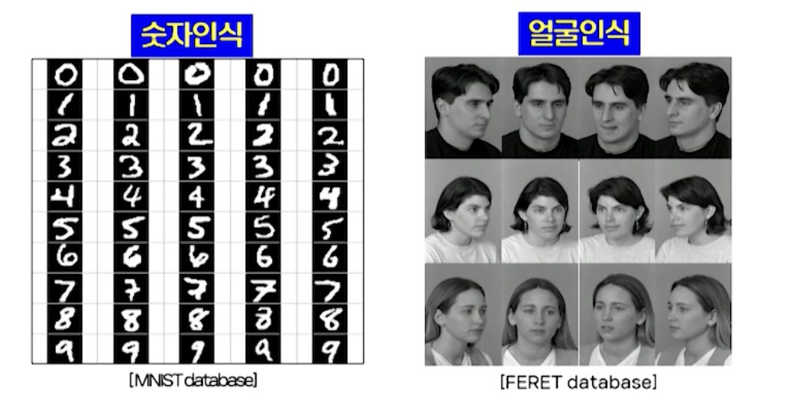

  - 베이즈 분류기, K-최근접 분류기

- 분류기의 입출력 관계

  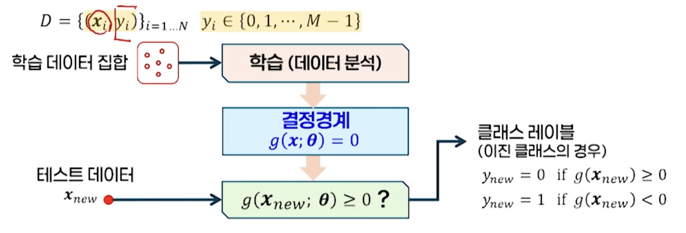

- 결정경계를 얻기 위한 두 가지 접근법

  - 확률 기반 방법
    - 조건부확률을 추정해 분류
    - 베이즈(Bayes) 분류기
  - 데이터 기반 방법
    - 데이터 간의 관계를 바탕으로 분류
    - K-최근접이웃(K-nearest Neighbor), K-NN 분류기

## 2. 베이즈 분류기

### 확률에 기반한 분류기의 개념

### 베이즈 분류기

- 이진 분류
  - x가 각 클래스에 속할확률 중 확률값이 큰 클래스로 할당
  - 판별함수
    - 베이즈정리(사전확률로부터 사후확률을 계산하는 식)
    - 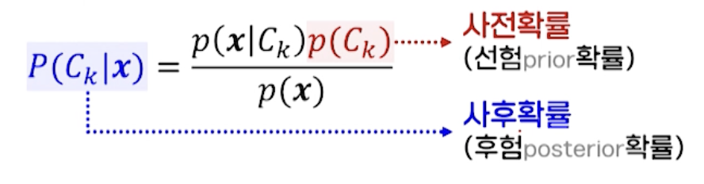
  
  - 결정 경계
  
    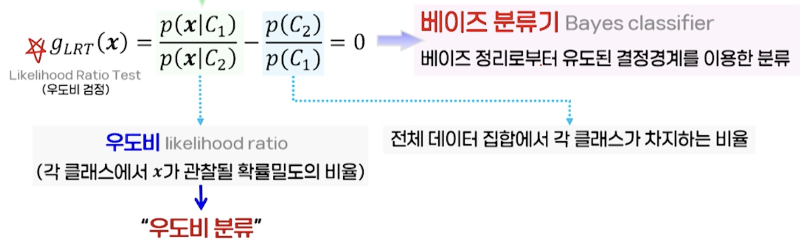
  
    - 우도비(likelihood ratio)
      - 각 클래스에서 x가 관찰될 확률밀도의 비율 > 우도비 분류
      - 베이즈 분류기(Bayes classifier): 베이즈 정리로부터 유도된 결정경계를 이용한 분류
  
  - 결정규칙

### 베이즈 분류기: 결정 경계(이진 클래스)

- 1차원 데이터, 이진 클래스 p(C1) = p(C2)인 경우

  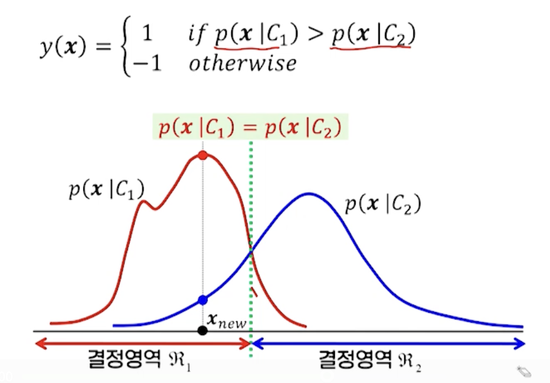

  - 2개의 함수가 만나는 지점이 결정경계
  - (예) 160cm인 사람은 대체로 여자

- 1차원 데이터, 이진 클래스 p(C1) ≠ p(C2)인 경우

  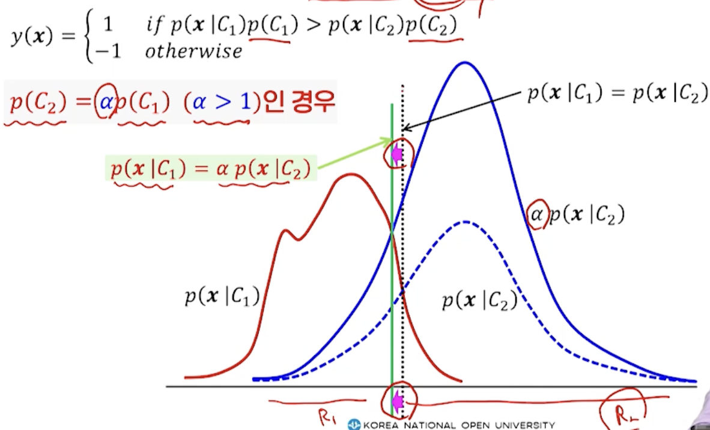

  - 비율이 다름 - 결정경계가 이동
  - (예) 질병 진단시 사용. 예를 들어 C1은 환자, C2는 정상인으로 나누었을때, 각 클래스가 차지하는 비율이 다름. 

### 베이즈 분류기: 다중 클래스 문제

### 베이즈 분류기: 처리 과정

- 분류 절차

  - 학습 데이터 수집

  - 학습 데이터로부터 클래스별 분포함수 p(x|Ck) 추정

  - 테스트데이터 입력

  - 각 클래스별 판별함수 값 계산

    

  - gk(xnew)가 가장 큰 클래스 k로 할당

    

### 베이즈 분류기: 구현

- 클래스별 밀도함수 p(x|Ci)가 가우시안 분포를 따르는 경우

  - 가우시안 분포의 확률밀도함수(평균, 공분산 알아내야 함)

    

  - 다중 클래스 분류를 위한 판별함수 (사전확률 p(Ci)가 모두 동일하다고 가정)

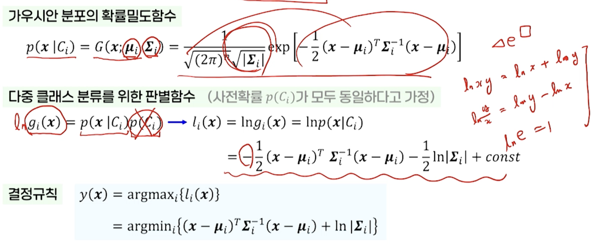

- 각 클래스의 공분산행렬 ∑i의 형태에 따른 판별함수
  - 클래스 공통 단위 공분산행렬(조건 느슨)
    - 모든 클래스의 공분산이 동일, 단위행렬의 상수배인 행렬을 가지는 경우
  - 클래스 공통 공분산행렬
    - 모든 클래스가 동일한 공분산을 갖지만, 그 형태가 일반적인 행렬이 되는 경우
  - 일반적인 공분산행렬(조건 타이트)
    - 각 클래스의 공분산이 서로 다른 일반적인 형태를 가지는 경우

### (1) 클래스 공통 단위 공분산행렬

- 최소거리 분류기(minimum distance classifier)

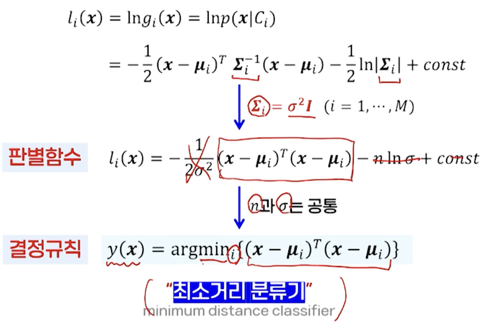

- 만족해야 하는 조건이 많음
  - 가우시안 분포 따라야 함
  - P(Ci) 클래스의 사전확률이 모두 갖다는 가정 하
  - 클래스별 공분산이 모두 공통
  - 단위 행렬의 상수배여야 함
- 따라서, 실제에서는 원하는 만큼의 좋은 결과를 얻기 어려움 

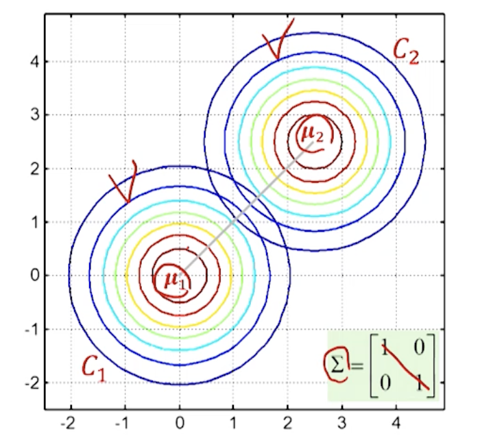

### (2) 클래스 공통 공분산행렬

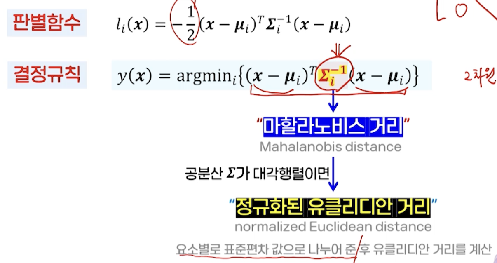

- 마할라노비스 거리(Mahalanobis distance)
- 정규화된 유클리디안 거리(normalized Euclidean distance)

- 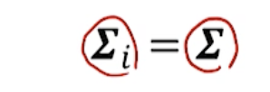

  - 타원형 형태의 데이터 분포

  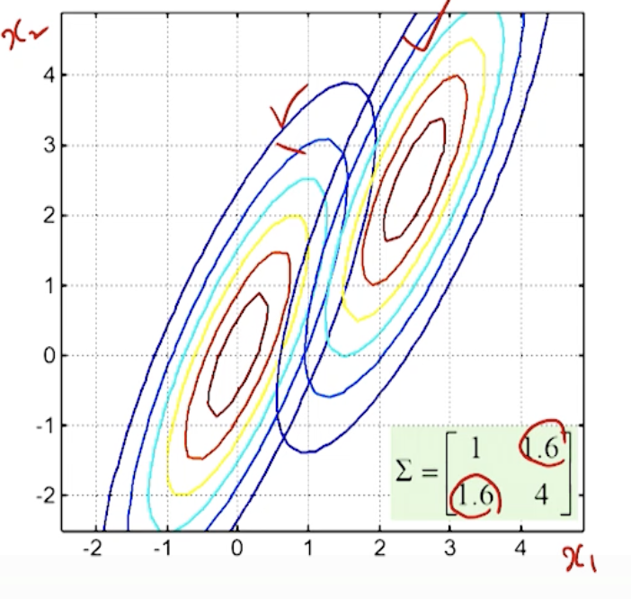

  

### (3) 일반적인 공분산행렬

- 서로 다른 타원형 형태의 데이터 분포

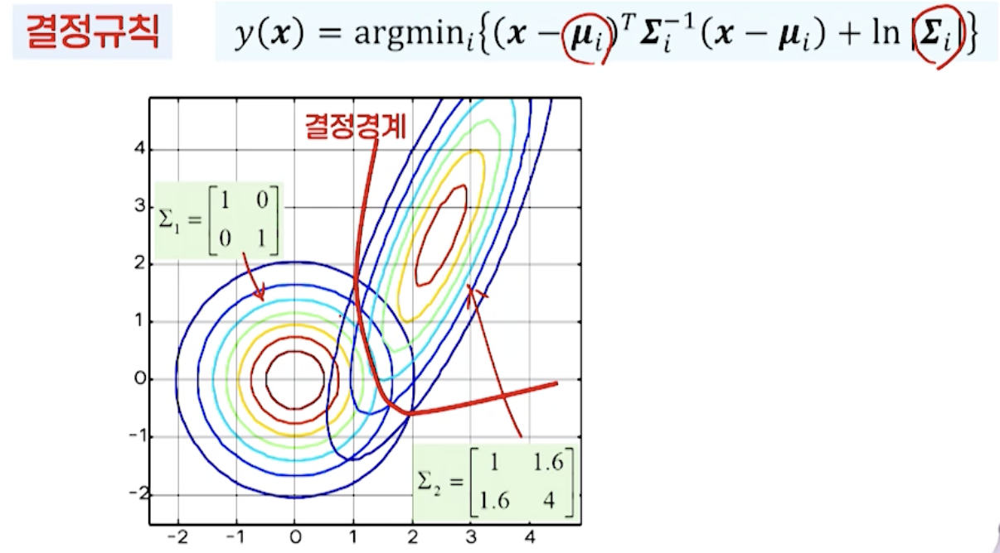

- 결정 경계는 곡선형이 됨

### 베이즈 분류기의 구현: 가우시안 모델을 따르는 경우

- 데이터 x에 대한 클래스별 밀도함수

  

  각 클래스의 평균과 공분산행렬을 각각 추정해야 함

- 간소화 방법

  - 공분산행렬이 모두 단위행렬로 동일한 경우
    - 최소거리분류기
    - x와 각 클래스의 평균과의 거리를 비교해 가까운 쪽의 클래스로 할당
  - 공분산행렬이 모두 동일하다고 가정한 경우
    - 마할라노비스 거리: 하나의 공분산만 추정해서 평균과의 거리 계산에 활용
  - 일반적으로 공분산행렬이 동일하다고 볼 수 없으나, 계산이 간단하여 널리 사용

## 3. K-최근접이웃분류기

### 최근접이웃분류기

- K-최근접이웃 분류기에서 K=1인 경우
  - K-nearest neighbor classifier, K-NN
- 클래스와 상관없이 모든 데이터 중에서 가장 작은 거리값을 갖는 데이터의 클래스로 할당

- 수행 단계

  - 주어진 데이터 x와 모든 학습 데이터와의 거리를 계산
  - 거리가 가장 가까운 데이터를 찾아 xmin으로 둠
  - xmin이 속하는 클래스에 할당

- 문제점

  - 데이터에 잡음이 있거나, 결정 경계에 데이터가 몰려 있는 경우 오분류율 높아질 수 있음
  - 과적합(overfitting)

  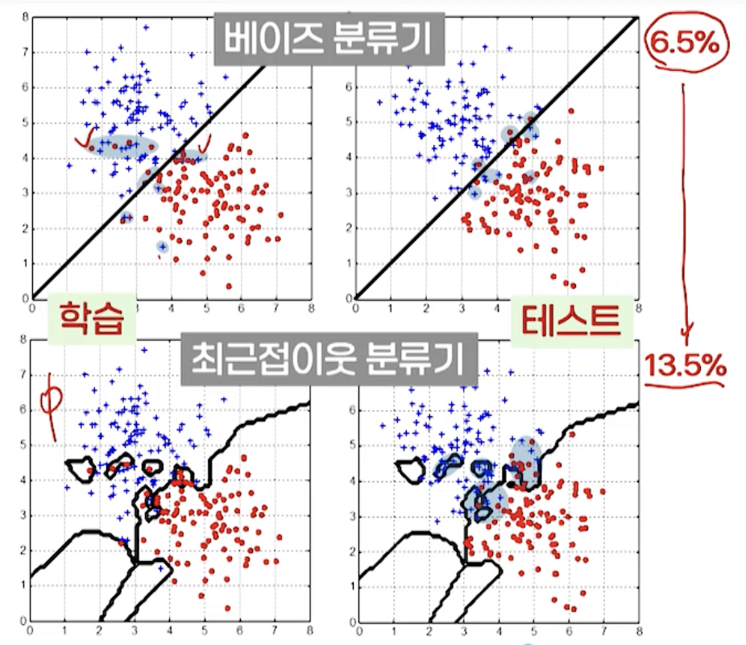

- K=5인 경우

  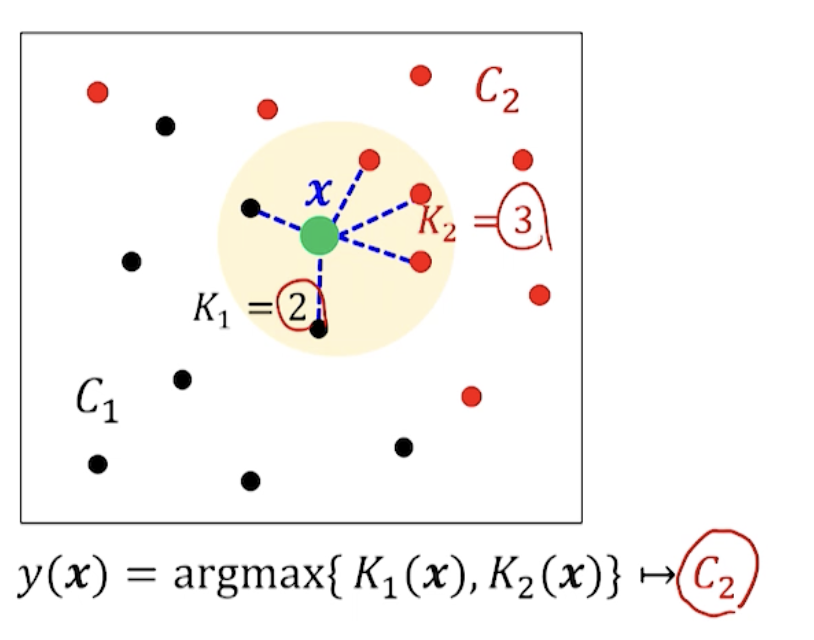

- 수행단계

  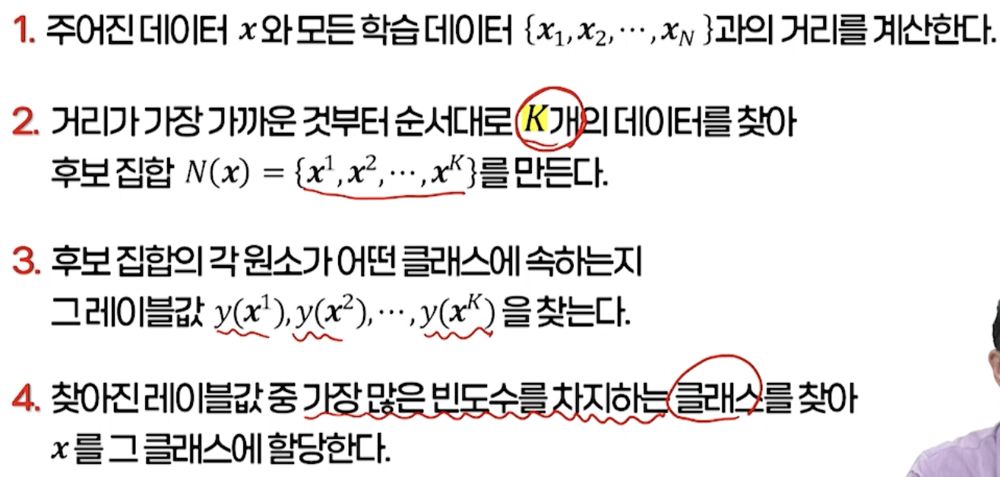

### K-최근접이웃 분류기의 설계 고려사항

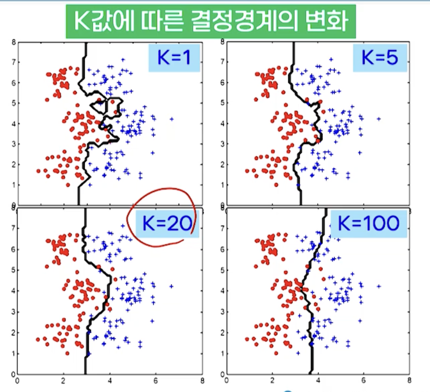

- **적절한 K값의 결정**
  - K=1 
    - 바로 이웃한 데이터에만 의존해 클래스가 결정
    - 노이즈에 민감, 과다적합 발생
  - K >> 1
    - 주어진 데이터 주변 영역이 아닌 전체 데이터 영역에서 각 클래스가 차지하는 비율(사전확률)에 의존
  - 주어진 문제(학습 데이터)에 의존적
    - 실용적으로는 학습 데이터에 대한 분류를 통해 가장 좋은 성능을 주는 값의 선택 가능

- **거리 함수** -> 주어진 데이터와 학습 데이터 간의 거리 계산 방법

  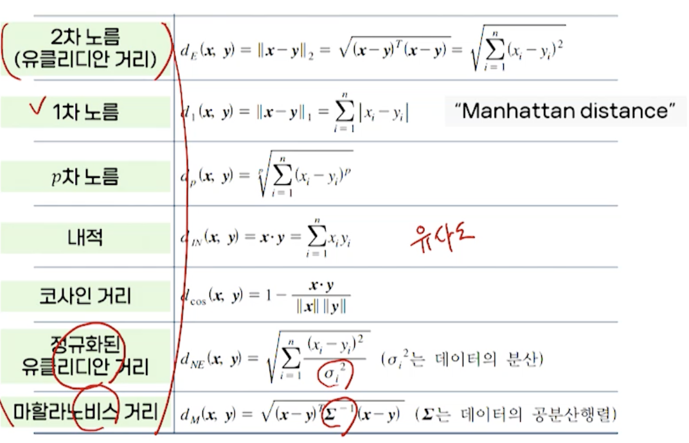

### 가우시안 베이즈 분류기 vs K-최근접이웃 분류기

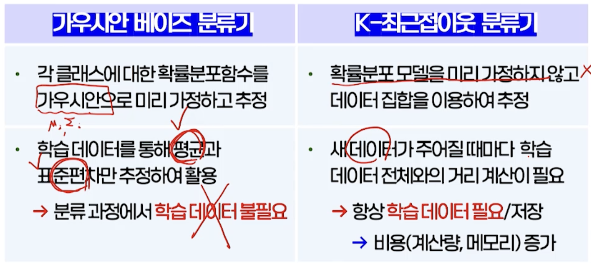

- 데이터 분포가 복잡한 비선형 구조를 가지는 경우 

  - K 최근접이웃

  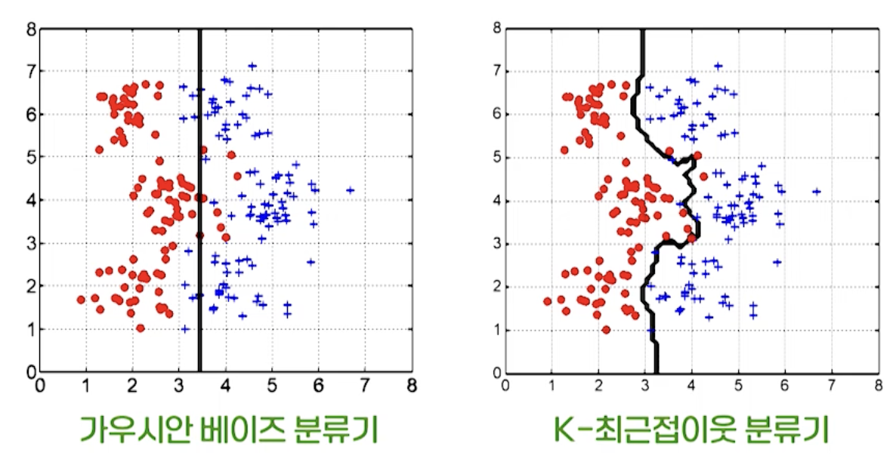

  

  

### 그밖의 분류기들

- 로지스틱 회귀
  - 회귀 기법을 분류 문제로 확장
- 결정 트리
  - 속성들의 정보를 순차적으로 적용하여 분류 > 판단 결과에 대한 설명력이 우수
- 서포트벡터머신(SVM)
  - 결정경계의 마진을 최대화하는 목적함수 사용 > 일반화 성능 우수
- 신경망(딥러닝모델)
  - 복잡한 결정경계를 신경망 모델로 정의해 학습
  - 특징추출 단계까지 한 번에 학습

