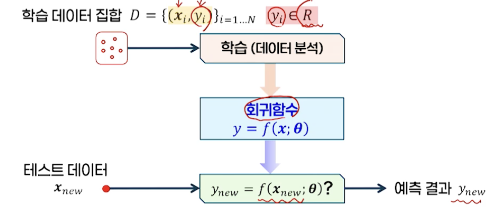

# 3강. 지도학습: 회귀

## 1. 회귀의 개념

### 회귀

- 입력변수와 출력변수 사이의 매핑 관계를 찾는 것
- 예: 시계열 예측 > 주가 예측, 환율 예측, 시장 예측, 판매 예측 등

### 회귀 시스템

- 입 출력의 관계

  - 분류 문제라는 것은 회귀의 특별한 경우로 간주할 수 있다

  

- 학습 목표

  - 예측 오류를 최소화하는 최적의 회귀함수를 찾는 것

  - 오차함수

    

### 보간법과 회귀

- 데이터의 입력과 출력의 관계를 가장 잘 표현하는 직선/곡선을 찾는 경우
- 보간법 → 제곱 오차가 0, 하지만 매우 복잡한 곡선
- 회귀 → 어느 정도 오차 존재, 데이터의 전체적 경향을 보여주는 입출력 관계 표현에 적합
- 회귀 → "데이터의 경향을 일종의 평균과 같으 ㄴ값으로 되돌려준다"

## 2. 선형 회귀

## 3. 로지스틱 회귀